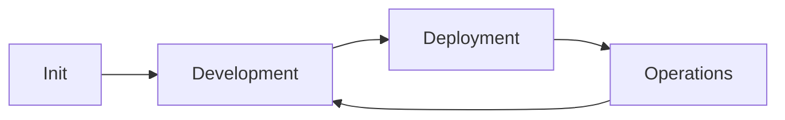

# Getting Started with AI Agent Development Framework v3.7

**Choose Your Path** | **[Implementation Templates](templates/README.md)** | **[Quick Decision Guide](#quick-decision-guide)**

Welcome to the AI Agent Development Framework v3.7 - a comprehensive methodology for AI-first software development. This guide helps you get started quickly based on your specific needs.

---

## 🚀 Quick Decision Guide

### 📝 New Project (5 minutes)
**Best for:** Starting a brand new AI-first project

**What you get:** Complete project structure, templates, AI context system
```bash
# Quick setup
chmod +x templates/init/setup-script.sh
./templates/init/setup-script.sh my-project gcp
```

**[→ Go to New Project Setup](#new-project-5-minute-setup)**

### 🔄 Existing Project Integration
**Best for:** Adding framework to existing codebase

**What you get:** Framework integration with your existing code protected
- **Option A:** Modify existing project (preserves git history)  
- **Option B:** Copy to new directory (safe isolation)

**[→ Go to Existing Project Integration](#existing-project-integration)**

### 🚀 Deployment Only
**Best for:** Just want deployment automation for existing code

**What you get:** Infrastructure-as-code, CI/CD pipelines, zero-downtime deployment
```bash
# Quick deployment setup
cp -r templates/infrastructure/* ./
cp -r templates/workflows/* ./.github/workflows/
```

**[→ Go to Deployment Setup](#deployment-only)**

### 🤖 AI-Autonomous Operations
**Best for:** Adding intelligent monitoring and operations

**What you get:** Predictive monitoring, auto-scaling, cost optimization
```bash
# Operations setup
cp -r templates/configurations/monitoring/* ./monitoring/
```

**[→ Go to Operations Setup](#operations-setup)**

### ❓ Learn More First
**Best for:** Understanding the framework before implementing

**[→ Go to Framework Overview](#framework-overview)**

---

## 📝 New Project 5-Minute Setup

### Step 1: Initialize Project
```bash
# Clone framework or download templates
git clone <framework-repo> my-aiops-project
cd my-aiops-project

# Run initialization script
chmod +x templates/init/setup-script.sh
./templates/init/setup-script.sh my-project gcp

# This creates:
# ✅ Complete directory structure
# ✅ Git repository with .gitignore
# ✅ Environment configuration  
# ✅ AI context system
# ✅ AI assistant configuration
# ✅ Ready-to-use templates
```

### Step 2: Configure Environment
```bash
# Set up your environment variables
cp .env.template .env
# Edit .env with your specific values

# Install dependencies (if applicable)
pip install -r requirements.txt  # Python
npm install                      # Node.js
```

### Step 3: Initialize AI Context
```bash
# The framework creates AI context files automatically
# Review and customize these files:
ls .ai_context/
# - framework_progress.md (tracks your progress)
# - current_context.md (current working state)  
# - team_patterns.md (development standards)
# - domain_context.md (project knowledge)
```

### Step 4: Start Development
```bash
# Follow the framework phases:
# 1. Fill out templates/framework/product.md
# 2. Define requirements in templates/framework/requirements.md  
# 3. Create architecture in templates/framework/design.md
# 4. Plan implementation in templates/framework/tasks.md
```

**✅ You're ready! Your project now follows AI-first development practices.**

---

## 🔄 Existing Project Integration

### Safe Integration Options

#### Option A: Modify Existing Project (Recommended)
**Preserves git history and file timestamps**

```bash
# 1. Backup your project (CRITICAL)
git add . && git commit -m "Backup before framework integration"

# 2. Copy framework structure
cp -r framework-templates/* ./

# 3. Customize templates with your project info
# Edit templates/framework/*.md files

# 4. Initialize AI context
mkdir -p .ai_context
# Copy .ai_context templates and customize
```

#### Option B: Copy to New Directory (Safest)
**Complete isolation, easy rollback**

```bash
# 1. Copy your project to new directory
cp -r my-existing-project my-project-with-framework
cd my-project-with-framework

# 2. Apply framework structure
cp -r framework-templates/* ./

# 3. Integrate your existing code with new structure
# Move files to appropriate framework directories

# 4. Initialize git repository
git init && git add . && git commit -m "Initial framework integration"
```

### Integration Checklist
- [ ] Templates copied and customized
- [ ] AI context system initialized  
- [ ] Existing code integrated with new structure
- [ ] Dependencies and environment configured
- [ ] Git repository status confirmed
- [ ] Framework validation completed

---

## 🚀 Deployment Only

Perfect for adding professional deployment automation to existing projects.

### Quick Deployment Setup

#### Step 1: Infrastructure Templates
```bash
# Copy infrastructure templates
mkdir -p infrastructure
cp -r templates/infrastructure/* infrastructure/

# Configure for your cloud provider
cd infrastructure/terraform/gcp  # or aws/azure
cp terraform.tfvars.example terraform.tfvars
# Edit terraform.tfvars with your settings
```

#### Step 2: CI/CD Pipeline
```bash
# Copy workflow templates  
mkdir -p .github/workflows
cp templates/workflows/github-actions/* .github/workflows/

# Configure repository variables in GitHub:
# - GCP_PROJECT_ID, GCP_REGION
# - WIF_PROVIDER, WIF_SERVICE_ACCOUNT
```

#### Step 3: Deploy Infrastructure
```bash
# Deploy infrastructure
cd infrastructure/terraform/gcp
terraform init
terraform plan
terraform apply

# Deploy application
git add . && git commit -m "Add deployment automation"
git push  # Triggers CI/CD pipeline
```

### Deployment Features You Get
- **Zero-downtime deployments** (blue-green, canary, rolling)
- **Infrastructure-as-code** with Terraform
- **AI-powered deployment decisions** 
- **Automated monitoring setup**
- **Security scanning integration**

---

## 🤖 Operations Setup

Add intelligent monitoring and autonomous operations to any project.

### Step 1: Monitoring Templates
```bash
# Copy monitoring configurations
mkdir -p monitoring
cp -r templates/configurations/monitoring/* monitoring/

# Set up dashboards and alerts
kubectl apply -f monitoring/dashboards/
kubectl apply -f monitoring/alerts/
```

### Step 2: AI Agent Scripts
```bash
# Copy AI operational agents
mkdir -p scripts/ai-agents
cp templates/ai-agents/*.py scripts/ai-agents/
pip install -r templates/ai-agents/requirements.txt

# Test agents
python scripts/ai-agents/code-quality-agent.py --analyze-all
```

### Step 3: Configure Autonomous Operations
```bash
# Set up operational automation
cp templates/configurations/gcp/* ./
# Configure monitoring thresholds and auto-scaling
```

### Operations Features You Get
- **Predictive monitoring** with anomaly detection
- **Auto-scaling** based on intelligent analysis  
- **Cost optimization** recommendations
- **Incident response** automation
- **Performance optimization** suggestions

---

## ❓ Framework Overview

### What is the AI Agent Development Framework v3.7?

This is a **comprehensive methodology** (not software) for building applications using an "AI-first" approach. The framework automates and accelerates the entire software development lifecycle with AI agents handling execution while humans provide strategic oversight.

### Core Framework Phases



1. **Init Phase:** Project setup, structure creation, AI context optimization
2. **Development Phase:** AI-accelerated development with BDD/TDD
3. **Deployment Phase:** AI-autonomous deployment with zero-downtime strategies  
4. **Operations Phase:** AI-driven monitoring and optimization

### Key Benefits

**Development Phase:**
- 10x development velocity
- 95% test coverage with AI-generated tests
- Security-by-design integration
- Complete documentation automation

**Deployment Phase:** 
- 99.9% deployment reliability
- Zero-downtime production deployments
- Intelligent deployment strategy selection
- Comprehensive security scanning

**Operations Phase:**
- 99.9% system availability  
- Sub-2-minute incident resolution
- 20-30% cost optimization
- Predictive scaling and monitoring

### AI-First Methodology

**AI Agents Handle (90%):**
- Code generation and implementation
- Infrastructure provisioning
- Testing automation and quality assurance  
- Performance optimization
- Security scanning and compliance
- Monitoring and incident response

**Humans Provide (10%):**
- Initial PRD and architecture
- Strategic decisions and business impact assessment
- Production deployment authorization
- Policy and compliance approval
- Critical incident escalation

---

## 🆘 Need Help?

### Common Issues
- **Missing dependencies:** Install framework prerequisites for your platform
- **Template errors:** Ensure all variables are properly configured
- **AI context issues:** Verify .ai_context files are properly initialized

### Get Support
- **Documentation:** [Framework Documentation](README.md)
- **Templates:** [Implementation Templates](templates/README.md)  
- **Navigation:** [Document Navigation](NAVIGATION.md)

### Next Steps
1. **Choose your path** from the options above
2. **Follow the step-by-step instructions** for your selected path
3. **Customize templates** for your specific project needs
4. **Initialize AI context** for development acceleration
5. **Begin AI-first development** following the framework methodology

---

**Ready to build with AI-first methodology? Choose your path above and get started in minutes!**

*Framework: AI Agent Development Framework v3.7*  
*Version: 3.7 - Production Ready AI-First Edition*  
*Created: 2025-08-24*