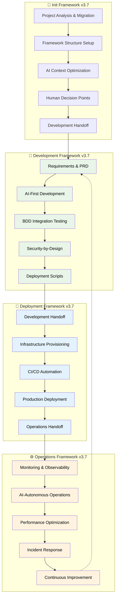

# AI Agent Development Framework v3.7

**🚀 [GET STARTED IN 5 MINUTES](GET_STARTED.md) | [See Quick Start Options](GET_STARTED.md#quick-decision-guide)**

This project is not a software application, but rather a comprehensive and highly structured **methodology** for building software using an "AI-first" approach. The core idea is to leverage AI agents to automate and accelerate the entire software development lifecycle, from initial project setup to production operations, with humans providing strategic oversight and approval at key checkpoints.

**Proven Results:** 10x development velocity • >99.9% reliability • Zero-downtime deployments

## Complete AI-First Init → Development → Deployment → Operations Lifecycle

**Version:** 3.7 - Production Ready AI-First Edition  
**Date:** 2025-08-22  
**Framework:** AI Agent Development Framework v3.7  
**Purpose:** Complete AI-first methodology from project initialization through operations excellence  

---

## **Framework Overview**

The AI Agent Development Framework v3.7 provides a complete **AI-first methodology** designed to be executed by an AI assistant with human supervision. The human developer provides the initial PRD and architecture during the init stage, and the AI assistant handles the rest of the development, deployment, and operations, with the human developer confirming the completion of each phase.

- **🎯 Init**: Project initialization, pre-work, and framework setup with human decision points
- **🔨 Development**: AI-accelerated development with Framework v3.7 methodology
- **🚀 Deployment**: AI-autonomous deployment with zero-downtime production strategies  
- **⚙️ Operations**: AI-autonomous operations with predictive monitoring and optimization

### **Core Principles**
1. **AI-First Methodology**: AI assistants drive execution, humans provide supervision
2. **Security-by-Design**: Integrated security throughout the complete lifecycle
3. **Complete Lifecycle Coverage**: Init → Development → Deployment → Operations workflow
4. **Human Supervision**: Strategic oversight with operational autonomy
5. **Framework Compliance Targets**: Full structure compliance; >95% implementation adherence

---

## **Framework Workflow**

### **Complete Init → Development → Deployment → Operations Flow**



---

## 📁 **Directory Structure**

```
📁 .aiops_v3.7/
├── 📁 agents/                  # 16 specialized AI agents
│   ├── README.md              # Agent coordination guide
│   └── [agent-definitions]     # Individual agent specifications
├── 📁 init/                   # Init Framework v3.7
│   ├── init_framework_v3.7.md        # Project initialization methodology
│   ├── AI_ASSISTANT_STARTUP.md  # AI init startup guide
│   ├── ai_system_prompt_v3.7.md      # AI init system prompt
│   └── ai_assistant_tasks_init.md    # Init task automation
├── 📁 development/            # Development Framework v3.7
│   ├── development_framework_v3.7.md    # Core development methodology
│   ├── ai_assistant_guide_v3.7.md       # AI development optimization
│   ├── ai_prompts_workflow_v3.7.md      # Development workflow prompts
│   ├── prd_template_v3.7.md             # Product requirements template
│   ├── development_guide_v3.7.md        # Development patterns guide
│   ├── adr_guide_v3.7.md               # Architecture decision records
│   └── bdd_integration_guide_v3.7.md    # BDD testing integration
├── 📁 deployment/             # Deployment Framework v3.7
│   ├── deployment_framework_v3.7.md     # Core deployment methodology
│   ├── infrastructure_automation_v3.7.md # Infrastructure as code
│   ├── deployment_strategies_v3.7.md    # Zero-downtime strategies
│   ├── ci_cd_pipeline_v3.7.md          # CI/CD automation
│   ├── dynamic_test_generation_v3.7.md  # AI-powered testing
│   ├── ai_assistant_guide_v3.7.md       # AI deployment optimization
│   ├── ai_prompts_workflow_v3.7.md      # Deployment workflow prompts
│   └── ai_system_prompt_v3.7.md         # AI deployment configuration
├── 📁 operations/             # Operations Framework v3.7
│   ├── operations_framework_v3.7.md     # Core operations methodology
│   ├── monitoring_observability_v3.7.md # AI-autonomous monitoring
│   ├── ai_assistant_guide_v3.7.md       # AI operations optimization
│   ├── ai_prompts_workflow_v3.7.md      # Operations workflow prompts
│   └── ai_system_prompt_v3.7.md         # AI operations configuration
└── README.md                  # This file
```

---

## 🎯 **Framework Benefits**

### **Development Phase** 🔨
- **10x Development Velocity**: AI-accelerated coding with framework compliance
- **95% Test Coverage**: AI-generated comprehensive test suites
- **Security-by-Design**: Integrated security throughout development
- **Complete Documentation**: ADRs, PRDs, and technical specifications

### **Deployment Phase** 🚀
- **99.9% Deployment Reliability**: Zero-downtime production deployments
- **10x Deployment Speed**: AI-autonomous infrastructure provisioning
- **Comprehensive Security**: Automated security scanning and compliance
- **Intelligent Strategies**: Blue-green, canary, and rolling deployments

### **Operations Phase** ⚙️
- **99.9% System Availability**: AI-autonomous monitoring and optimization
- **Sub-2-minute MTTR**: AI-powered incident detection and resolution
- **10x Operational Efficiency**: AI-autonomous operations with human oversight
- **Cost Optimization**: 20-30% resource cost reduction through AI optimization

---

## 🤖 **AI-First Methodology**

This framework is designed to be executed by an AI assistant with a human developer providing supervision and approval. The AI assistant is responsible for the following:

*   **Code generation and implementation**
*   **Infrastructure provisioning and configuration**
*   **Monitoring and incident response**
*   **Performance optimization and scaling**
*   **Security scanning and compliance validation**
*   **Testing automation and quality assurance**

The human developer is responsible for the following:

*   **Providing the initial PRD and architecture**
*   **Confirming the completion of each phase**
*   **Making strategic architecture decisions**
*   **Assessing business impact**
*   **Approving policy and compliance changes**
*   **Authorizing production deployments**
*   **Handling critical incident escalations**
*   **Evolving the framework and methodology**

---

## 🛡️ **Security & Compliance**

### **Security-by-Design Integration**
- **Threat Modeling**: Integrated throughout development lifecycle
- **Security Scanning**: SAST, DAST, and dependency analysis
- **Compliance Automation**: NEPA, SOC 2, ISO 27001 validation
- **Access Management**: IAM, RBAC, and principle of least privilege
- **Incident Response**: Automated security incident detection and response

### **Regulatory Compliance**
- **Government Standards**: FedRAMP, FISMA compliance ready
- **Environmental Compliance**: NEPA document processing and validation
- **Audit Trails**: Comprehensive audit logging and compliance reporting
- **Data Protection**: Encryption at rest and in transit
- **Privacy Controls**: PII protection and data governance

---

## 📊 **Success Metrics**

### **Framework Effectiveness Targets**
- **Development Velocity**: 10x improvement over traditional development
- **Deployment Reliability**: >99.9% success rate with zero-downtime
- **System Availability**: >99.9% uptime with AI-autonomous operations
- **Security Integration**: >95% security-by-design implementation
- **Framework Compliance**: 100% structure compliance, >95% implementation
- **Cost Optimization**: 20-50% cost reduction through AI optimization

### **Quality Assurance Standards**
- **Test Coverage**: 95% unit, 85% integration, 75% end-to-end testing
- **Security Validation**: 100% critical vulnerability remediation
- **Performance Standards**: <2s response time, >1000 RPS throughput
- **Reliability Targets**: <2 minute MTTR, >99.9% availability
- **Documentation Coverage**: 100% framework documentation compliance

---

## 🚀 **Getting Started (Choose Your Path)**

### 📝 **I Want to Start a New Project**
**→ [GET STARTED in 5 minutes](GET_STARTED.md#new-project-5-minute-setup)**
- Complete setup with AI guidance
- Framework structure creation
- Ready for development in minutes

### 🔄 **I Have an Existing Project**
**→ [Integrate Framework](GET_STARTED.md#existing-project-integration)**
- Safe integration options (modify OR copy)
- Existing code protection
- Enhanced with AI development

### 🚀 **I Want to Deploy Existing Code**
**→ [Deploy in 15 minutes](GET_STARTED.md#deployment-only)**
- Zero-downtime deployment strategies
- Infrastructure-as-Code setup
- Production monitoring included

### 🤖 **I Want AI-Autonomous Operations**
**→ [Operations Setup](GET_STARTED.md#operations-setup)**
- Predictive monitoring
- Self-healing systems
- Cost optimization

### ❓ **I Want to Learn More**
**→ [Framework Overview](GET_STARTED.md#framework-overview)**
- Understand the methodology  
- See proven results
- Review agent capabilities

---

## 📋 **Session Management**

For a detailed explanation of the session management protocols, please see the [SESSION_MANAGEMENT.md](SESSION_MANAGEMENT.md) file.

---

## 📚 **Additional Resources**

### **Support and Documentation**
- **Agent Coordination**: [Agents Directory](agents/) - Specialized AI agents
- **Style Guide**: [STYLE_GUIDE.md](STYLE_GUIDE.md) - The style guide for the framework documentation.
- **Glossary**: [GLOSSARY.md](GLOSSARY.md) - A glossary of key terms and concepts.

### **Framework Evolution**
This framework evolves continuously based on:
- **Operational Feedback**: Real-world implementation lessons
- **AI Technology Advances**: Integration of new AI capabilities  
- **Industry Best Practices**: Adoption of emerging methodologies
- **Compliance Requirements**: Updates for regulatory changes

---

## 🎯 **Conclusion**

Framework v3.7 provides **complete AI-first methodology** covering the entire software lifecycle from development through operations excellence. By following the **Development → Deployment → Operations** workflow with AI-autonomous execution and human supervision, teams achieve:

- **Unprecedented Velocity**: 10x improvement across all phases
- **Enterprise Reliability**: >99.9% success rates and availability
- **Security Excellence**: Comprehensive security-by-design integration
- **Operational Excellence**: AI-autonomous operations with continuous improvement

**Start your AI-first transformation today by choosing your entry point above and following the systematic framework methodology.**

---

*Framework: AI Agent Development Framework v3.7*  
*Version: 3.7 - Complete Lifecycle AI-First Edition*  
*Created: 2025-08-22*

*The future of software development is AI-first, secure, and autonomous.*