# AI Agent Development Framework v3.7
## Complete AI-First Init → Development → Deployment → Operations Lifecycle

**Version:** 3.7 - Production Ready AI-First Edition  
**Date:** 2025-08-22  
**Framework:** AI Agent Development Framework v3.7  
**Purpose:** Complete AI-first methodology from project initialization through operations excellence  

---

## 🚀 **Framework Overview**

The AI Agent Development Framework v3.7 provides a complete **AI-first methodology** with **human supervision** covering the entire software lifecycle:

- **🎯 Init**: Project initialization, pre-work, and framework setup with human decision points
- **🔨 Development**: AI-accelerated development with Framework v3.7 methodology
- **🚀 Deployment**: AI-autonomous deployment with zero-downtime production strategies  
- **⚙️ Operations**: AI-autonomous operations with predictive monitoring and optimization

### **Core Principles**
1. **AI-First Methodology**: AI assistants drive execution, humans provide supervision
2. **Security-by-Design**: Integrated security throughout the complete lifecycle
3. **Complete Lifecycle Coverage**: Init → Development → Deployment → Operations workflow
4. **Human Supervision**: Strategic oversight with operational autonomy
5. **Framework Compliance**: 100% structure compliance, >95% implementation adherence

---

## 📋 **Framework Workflow**

### **Complete Init → Development → Deployment → Operations Flow**

```mermaid
graph TD
    subgraph "🎯 Init Framework v3.7"
        I1[Project Analysis & Migration]
        I2[Framework Structure Setup]
        I3[AI Context Optimization]
        I4[Human Decision Points]
        I5[Development Handoff]
    end
    
    subgraph "🔨 Development Framework v3.7"
        A1[Requirements & PRD]
        A2[AI-First Development]
        A3[BDD Integration Testing]
        A4[Security-by-Design]
        A5[Deployment Scripts]
    end
    
    subgraph "🚀 Deployment Framework v3.7"
        B1[Development Handoff]
        B2[Infrastructure Provisioning]
        B3[CI/CD Automation]
        B4[Production Deployment]
        B5[Operations Handoff]
    end
    
    subgraph "⚙️ Operations Framework v3.7"
        C1[Monitoring & Observability]
        C2[AI-Autonomous Operations]
        C3[Performance Optimization]
        C4[Incident Response]
        C5[Continuous Improvement]
    end
    
    I1 --> I2
    I2 --> I3
    I3 --> I4
    I4 --> I5
    I5 --> A1
    
    A1 --> A2
    A2 --> A3
    A3 --> A4
    A4 --> A5
    A5 --> B1
    
    B1 --> B2
    B2 --> B3
    B3 --> B4
    B4 --> B5
    B5 --> C1
    
    C1 --> C2
    C2 --> C3
    C3 --> C4
    C4 --> C5
    
    C5 -.-> A1
    
    style A1 fill:#e8f5e8,color:#000
    style A2 fill:#e8f5e8,color:#000
    style A3 fill:#e8f5e8,color:#000
    style A4 fill:#e8f5e8,color:#000
    style A5 fill:#e8f5e8,color:#000
    style B1 fill:#e3f2fd,color:#000
    style B2 fill:#e3f2fd,color:#000
    style B3 fill:#e3f2fd,color:#000
    style B4 fill:#e3f2fd,color:#000
    style B5 fill:#e3f2fd,color:#000
    style C1 fill:#fff3e0,color:#000
    style C2 fill:#fff3e0,color:#000
    style C3 fill:#fff3e0,color:#000
    style C4 fill:#fff3e0,color:#000
    style C5 fill:#fff3e0,color:#000
```



---

## 🎯 **Quick Start by Role**

### **For New Projects & Migration** 🎯
**Start Here:** `init/` directory
1. **Project Initialization:** [Init Framework](init/init_framework_v3.7.md)
2. **AI Assistant Init:** [AI Init Startup Guide](init/AI_ASSISTANT_STARTUP_INIT.md)
3. **Pre-Work Requirements:** Complete before any development work
4. **Framework Setup:** Migration and structure establishment

### **For Development Teams** 🔨
**Start Here:** `development/` directory (after Init completion)
1. **Framework Methodology:** [Development Framework](development/development_framework_v3.7.md)
2. **AI Assistant Setup:** [AI Assistant Guide](development/ai_assistant_guide_v3.7.md)
3. **Development Workflow:** [AI Prompts Workflow](development/ai_prompts_workflow_v3.7.md)
4. **Requirements Management:** [PRD Template](development/prd_template_v3.7.md)

### **For DevOps/Deployment Teams** 🚀
**Start Here:** `deployment/` directory
1. **Deployment Framework:** [Deployment Framework](deployment/deployment_framework_v3.7.md)
2. **Infrastructure Automation:** [Infrastructure Automation](deployment/infrastructure_automation_v3.7.md)
3. **Deployment Strategies:** [Deployment Strategies](deployment/deployment_strategies_v3.7.md)
4. **CI/CD Pipelines:** [CI/CD Pipeline Framework](deployment/ci_cd_pipeline_v3.7.md)

### **For Operations/SRE Teams** ⚙️
**Start Here:** `operations/` directory
1. **Operations Framework:** [Operations Framework](operations/operations_framework_v3.7.md)
2. **Monitoring & Observability:** [Monitoring Framework](operations/monitoring_observability_v3.7.md)
3. **AI Assistant Operations:** [AI Assistant Guide](operations/ai_assistant_guide_v3.7.md)
4. **Operations Workflow:** [AI Prompts Workflow](operations/ai_prompts_workflow_v3.7.md)

### **For AI Assistants** 🤖
**AI Agent Directory:** `agents/` directory
- **16 Specialized Agents:** Each with specific domain expertise
- **Multi-Agent Coordination:** Patterns for complex task coordination
- **Framework Integration:** AI-optimized for Framework v3.7 compliance

---

## 📁 **Directory Structure**

```
📁 .aiops_v3.7/
├── 📁 agents/                  # 16 specialized AI agents
│   ├── README.md              # Agent coordination guide
│   └── [agent-definitions]     # Individual agent specifications
├── 📁 init/                   # Init Framework v3.7
│   ├── init_framework_v3.7.md        # Project initialization methodology
│   ├── AI_ASSISTANT_STARTUP_INIT.md  # AI init startup guide
│   ├── ai_system_prompt_v3.7.md      # AI init system prompt
│   └── ai_assistant_tasks_init.md    # Init task automation
├── 📁 development/            # Development Framework v3.7
│   ├── development_framework_v3.7.md    # Core development methodology
│   ├── ai_assistant_guide_v3.7.md       # AI development optimization
│   ├── ai_prompts_workflow_v3.7.md      # Development workflow prompts
│   ├── prd_template_v3.7.md             # Product requirements template
│   ├── development_guide_v3.7.md        # Development patterns guide
│   ├── adr_guide_v3.7.md               # Architecture decision records
│   └── bdd_integration_guide_v3.7.md    # BDD testing integration
├── 📁 deployment/             # Deployment Framework v3.7
│   ├── deployment_framework_v3.7.md     # Core deployment methodology
│   ├── infrastructure_automation_v3.7.md # Infrastructure as code
│   ├── deployment_strategies_v3.7.md    # Zero-downtime strategies
│   ├── ci_cd_pipeline_v3.7.md          # CI/CD automation
│   ├── dynamic_test_generation_v3.7.md  # AI-powered testing
│   ├── ai_assistant_guide_v3.7.md       # AI deployment optimization
│   ├── ai_prompts_workflow_v3.7.md      # Deployment workflow prompts
│   └── ai_system_prompt_v3.7.md         # AI deployment configuration
├── 📁 operations/             # Operations Framework v3.7
│   ├── operations_framework_v3.7.md     # Core operations methodology
│   ├── monitoring_observability_v3.7.md # AI-autonomous monitoring
│   ├── ai_assistant_guide_v3.7.md       # AI operations optimization
│   ├── ai_prompts_workflow_v3.7.md      # Operations workflow prompts
│   └── ai_system_prompt_v3.7.md         # AI operations configuration
├── CLAUDE.md                  # Universal session management
└── README.md                  # This file
```

---

## 🎯 **Framework Benefits**

### **Development Phase** 🔨
- **10x Development Velocity**: AI-accelerated coding with framework compliance
- **95% Test Coverage**: AI-generated comprehensive test suites
- **Security-by-Design**: Integrated security throughout development
- **Complete Documentation**: ADRs, PRDs, and technical specifications

### **Deployment Phase** 🚀
- **99.9% Deployment Reliability**: Zero-downtime production deployments
- **10x Deployment Speed**: AI-autonomous infrastructure provisioning
- **Comprehensive Security**: Automated security scanning and compliance
- **Intelligent Strategies**: Blue-green, canary, and rolling deployments

### **Operations Phase** ⚙️
- **99.9% System Availability**: AI-autonomous monitoring and optimization
- **Sub-2-minute MTTR**: AI-powered incident detection and resolution
- **10x Operational Efficiency**: AI-autonomous operations with human oversight
- **Cost Optimization**: 20-30% resource cost reduction through AI optimization

---

## 🤖 **AI-First Methodology**

### **AI Autonomous Operations (90-95%)**
- Code generation and implementation
- Infrastructure provisioning and configuration
- Monitoring and incident response
- Performance optimization and scaling
- Security scanning and compliance validation
- Testing automation and quality assurance

### **Human Supervision Required (5-10%)**
- Strategic architecture decisions
- Business impact assessment
- Policy and compliance approval
- Production deployment authorization
- Critical incident escalation
- Framework evolution and methodology changes

---

## 🛡️ **Security & Compliance**

### **Security-by-Design Integration**
- **Threat Modeling**: Integrated throughout development lifecycle
- **Security Scanning**: SAST, DAST, and dependency analysis
- **Compliance Automation**: NEPA, SOC 2, ISO 27001 validation
- **Access Management**: IAM, RBAC, and principle of least privilege
- **Incident Response**: Automated security incident detection and response

### **Regulatory Compliance**
- **Government Standards**: FedRAMP, FISMA compliance ready
- **Environmental Compliance**: NEPA document processing and validation
- **Audit Trails**: Comprehensive audit logging and compliance reporting
- **Data Protection**: Encryption at rest and in transit
- **Privacy Controls**: PII protection and data governance

---

## 📊 **Success Metrics**

### **Framework Effectiveness Targets**
- **Development Velocity**: 10x improvement over traditional development
- **Deployment Reliability**: >99.9% success rate with zero-downtime
- **System Availability**: >99.9% uptime with AI-autonomous operations
- **Security Integration**: >95% security-by-design implementation
- **Framework Compliance**: 100% structure compliance, >95% implementation
- **Cost Optimization**: 20-50% cost reduction through AI optimization

### **Quality Assurance Standards**
- **Test Coverage**: 95% unit, 85% integration, 75% end-to-end testing
- **Security Validation**: 100% critical vulnerability remediation
- **Performance Standards**: <2s response time, >1000 RPS throughput
- **Reliability Targets**: <2 minute MTTR, >99.9% availability
- **Documentation Coverage**: 100% framework documentation compliance

---

## 🚀 **Getting Started**

### **Phase 1: Choose Your Starting Point**
1. **New Project or Migration**: Start with `init/AI_ASSISTANT_STARTUP_INIT.md`
2. **Continue Development** (after Init): Start with `development/AI_ASSISTANT_STARTUP_DEVELOPMENT.md`
3. **Deploy Existing Project**: Start with `deployment/AI_ASSISTANT_STARTUP_DEPLOYMENT.md`  
4. **Manage Production**: Start with `operations/AI_ASSISTANT_STARTUP_OPERATIONS.md`

### **Phase 2: AI Assistant Setup**
1. **Load Framework Context**: Use appropriate AI assistant guide for your phase
2. **Initialize AI Context**: Follow AI system prompt setup for optimal performance
3. **Configure Workflow**: Use AI prompts workflow for systematic implementation

### **Phase 3: Framework Implementation**
1. **Follow Methodology**: Use framework-specific implementation guides
2. **Maintain Compliance**: Ensure 100% framework structure compliance
3. **Validate Quality**: Use comprehensive quality gates and validation

### **Phase 4: Continuous Improvement**
1. **Monitor Effectiveness**: Track framework effectiveness metrics
2. **Optimize Performance**: Implement AI-driven optimizations
3. **Evolve Framework**: Contribute to framework evolution and improvement

---

## 📋 **Session Management & TodoWrite Integration**

### **Universal Session Management System**

Framework v3.7 implements a **Hybrid Session Management System** that ensures consistent AI assistant workflow across all framework phases:

- **Clean Session Focus**: Each session starts with clear, prioritized tasks
- **Cumulative Progress Tracking**: Complete historical record of all achievements  
- **Cross-Session Continuity**: Seamless context preservation across sessions
- **Framework Compliance**: Maintained quality gates and methodology adherence
- **Complete Lifecycle Support**: Init → Development → Deployment → Operations workflow

### **Core Session Management Components**

1. **TodoWrite Tool**: Real-time session task management across all frameworks
2. **.ai_context/framework_progress.md**: Master state file (single source of truth)
3. **Framework-Specific Protocols**: Specialized session management for each phase
4. **Git Integration**: Immutable session evidence and audit trail
5. **Human Oversight**: Strategic decision points and approval requirements

### **TodoWrite Tool Integration Standards**

#### **Required TodoWrite Behaviors**
```markdown
TodoWrite Tool Requirements:
1. **Single Focus Enforcement**: Prevent multiple IN_PROGRESS tasks
2. **Real-Time Updates**: Immediate status reflection and state management
3. **Framework Phase Alignment**: Validates tasks align with current framework phase
4. **Quality Gates**: Enforces quality validation before task completion
5. **Human Checkpoints**: Identifies required human approval points
```

#### **Session Management Rules**
```markdown
Universal Session Rules:
1. **ONE TASK RULE**: Only ONE task can be "IN_PROGRESS" at any time
2. **Status Updates**: Use TodoWrite tool for immediate status changes
3. **Framework Alignment**: Ensure session tasks align with current framework phase
4. **Quality Validation**: Validate deliverables before marking completed
5. **Human Approval**: Required at designated framework checkpoints
```

### **Framework-Specific Session Management**

Each framework phase has specialized session management protocols:

- **Init Framework**: [Safety-First Session Management](init/session_management_protocols_init.md)
- **Development Framework**: [Quality-Driven Session Management](development/session_management_protocols_development.md)
- **Deployment Framework**: [Production-Ready Session Management](deployment/session_management_protocols_deployment.md)
- **Operations Framework**: [Autonomous Operations Session Management](operations/session_management_protocols_operations.md)

### **Session Lifecycle Protocol**

#### **Session Start (Every Session)**
1. **Context Loading**: Load .ai_context/framework_progress.md as authoritative state
2. **Phase Determination**: Identify current framework phase and requirements
3. **Priority Setting**: Set session goals based on framework phase objectives
4. **Environment Validation**: Ensure all prerequisites satisfied for current phase

#### **Session Work (Continuous)**
1. **Single Focus Discipline**: Only ONE task IN_PROGRESS at any time
2. **Real-Time Updates**: Immediate status changes via TodoWrite tool
3. **Quality Gates**: Comprehensive validation before task completion
4. **Framework Compliance**: Maintain adherence to Framework v3.7 methodology

#### **Session End (Every Session)**
1. **Task Completion**: Complete all IN_PROGRESS tasks or document handoff
2. **State Updates**: Update .ai_context/framework_progress.md with achievements
3. **Git Commitment**: Commit all session work with comprehensive messages
4. **Next Session Preparation**: Prepare context for seamless continuation

---

## 📚 **Additional Resources**

### **Support and Documentation**
- **AI Assistant Optimization**: [CLAUDE.md](CLAUDE.md) - Universal session management and AI optimization
- **Agent Coordination**: [Agents Directory](agents/) - Specialized AI agents
- **Session Management**: Framework-specific protocols for each phase (see Session Management section above)

### **Framework Evolution**
This framework evolves continuously based on:
- **Operational Feedback**: Real-world implementation lessons
- **AI Technology Advances**: Integration of new AI capabilities  
- **Industry Best Practices**: Adoption of emerging methodologies
- **Compliance Requirements**: Updates for regulatory changes

---

## 🎯 **Conclusion**

Framework v3.7 provides **complete AI-first methodology** covering the entire software lifecycle from development through operations excellence. By following the **Development → Deployment → Operations** workflow with AI-autonomous execution and human supervision, teams achieve:

- **Unprecedented Velocity**: 10x improvement across all phases
- **Enterprise Reliability**: >99.9% success rates and availability
- **Security Excellence**: Comprehensive security-by-design integration
- **Operational Excellence**: AI-autonomous operations with continuous improvement

**Start your AI-first transformation today by choosing your entry point above and following the systematic framework methodology.**

---

*Framework: AI Agent Development Framework v3.7*  
*Version: 3.7 - Complete Lifecycle AI-First Edition*  
*Created: 2025-08-22*

*The future of software development is AI-first, secure, and autonomous.*