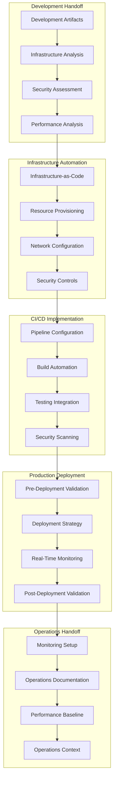

# Deployment Framework v3.7
## AI-First Production Deployment: Development → Production Excellence

**Version:** 3.7 - Deployment Framework Edition  
**Date:** 2025-08-23  
**Framework:** AI-Driven Deployment Framework v3.7  
**Purpose:** Complete deployment methodology with AI-autonomous execution  
**Integration:** Development Framework → Deployment Framework → Operations Framework  

---

## **Deployment Framework Overview**

The Deployment Framework v3.7 transforms traditional deployment processes into **AI-autonomous, zero-downtime production deployments** with comprehensive security integration and intelligent monitoring.

### **Core Deployment Principles**
- **AI-Autonomous Deployment**: 90% autonomous execution with human approval at critical gates
- **Zero-Downtime Operations**: Blue-green, canary, and rolling deployment strategies
- **Security-Integrated Deployment**: Security controls deployed with infrastructure automation
- **Intelligence-Driven Operations**: AI-powered monitoring and optimization from deployment start

---

## **Framework Structure**

```
📁 deployment/
├── 📄 README.md                           # This file - Framework overview
├── 📄 deployment_framework_v3.7.md        # Core deployment methodology
├── 📄 infrastructure_automation_v3.7.md   # Infrastructure-as-Code automation
├── 📄 deployment_strategies_v3.7.md       # Zero-downtime deployment strategies
├── 📄 ci_cd_pipeline_v3.7.md             # CI/CD pipeline automation
├── 📄 AI_ASSISTANT_STARTUP.md            # AI assistant deployment guide
├── 📄 ai_system_prompt_v3.7.md           # AI deployment system prompt
├── 📄 ai_prompts_workflow_v3.7.md        # Deployment workflow automation
├── 📄 ai_assistant_tasks_deployment.md   # Deployment task automation
└── 📄 session_management_protocols.md          # Deployment session protocols
```

---

## **Deployment Workflow**

### **Phase 7: AI-First Deployment Preparation**



---

## **Framework Components**

### **1. Infrastructure Automation**
**Purpose**: Complete infrastructure provisioning and configuration automation

**Key Features:**
- **Infrastructure-as-Code**: 100% infrastructure defined and managed through code
- **Multi-Cloud Support**: GCP, AWS, Azure deployment automation
- **Security Integration**: Security controls deployed automatically with infrastructure
- **Resource Optimization**: AI-driven resource provisioning and cost optimization

**Reference**: [Infrastructure Automation Guide](infrastructure_automation_v3.7.md)

### **2. Deployment Strategies**
**Purpose**: Zero-downtime production deployment with intelligent strategy selection

**Strategies Available:**
- **Blue-Green Deployment**: Complete environment switching with instant rollback
- **Canary Deployment**: Gradual rollout with risk mitigation and monitoring
- **Rolling Deployment**: Sequential updates maintaining service availability

**Reference**: [Deployment Strategies Guide](deployment_strategies_v3.7.md)

### **3. CI/CD Pipeline Automation**
**Purpose**: Comprehensive build, test, and deployment pipeline automation

**Pipeline Features:**
- **AI-Enhanced Pipelines**: Intelligent build optimization and failure prediction
- **Security Integration**: Automated security scanning and vulnerability management
- **Quality Gates**: Comprehensive testing and validation before deployment
- **Deployment Orchestration**: Automated deployment coordination and monitoring

**Reference**: [CI/CD Pipeline Guide](ci_cd_pipeline_v3.7.md)

### **4. AI Assistant Integration**
**Purpose**: AI-autonomous deployment execution with human supervision

**AI Capabilities:**
- **90% Autonomous Execution**: AI handles infrastructure, deployment, and validation
- **Intelligent Decision Making**: AI recommends optimal deployment strategies
- **Human Supervision**: Critical decision points require human approval
- **Multi-Agent Coordination**: Specialized agents for infrastructure, security, monitoring

**Reference**: [AI Assistant Guide](AI_ASSISTANT_STARTUP.md)

---

## **Framework Benefits**

### **Deployment Excellence**
- **Target: Deployment Reliability >99.9%** with zero-downtime strategies
- **Target: Deployment Speed 10x** via autonomous provisioning and deployment
- **Target: Security Integration** with automated controls and compliance validation
- **Intelligent Monitoring** from deployment start

### **Operational Excellence**
- **Zero-Downtime Deployments** with no service interruption
- **Target: Automated Rollback** with <2 minute recovery
- **Performance Optimization** during deployment process
- **Target: Cost Optimization** through AI-driven resource efficiency

### **Quality Assurance**
- **Comprehensive Validation** with automated quality gates
- **Security-by-Design** integrated throughout deployment process
- **Performance Validation** during deployment execution
- **Compliance Assurance** with audit trail creation

---

## **Security & Compliance**

### **Security-by-Design Integration**
- **Infrastructure Security**: Security controls deployed automatically with infrastructure
- **Pipeline Security**: CI/CD pipeline security scanning and vulnerability assessment
- **Runtime Security**: Container and application security controls activation
- **Monitoring Security**: Security event monitoring and incident response automation

### **Compliance Automation**
- **Regulatory Compliance**: Industry-specific, SOC 2, ISO 27001 compliance validation
- **Audit Trails**: Comprehensive audit logging and compliance reporting
- **Policy Enforcement**: Automated policy enforcement and compliance monitoring
- **Governance Controls**: Data governance and privacy protection implementation

---

## **Success Metrics**

### **Performance Targets**
- **Target:** Deployment reliability >99.9%
- **Target:** Deployment speed <15 minutes for standard deployments
- **Target:** Zero-downtime deployment capability
- **Target:** Rollback speed <2 minutes for automated rollback execution
- **Target:** Security control deployment and validation

### **Quality Metrics**
- **Target:** AI automation success >95%
- **Target:** Human intervention <10% of tasks
- **Target:** Performance impact <5% during deployments
- **Target:** Deployment error rate <0.1%
- **Target:** Negative user experience impact <1%

---

## **Integration Points**

### **Development → Deployment Handoff**
**Prerequisites**: Development Framework Phase 6 completion
- Complete implementation with BDD validation
- Security controls implemented and tested
- Performance targets achieved with validation
- Technical specifications and deployment requirements documented

### **Deployment → Operations Handoff**  
**Deliverables**: Production-ready system with operational excellence
- Production infrastructure with AI-autonomous management
- Comprehensive monitoring and observability systems
- Security operations and incident response capabilities
- Performance baselines and optimization frameworks

---

## 🚀 **Getting Started**

### **Prerequisites**
- [ ] Development Framework Phase 6 completed with human approval
- [ ] All BDD scenarios passing with comprehensive test coverage
- [ ] Security controls implemented and validated
- [ ] Performance targets achieved and documented
- [ ] Infrastructure requirements and deployment strategy defined

### **Deployment Framework Startup**
1. **Load AI Assistant Context**: [AI Assistant Startup Guide](AI_ASSISTANT_STARTUP.md)
2. **Initialize Deployment Framework**: Follow AI system prompt setup
3. **Execute Deployment Phases**: Systematic execution through Phase 7
4. **Validate Operations Handoff**: Prepare for Operations Framework transition

### **Phase Execution Order**
1. **Development Handoff Processing**: Analyze and validate development deliverables
2. **Infrastructure Automation**: Deploy complete infrastructure with security controls
3. **CI/CD Implementation**: Establish deployment pipeline automation
4. **Production Deployment**: Execute zero-downtime deployment with validation
5. **Operations Handoff**: Prepare comprehensive operations transition package

---

## 📚 **Additional Resources**

### **Core Documentation**
- **Master Deployment Strategy**: [`../templates/framework/deployment.md`](../templates/framework/deployment.md) - Framework-wide deployment strategy
- **Session Management**: [Deployment Session Protocols](session_management_protocols.md)
- **Framework Integration**: [Core Deployment Framework](deployment_framework_v3.7.md)

### **Specialized Guides**
- **Infrastructure**: [Infrastructure Automation](infrastructure_automation_v3.7.md)
- **Strategies**: [Deployment Strategies](deployment_strategies_v3.7.md)
- **CI/CD**: [Pipeline Automation](ci_cd_pipeline_v3.7.md)
- **AI Integration**: [AI Assistant Deployment](AI_ASSISTANT_STARTUP.md)

---

## ✅ **Framework Validation**

### **Deployment Success Criteria**
The Deployment Framework v3.7 succeeds when:

✅ **Zero-Downtime Achievement**: Production deployments completed with no service interruption  
✅ **AI-Autonomous Execution**: >90% deployment tasks completed autonomously with quality assurance  
✅ **Security Integration**: Complete security controls deployed and validated automatically  
✅ **Monitoring Excellence**: Comprehensive monitoring operational within minutes of deployment  
✅ **Performance Achievement**: All deployment performance targets met consistently  
✅ **Operations Readiness**: Operations Framework ready with complete handoff package  

### **Next Phase: Operations Framework**
Upon deployment completion, transition to:
**Operations Framework**: [`../operations/`](../operations/) - AI-autonomous operations with continuous improvement

---

*Deployment Framework README Version: v3.7 - Complete Deployment Framework Overview*  
*Framework: AI-Driven Deployment Framework v3.7*  
*Created: 2025-08-23*  
*Purpose: Complete overview and getting started guide for AI-first deployment methodology*
