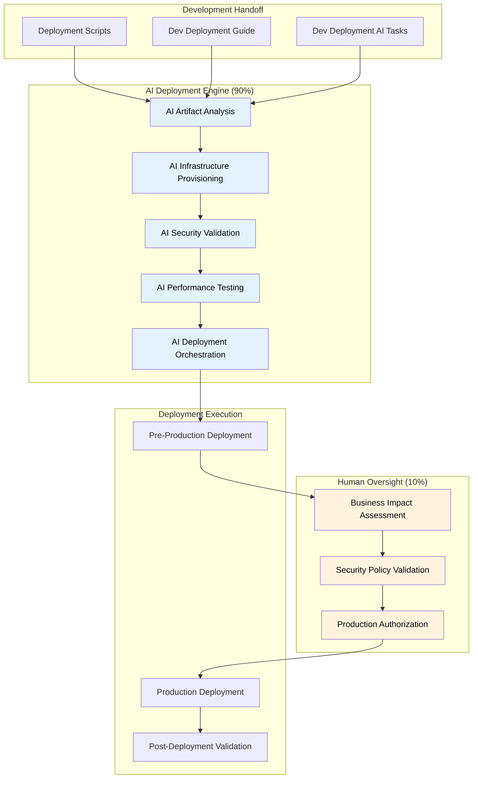

# AI-Driven Deployment Framework v3.7
## Comprehensive Deployment Implementation for Enterprise AI Platform

**Framework Integration:** Complete deployment implementation guide following Framework v3.7 methodology with AI-first deployment automation, security-by-design, and production deployment excellence.

**Target Audience:** Development teams, DevOps engineers, and AI assistants implementing comprehensive AI-first deployment for enterprise applications.

---

## Executive Summary

### Vision and Objectives
The [Project Name] AI-Driven Deployment Framework transforms traditional deployment practices through **AI-first deployment automation** with intelligent orchestration, predictive risk assessment, and automated production validation. Target outcomes:

- **Target:** 10x deployment velocity via automation and intelligent strategies
- **Target:** 99.9% deployment reliability through risk assessment and rollback intelligence
- **Target:** 95% pre-production test automation using AI-generated suites
- **Target:** Security-by-design validation integrated throughout deployment
- **Target:** Zero-downtime production deployments via intelligent traffic management

### AI-First Deployment Architecture

**AI AUTONOMOUS Deployment Operations (90%):**
- **Development Handoff Processing**: AI-driven analysis and optimization of development artifacts
- **Infrastructure Provisioning**: AI-automated infrastructure-as-code deployment and validation
- **CI/CD Pipeline Execution**: AI-orchestrated build, test, and deployment automation
- **Pre-Production Testing**: AI-generated comprehensive testing with intelligent validation
- **Security Scanning**: AI-enhanced security analysis and vulnerability remediation
- **Performance Validation**: AI-driven performance testing and optimization

**HUMAN SUPERVISION Required for Deployment (10%):**
- **Production Deployment Authorization**: Human approval required for production releases
- **Infrastructure Architecture Decisions**: Human validation of major infrastructure changes
- **Security Policy Approval**: Human oversight for security configurations and compliance
- **Business Impact Assessment**: Human evaluation of deployment risks and business implications
- **Critical Deployment Decision-Making**: Human oversight for high-risk or complex deployments

### Framework v3.7 Integration
This deployment framework directly supports Framework v3.7 development → deployment workflow:

**Development → Deployment Handoff:**
- **🤖 AI AUTONOMOUS**: Processing of deployment scripts, infrastructure requirements, and AI deployment tasks
- **🤖 AI AUTONOMOUS**: Validation and optimization of development artifacts for production readiness
- **👤 HUMAN SUPERVISION**: Approval of production deployment strategies and business impact assessment

---

## 📋 AI-First Deployment Strategy

### Deployment Pipeline Architecture



---

## Deployment Implementation Philosophy

### AI-First Deployment Commands

**AI Assistant Action Steps:**

1.  **Analyze development deployment artifacts:** Analyze the development deployment artifacts, optimize the infrastructure requirements, validate the security configurations, and prepare an AI-enhanced deployment strategy with predictive risk assessment.
2.  **Execute AI-driven infrastructure provisioning:** Execute AI-driven infrastructure provisioning with intelligent resource allocation, automated security configuration, and optimized performance settings based on the deployment context.
3.  **Perform AI-driven comprehensive security scanning:** Perform AI-driven comprehensive security scanning, including automated vulnerability assessment, intelligent threat detection, and adaptive security control validation.
4.  **Execute AI-driven deployment:** Execute an AI-driven deployment with intelligent strategy selection, automated rollback capabilities, and predictive failure detection with human authorization for production deployment.

**Supporting Human Oversight (10%)** 👤 HUMAN SUPERVISION REQUIRED
- Production deployment authorization and risk acceptance
- Business impact validation and stakeholder approval  
- Security policy compliance and regulatory validation
- Strategic infrastructure decisions and architecture approval

### Key Deployment Success Metrics
- **AI Execution Speed**: Sub-second deployment analysis and strategy optimization
- **Deployment Reliability**: >99.9% successful deployment rate with AI-driven validation
- **Security Integration**: 100% automated security scanning with AI-enhanced threat detection
- **Performance Validation**: Automated performance testing with AI-powered optimization recommendations

---

## 🎯 Deployment Responsibilities & Scope

### **Deployment Framework Scope**
The deployment framework handles the complete transition from development handoff to production operations:

**📥 Development Handoff Processing**: 
- Development deployment scripts analysis and optimization
- Infrastructure requirements processing and validation
- Development deployment guides integration and enhancement
- AI deployment tasks automation and intelligence optimization

**🔄 Pre-Production Deployment Pipeline**:
- AI-driven infrastructure provisioning and configuration management
- Automated CI/CD pipeline execution with intelligent quality gates and validation
- Comprehensive security scanning, vulnerability assessment, and compliance validation
- Performance testing, load testing, and optimization with predictive analytics and benchmarking
- Pre-production environment deployment with comprehensive validation and testing

**🚀 Production Deployment Execution**:
- Zero-downtime production deployment with AI-orchestrated strategies (blue-green, canary, rolling)
- Real-time deployment monitoring with automated health validation and performance tracking
- Intelligent rollback capabilities with automated failure detection and recovery
- Security posture validation and threat model implementation with continuous monitoring

**📤 Operations Handoff Delivery**:
- Live production system fully operational and optimized for autonomous operations
- Comprehensive operational monitoring and observability setup with alerting and dashboards
- Performance baselines, optimization recommendations, and capacity planning data
- Complete security posture documentation and operational security procedures

### **Handoff to Operations Framework**
Upon successful deployment, the system transitions to the Operations Framework for:
- **AI AUTONOMOUS Observability Operations**: Post-deployment monitoring and optimization
- **Operational Excellence**: Performance monitoring, cost optimization, and system reliability
- **Incident Response**: Automated incident detection and intelligent remediation

---

## 🤖 **Deployment AI Agent Coordination**

### **Available Deployment AI Agents**
**Infrastructure & Deployment:**
- **cloud-devops-expert**: Primary deployment orchestration and automation
- **cloud-ops-engineer**: Infrastructure provisioning and cloud platform management
- **gcp-ai-architect**: Cloud architecture optimization and service configuration

**Security & Quality:**
- **security-auditor**: Security scanning, vulnerability assessment, and compliance validation
- **test-engineer**: Automated testing, quality gates, and validation strategies
- **performance-optimizer**: Performance testing, optimization, and scalability validation

**Development Integration:**
- **coder-agent**: Code integration and deployment preparation
- **database-specialist**: Database deployment, migration, and optimization
- **project-manager**: Multi-agent coordination and deployment workflow orchestration

### **Agent Coordination Patterns**
```bash
# Multi-agent deployment orchestration
"cloud-devops-expert + security-auditor + performance-optimizer: Execute comprehensive deployment including infrastructure provisioning, security validation, and performance optimization with coordinated AI intelligence"

# Security-first deployment validation
"security-auditor + gcp-ai-architect: Validate deployment security architecture with AI-enhanced threat detection and automated compliance verification"

# Performance-optimized deployment
"performance-optimizer + cloud-ops-engineer: Execute deployment with AI-driven performance optimization and predictive scaling configuration"
```

---

## 🔍 **AI-Powered Deployment Intelligence**

### **Intelligent Deployment Validation Architecture**

**Pre-Deployment AI Validation Framework:**
- **Environment Compatibility Engine**: AI-powered validation of deployment scripts against target environments
- **Dependency Resolution System**: Intelligent dependency analysis and conflict resolution
- **Security Compliance Validator**: Comprehensive security compliance verification and risk assessment
- **Performance Impact Predictor**: AI-driven performance impact analysis and optimization recommendations
- **Risk Assessment Engine**: Multi-dimensional risk analysis and mitigation strategy generation

**AI Agent Implementation Pattern:**

**AI Assistant Action Steps:**

1.  **Validate deployment readiness:** Validate the deployment readiness, including environment compatibility, dependency resolution, security compliance, performance impact prediction, and comprehensive risk assessment. Generate go/no-go decisions and deployment strategy recommendations.

**Environment Validation Capabilities:**
- **Target Environment Discovery**: Automatic identification and analysis of deployment target environments
- **Compatibility Analysis**: AI-powered compatibility scoring and incompatibility identification
- **Adaptation Requirements**: Intelligent generation of required environment adaptations
- **Risk Level Assessment**: Comprehensive risk evaluation for each target environment
- **Optimal Environment Selection**: AI-driven selection of optimal deployment targets

**Deployment Strategy Optimization:**
- **Complexity Analysis**: AI-powered deployment complexity assessment and categorization
- **Pattern Selection**: Intelligent deployment pattern selection (blue-green, canary, rolling)
- **Timeline Generation**: Optimized deployment timeline creation with dependency management
- **Rollback Strategy Creation**: Comprehensive rollback strategy design and validation
- **Success Criteria Definition**: AI-generated success criteria and monitoring requirements

### **Real-Time Deployment Execution Intelligence**

**AI-Powered Deployment Orchestration:**
- **Phase-Based Execution**: Intelligent deployment phase management with pre-phase validation
- **Real-Time Monitoring**: Continuous monitoring with AI-powered anomaly detection
- **Adaptive Decision Making**: AI-driven decisions for deployment continuation or pause
- **Failure Analysis**: Intelligent failure analysis and automated recovery attempts
- **Rollback Intelligence**: Smart rollback strategy execution with minimal impact

**Post-Deployment Testing Architecture:**
- **Comprehensive Test Suite Execution**: AI-driven functional, performance, security, integration, UX, and business logic testing
- **Intelligent Test Result Analysis**: AI-powered analysis of test results with success scoring
- **Endpoint Discovery**: Automatic application endpoint discovery and test case generation
- **Critical Issue Identification**: AI-powered identification of critical issues and recommendations
- **Deployment Verdict Generation**: Intelligent deployment success/failure determination

**Testing Capabilities:**
- Functional testing with AI validation and intelligent test case generation
- Performance testing with AI analysis and optimization recommendations
- Security testing with AI-powered scanning and vulnerability assessment
- Integration testing with intelligent validation and dependency analysis
- User experience testing with AI analysis and usability assessment
- Business logic validation with comprehensive workflow testing

### **Continuous Deployment Intelligence Framework**

**AI Deployment Engine Components:**
- **AI Deployment Engine**: Comprehensive AI-powered deployment orchestration and control
- **Intelligent Artifact Processing**: AI-driven analysis, validation, and enhancement of development artifacts
- **Pre-Deployment Validation System**: Multi-dimensional validation including environment, dependencies, security, and performance
- **Deployment Execution Engine**: AI-powered deployment execution with real-time monitoring and adaptive decision-making
- **Post-Deployment Testing Suite**: Comprehensive AI-driven testing and validation framework

**Continuous Validation System**: Real-time validation and adaptation during deployment with intelligent error recovery and automated optimization.

---

## 🎯 **Conclusion: AI-First Deployment Excellence**

Framework v3.7 Deployment provides **enterprise-grade deployment automation** with:

**🚀 Complete Deployment Coverage:**
- AI-first development handoff processing and artifact optimization
- Automated infrastructure provisioning with intelligent configuration
- Comprehensive security scanning and compliance validation
- Performance testing and optimization with predictive analytics
- Production deployment with AI-orchestrated strategies and human oversight

**🤖 AI-First Intelligence:**
- Context-aware deployment strategy selection and optimization
- Intelligent risk assessment and predictive failure detection
- Automated rollback capabilities with root cause analysis
- Continuous learning and deployment pattern optimization

**🚀 Production Excellence:**
- >99.9% deployment reliability with AI-driven validation
- Zero-downtime production deployments with intelligent traffic management
- Comprehensive security posture with AI-enhanced threat detection
- Enterprise compliance and regulatory validation automation

**Framework Integration:**
The deployment framework seamlessly bridges Framework v3.7 development and operations, providing AI-first deployment automation that accelerates delivery while maintaining enterprise-grade reliability, security, and human oversight for critical production decisions.

---

*Framework: AI Agent Development Framework v3.7*  
*Version: 3.7 - AI-First Deployment Excellence*  
*Created: 2025-08-22*
