# Dynamic Test Generation Framework v3.7
## AI-First Intelligent Test Automation and Dynamic Quality Assurance

**Version:** 3.7 - Production Ready Dynamic Testing Platform  
**Date:** 2025-08-23  
**Status:** Production Ready  
**Integration:** Framework v3.7 compliant with AI-first development methodology  
**Focus:** Intelligent test generation with adaptive strategies and continuous learning  

---

## **Executive Summary: Dynamic Test Generation Excellence**

### **AI-First Dynamic Testing Capabilities**
Framework v3.7 delivers **enterprise-grade dynamic test generation** through:

- **Intelligent Test Generation:** AI-powered test creation based on code analysis and behavior patterns
- **Adaptive Test Strategies:** Dynamic test adaptation based on codebase changes and execution results
- **Multi-Modal Test Coverage:** Unit, integration, performance, security, and infrastructure test automation
- **Context-Aware Testing:** Real-time test generation based on system state and requirements
- **Continuous Learning:** AI improvement from every test execution and failure analysis
- **Predictive Quality Assurance:** AI-driven quality prediction and proactive test generation
- **Automated Test Maintenance:** Self-healing tests that adapt to application changes

### **Production Readiness Indicators**
✅ **AI Test Generation Engine:** Real-time test creation (target: sub-second response times)  
✅ **Multi-Layer Test Coverage Targets:** Unit (95%), Integration (85%), E2E (75%) automated coverage  
✅ **Security Test Automation:** AI-generated security tests with threat model adaptation  
✅ **Performance Test Intelligence:** Dynamic performance test generation and execution  
✅ **Infrastructure Test Validation:** Automated infrastructure and configuration testing  
✅ **Quality Gate Integration:** Intelligent quality validation with adaptive thresholds  
✅ **CI/CD Pipeline Integration:** Seamless integration with deployment automation  
✅ **Test Analytics Platform:** Comprehensive test analytics and continuous improvement  

---

## **Dynamic Test Generation Philosophy**

### **AI-First Testing Approach**

**What is Dynamic Test Generation?**
Dynamic Test Generation represents a revolutionary approach to software testing where AI assistants generate, execute, and maintain tests in real-time based on:

- **Live Code Analysis:** Real-time understanding of code changes, structure, and behavior patterns
- **Context Intelligence:** Comprehensive awareness of application domain, requirements, and user scenarios
- **Failure Learning:** Continuous improvement from test failures, production issues, and user feedback
- **Adaptive Strategies:** Dynamic adjustment of testing approaches based on system complexity and risk
- **Predictive Testing:** Proactive test generation for potential issues before they manifest

**Why Dynamic Testing is Critical for AI-First DevOps:**

1. **Speed and Agility:** Generate comprehensive test suites in seconds rather than hours or days
2. **Context Awareness:** Perfect understanding of current system state and recent changes
3. **Comprehensive Coverage:** AI identifies and fills testing gaps automatically
4. **Adaptive Intelligence:** Tests evolve with the application without manual maintenance
5. **Quality Prediction:** AI predicts quality issues and generates preventive tests
6. **Resource Optimization:** Intelligent test execution prioritization and resource allocation

### **Framework v3.7 Integration Philosophy**

**90% AI-First Dynamic Generation + 10% Static Compliance Foundation**


---

## 📋 **AI-Powered Test Generation Strategies**

### **1. Code Analysis-Based Generation**

#### **Real-Time Code Intelligence**
AI assistants analyze code changes and generate comprehensive test suites dynamically:

```bash
# AI Code Analysis and Test Generation
"test-engineer + code-reviewer: Analyze current codebase changes including new functions, modified classes, and updated dependencies. Generate comprehensive unit test suite with 95% coverage, create integration tests for component interactions, and generate security tests for any new attack surfaces. Execute tests immediately and analyze any failures for root cause."

# Context-Aware Functional Testing
"test-engineer + domain-expert: Analyze application domain logic and business requirements. Generate functional tests based on user stories, create edge case tests for boundary conditions, generate error handling tests for exception scenarios, and create data validation tests for input processing."

# AI-Driven Regression Testing
"test-engineer + performance-optimizer: Analyze code changes for regression risk, generate targeted regression tests for modified components, create performance regression tests for critical paths, and generate compatibility tests for dependency updates."
```

#### **Dynamic Code Coverage Analysis**
```bash
# Intelligent Coverage Gap Detection
"test-engineer + code-reviewer: Analyze current test coverage, identify uncovered code paths and branches, generate tests specifically for coverage gaps, create tests for complex conditionals and loops, and generate tests for error handling paths."

# AI-Generated Edge Case Testing
"test-engineer + security-auditor: Analyze code for potential edge cases and boundary conditions, generate tests for input validation limits, create tests for null/empty/invalid scenarios, generate tests for concurrent access patterns, and create tests for resource exhaustion scenarios."
```

### **2. API Specification-Based Generation**

#### **OpenAPI/Swagger Analysis**
```bash
# API Contract Testing Generation
"test-engineer + api-specialist: Analyze OpenAPI specifications and generate comprehensive API tests including contract validation, schema validation, response time testing, and error response validation. Create tests for all endpoints, HTTP methods, and status codes."

# Dynamic API Integration Testing
"test-engineer + cloud-ops-engineer: Generate API integration tests based on service dependencies, create tests for inter-service communication, generate tests for API versioning and backward compatibility, and create tests for API rate limiting and throttling."

# AI-Powered API Security Testing
"security-auditor + test-engineer: Generate API security tests including authentication testing, authorization validation, injection attack testing, and data exposure validation. Create tests for OWASP API Top 10 vulnerabilities and generate custom security tests based on API behavior."
```

#### **GraphQL and gRPC Testing**
```bash
# GraphQL Query Testing Generation
"test-engineer + api-specialist: Analyze GraphQL schema and generate comprehensive query tests including field validation, nested query testing, mutation testing, and subscription testing. Create tests for query complexity limits and performance optimization."

# gRPC Service Testing Generation
"test-engineer + cloud-ops-engineer: Generate gRPC service tests including method validation, streaming tests, error handling validation, and performance testing. Create tests for service discovery and load balancing scenarios."
```

### **3. User Behavior Pattern-Based Generation**

#### **User Journey Testing**
```bash
# AI-Generated User Flow Testing
"test-engineer + ux-specialist: Analyze user analytics and behavior patterns to generate realistic user journey tests. Create tests that simulate common user paths, generate tests for abandoned workflows, and create tests for user error scenarios."

# Behavioral Analytics Testing
"test-engineer + data-analyst: Generate tests based on user interaction patterns, create tests for feature usage analytics, generate tests for A/B testing scenarios, and create tests for user engagement metrics validation."
```

#### **Load Pattern Simulation**
```bash
# Dynamic Load Testing Generation
"performance-optimizer + test-engineer: Analyze production traffic patterns and generate realistic load tests with dynamic user distribution, varying request patterns, and realistic think times. Create tests that simulate peak traffic scenarios and gradual load increases."
```

### **4. Infrastructure Configuration-Based Generation**

#### **Infrastructure as Code Testing**
```bash
# Terraform/CloudFormation Testing
"cloud-ops-engineer + test-engineer: Analyze infrastructure code and generate tests for resource provisioning, configuration validation, security group testing, and dependency management. Create tests for infrastructure state management and drift detection."

# Container Configuration Testing
"cloud-ops-engineer + security-auditor: Generate tests for container images, Dockerfile analysis, security scanning, runtime configuration validation, and orchestration testing. Create tests for container networking and storage validation."
```

#### **Configuration Drift Detection**
```bash
# Dynamic Configuration Testing
"cloud-ops-engineer + test-engineer: Generate tests for configuration management, environment parity validation, secret management testing, and configuration drift detection. Create tests for disaster recovery and backup validation."
```

### **5. Security Requirements-Based Generation**

#### **Threat Model Testing**
```bash
# AI-Generated Security Testing
"security-auditor + test-engineer: Analyze application architecture and generate security tests based on STRIDE threat model, create tests for authentication and authorization, generate injection attack tests, and create tests for data exposure scenarios."

# Dynamic Vulnerability Testing
"security-auditor + penetration-tester: Generate vulnerability tests based on latest threat intelligence, create tests for OWASP Top 10 and CWE Top 25, generate custom exploit tests for identified vulnerabilities, and create tests for security control effectiveness."
```

#### **Compliance Testing Generation**
```bash
# Regulatory Compliance Testing
"security-auditor + test-engineer: Generate comprehensive regulatory compliance tests for data entities, create tests for audit trail completeness, generate tests for data retention policies, and create tests for compliance reporting."

# Government Security Testing
"security-auditor + cloud-ops-engineer: Generate tests for government security requirements, create tests for FedRAMP compliance, generate tests for data classification and handling, and create tests for incident response procedures."
```

---

## 🎯 **Test Category Implementation**

### **Unit Test Generation**

#### **AI-Powered Unit Test Creation**
**Primary Implementation:** Dynamic unit test generation without predefined test files.

```bash
# Comprehensive Unit Test Generation
"test-engineer + code-reviewer: Analyze all functions and methods in current codebase changes, generate unit tests with 95% coverage including happy path, edge cases, and error conditions. Create tests for all public methods, private method validation through public interfaces, and mock dependencies appropriately."

# Test-Driven Development Support
"test-engineer: Generate failing unit tests based on requirements specifications, create tests that define expected behavior for new features, generate tests for refactoring scenarios, and create tests that serve as living documentation."
```

#### **Dynamic Unit Test Capabilities**
- **Function-Level Analysis:** AI understands function purpose, parameters, and expected behavior
- **Dependency Mocking:** Intelligent mock generation for external dependencies and services
- **Data Generation:** Realistic test data generation based on function requirements
- **Assertion Intelligence:** Smart assertion generation based on function behavior
- **Edge Case Detection:** Automatic identification and testing of boundary conditions

### **Integration Test Generation**

#### **Service Integration Testing**
```bash
# API Integration Test Generation
"test-engineer + api-specialist: Generate integration tests for all service-to-service communications, create tests for database interactions, generate tests for external API integrations, and create tests for message queue processing."

# Database Integration Testing
"database-specialist + test-engineer: Generate tests for database operations including CRUD operations, transaction testing, data integrity validation, and performance testing. Create tests for database migrations and schema changes."
```

#### **Component Integration Testing**
```bash
# Frontend-Backend Integration
"test-engineer + frontend-developer: Generate tests for frontend-backend communication, API contract validation, authentication flow testing, and real-time communication testing. Create tests for error handling and timeout scenarios."

# Multi-Service Integration Testing
"test-engineer + cloud-ops-engineer: Generate tests for microservice communication, service discovery testing, load balancer validation, and circuit breaker testing. Create tests for distributed transaction scenarios."
```

### **Performance Test Generation**

#### **Dynamic Performance Testing**
```bash
# Load Test Generation
"performance-optimizer + test-engineer: Analyze application performance characteristics and generate load tests with realistic user patterns, varying request volumes, and performance threshold validation. Create tests for different load profiles and scaling scenarios."

# Stress and Spike Testing
"performance-optimizer + test-engineer: Generate stress tests to identify breaking points, create spike tests for sudden traffic increases, generate endurance tests for sustained load, and create tests for resource exhaustion scenarios."
```

#### **Performance Regression Testing**
```bash
# Performance Baseline Testing
"performance-optimizer + test-engineer: Generate performance regression tests that establish baselines for critical operations, create tests that detect performance degradation, and generate tests for resource utilization monitoring."
```

### **Security Test Generation**

#### **Application Security Testing**
```bash
# Dynamic Security Test Generation
"security-auditor + test-engineer: Generate comprehensive security tests including input validation, authentication bypass testing, authorization validation, and data exposure testing. Create tests for OWASP Top 10 vulnerabilities and custom security scenarios."

# AI-Powered Penetration Testing
"security-auditor + penetration-tester: Generate automated penetration tests based on application attack surface, create tests for privilege escalation, generate tests for lateral movement scenarios, and create tests for data exfiltration detection."
```

#### **Infrastructure Security Testing**
```bash
# Container Security Testing
"security-auditor + cloud-ops-engineer: Generate tests for container security including image vulnerability scanning, runtime security testing, network security validation, and secret management testing."

# Cloud Security Testing
"security-auditor + gcp-ai-architect: Generate tests for cloud security configurations, IAM policy validation, network security testing, and compliance validation. Create tests for cloud-specific attack scenarios."
```

### **Infrastructure Test Generation**

#### **Infrastructure Validation Testing**
```bash
# Infrastructure as Code Testing
"cloud-ops-engineer + test-engineer: Generate tests for infrastructure provisioning, configuration validation, resource dependency testing, and disaster recovery validation. Create tests for infrastructure state management and compliance."

# Environment Parity Testing
"cloud-ops-engineer + test-engineer: Generate tests for environment configuration consistency, infrastructure drift detection, capacity planning validation, and disaster recovery testing."
```

#### **Monitoring and Observability Testing**
```bash
# Monitoring System Testing
"cloud-ops-engineer + test-engineer: Generate tests for monitoring system functionality, alerting validation, log aggregation testing, and dashboard accuracy validation. Create tests for monitoring system availability and performance."
```

### **End-to-End Test Generation**

#### **User Journey Testing**
```bash
# Complete User Workflow Testing
"test-engineer + ux-specialist: Generate end-to-end tests for complete user journeys including authentication, core functionality usage, data persistence validation, and logout scenarios. Create tests for multi-device and cross-browser compatibility."

# Business Process Testing
"test-engineer + domain-expert: Generate tests for complete business processes, workflow validation, data flow testing, and integration between different business functions. Create tests for exception handling and recovery scenarios."
```

#### **Cross-System Integration Testing**
```bash
# System-Wide Integration Testing
"test-engineer + cloud-ops-engineer: Generate tests for complete system integration including all microservices, databases, external APIs, and third-party integrations. Create tests for system resilience and fault tolerance."
```

---

## 🔄 **Automation Pipeline Integration**

### **CI/CD Pipeline Integration Architecture**


### **GitHub Actions Dynamic Testing Workflow**

#### **AI-Driven Test Automation Pipeline**
```yaml
# .github/workflows/dynamic-testing.yml
name: Dynamic Test Generation and Execution

on:
  push:
    branches: [ main, develop ]
  pull_request:
    branches: [ main ]
  schedule:
    - cron: '0 2 * * *'  # Daily at 2 AM for comprehensive testing
  workflow_dispatch:
    inputs:
      test_depth:
        description: 'Test generation depth (basic, comprehensive, exhaustive)'
        required: false
        default: 'comprehensive'

jobs:
  ai_test_generation:
    name: AI-Powered Test Generation
    runs-on: ubuntu-latest
    strategy:
      matrix:
        test_category: [unit, integration, security, performance, e2e]
    
    steps:
      - name: Intelligent Test Generation
        run: |
          # AI generates tests dynamically based on code changes
          echo "test-engineer + security-auditor: Analyze current code changes in ${{ matrix.test_category }} context, generate comprehensive test suite with adaptive coverage, execute tests with intelligent failure analysis, and optimize test execution based on system performance."

      - name: Context-Aware Test Execution
        run: |
          # AI executes tests with intelligent resource management
          echo "performance-optimizer + test-engineer: Execute generated tests with optimal resource allocation, parallel processing where beneficial, intelligent test ordering based on failure probability, and real-time performance monitoring."

      - name: Dynamic Quality Validation
        run: |
          # AI validates test results and adapts strategy
          echo "test-engineer + quality-assurance: Analyze test execution results, validate quality gate compliance, adapt testing strategy based on results, and generate comprehensive test reports with actionable insights."
```

### **Dynamic Test Pipeline Configuration**

#### **Pipeline Intelligence Components**
- **Smart Triggering:** AI determines when comprehensive testing is needed vs. targeted testing
- **Resource Optimization:** Dynamic allocation of test execution resources based on test complexity
- **Parallel Execution:** Intelligent test parallelization to minimize execution time
- **Failure Recovery:** Automatic retry and adaptation strategies for flaky tests
- **Real-time Feedback:** Immediate test result analysis and strategy adaptation

#### **Test Execution Strategies**
```bash
# Adaptive Test Execution
"test-engineer + performance-optimizer: Analyze current system load and test complexity to determine optimal execution strategy. Execute tests with intelligent parallelization, resource allocation based on test requirements, and adaptive timeout management based on historical performance data."

# Intelligent Test Prioritization
"test-engineer + risk-analyst: Prioritize test execution based on code change risk, historical failure rates, business impact analysis, and current system health. Execute high-priority tests first with early failure detection and fast feedback loops."

# Dynamic Test Environment Management
"cloud-ops-engineer + test-engineer: Provision test environments dynamically based on test requirements, manage environment lifecycle for optimal resource utilization, and ensure environment consistency across test executions."
```

### **Quality Gate Integration**

#### **AI-Powered Quality Gates**
```bash
# Adaptive Quality Threshold Management
"test-engineer + quality-assurance: Analyze historical quality metrics and current project context to establish intelligent quality gates with adaptive thresholds, automated pass/fail determination, and comprehensive quality reporting."

# Multi-Dimensional Quality Assessment
"test-engineer + security-auditor + performance-optimizer: Evaluate test results across multiple quality dimensions including functionality, security, performance, and maintainability. Provide comprehensive quality assessment with specific improvement recommendations."
```

#### **Quality Gate Configuration**
- **Coverage Gates:** Dynamic coverage thresholds based on code complexity and risk
- **Performance Gates:** Adaptive performance thresholds based on historical baselines
- **Security Gates:** Intelligent security validation with threat-aware thresholds
- **Business Logic Gates:** AI-driven business requirement validation

---

## 📊 **Quality Gates and Success Criteria**

### **Dynamic Quality Gate Framework**

#### **Multi-Tier Quality Validation**

```mermaid
graph TD
    subgraph "Tier 1: Foundation Quality"
        A1[Code Coverage ≥ 95%]
        A2[Build Success Rate ≥ 99%]
        A3[Static Analysis Pass]
        A4[Framework Compliance]
    end
    
    subgraph "Tier 2: Functional Quality"
        B1[Unit Test Success ≥ 99%]
        B2[Integration Test Success ≥ 95%]
        B3[API Contract Validation]
        B4[Data Integrity Validation]
    end
    
    subgraph "Tier 3: Security Quality"
        C1[Security Test Success ≥ 100%]
        C2[Vulnerability Scan Pass]
        C3[Compliance Validation]
        C4[Penetration Test Pass]
    end
    
    subgraph "Tier 4: Performance Quality"
        D1[Response Time ≤ 2s]
        D2[Throughput ≥ 1000 RPS]
        D3[Resource Usage ≤ 80%]
        D4[Load Test Success]
    end
    
    subgraph "Tier 5: Business Quality"
        E1[User Journey Success ≥ 95%]
        E2[Business Logic Validation]
        E3[Data Flow Validation]
        E4[Process Integration Success]
    end
    
    A1 --> B1
    A2 --> B2
    A3 --> B3
    A4 --> B4
    
    B1 --> C1
    B2 --> C2
    B3 --> C3
    B4 --> C4
    
    C1 --> D1
    C2 --> D2
    C3 --> D3
    C4 --> D4
    
    D1 --> E1
    D2 --> E2
    D3 --> E3
    D4 --> E4
```


### **Success Criteria Definitions**

#### **Coverage and Quality Metrics**
- **Unit Test Coverage:** 95% minimum with intelligent gap detection and filling
- **Integration Test Coverage:** 85% minimum with critical path prioritization
- **End-to-End Test Coverage:** 75% minimum with user journey optimization
- **Security Test Coverage:** 100% for critical security controls and requirements
- **Performance Test Coverage:** 90% for performance-critical operations

#### **Test Execution Metrics**
- **Test Success Rate:** >99% for unit tests, >95% for integration tests
- **Test Execution Time:** <10 minutes for complete test suite execution
- **Test Reliability:** <1% flaky test rate with automatic flaky test detection
- **Test Maintainability:** <5% test maintenance overhead through AI adaptation
- **Test Efficiency:** >80% test execution resource utilization optimization

#### **Quality Validation Metrics**
- **Code Quality:** Zero critical issues, <5 major issues per 1000 lines of code
- **Security Quality:** Zero high-severity vulnerabilities, 100% security control coverage
- **Performance Quality:** <2s response time, >1000 RPS throughput for critical operations
- **Business Quality:** >95% user journey success rate, 100% business rule validation

### **Adaptive Quality Thresholds**

#### **AI-Driven Threshold Management**
```bash
# Dynamic Threshold Optimization
"test-engineer + data-analyst: Analyze historical quality metrics, current project context, and industry benchmarks to establish optimal quality thresholds. Continuously adjust thresholds based on project maturity, risk profile, and performance trends."

# Risk-Based Quality Assessment
"test-engineer + risk-analyst: Evaluate quality gates based on business risk, technical complexity, and operational impact. Prioritize quality validation for high-risk components while optimizing resource allocation for lower-risk areas."
```

#### **Context-Aware Quality Validation**
- **Project Phase Adaptation:** Different quality thresholds for development, staging, and production
- **Component Risk Assessment:** Higher quality requirements for critical system components
- **Historical Performance Integration:** Quality thresholds based on historical performance data
- **Business Impact Consideration:** Quality requirements aligned with business criticality

---

## 📈 **Monitoring and Adaptation**

### **Test Analytics and Intelligence Platform**

#### **Real-Time Test Monitoring**
```bash
# Test Performance Analytics
"performance-optimizer + data-analyst: Monitor test execution performance including execution times, resource utilization, success rates, and failure patterns. Generate real-time analytics dashboard with predictive insights and optimization recommendations."

# Test Quality Trend Analysis
"test-engineer + data-analyst: Analyze test quality trends including coverage evolution, defect detection rates, test effectiveness metrics, and quality gate performance. Identify trends and provide recommendations for continuous improvement."
```

#### **Predictive Test Analytics**


### **Production Feedback Integration**

#### **Production-Driven Test Evolution**
```bash
# Production Issue Analysis
"test-engineer + site-reliability-engineer: Analyze production incidents and failures to identify test gaps, generate additional tests based on production issues, and adapt testing strategies to prevent similar issues."

# User Behavior Integration
"test-engineer + data-analyst: Analyze user behavior data and usage patterns to generate realistic test scenarios, adapt test data based on actual user patterns, and optimize test coverage based on user journey analytics."
```

#### **Continuous Learning Framework**
- **Failure Learning:** AI learns from every test failure to improve test generation
- **Production Integration:** Real-time production data informs test strategy adaptation
- **User Feedback Integration:** User-reported issues drive additional test generation
- **Performance Optimization:** Continuous optimization based on execution performance data

### **Self-Healing Test Infrastructure**

#### **Adaptive Test Maintenance**
```bash
# Automatic Test Maintenance
"test-engineer + automation-engineer: Monitor test health and automatically maintain tests including updating selectors for UI tests, adapting API tests for contract changes, and optimizing test data based on application changes."

# Intelligent Test Recovery
"test-engineer + cloud-ops-engineer: Implement intelligent test recovery including automatic retry mechanisms, environment reset procedures, and test isolation techniques to ensure reliable test execution."
```

#### **Test Environment Intelligence**
- **Dynamic Environment Provisioning:** AI provisions test environments based on test requirements
- **Environment Health Monitoring:** Continuous monitoring and automatic healing of test environments
- **Resource Optimization:** Intelligent resource allocation and cleanup for optimal efficiency
- **Environment Consistency:** Automated validation of environment configuration and state

---

## 🛠 **Best Practices and Anti-Patterns**

### **Proven Testing Patterns**

#### **AI-First Test Design Patterns**

**1. Context-Aware Test Generation Pattern**
```bash
# Best Practice: Context Intelligence
"test-engineer: Always analyze full application context including recent changes, current system state, user behavior patterns, and business requirements before generating tests. Generate tests that are appropriate for the current context and system complexity."

# Implementation Example
"test-engineer + domain-expert: Analyze current feature development context, understand business requirements and user stories, generate tests that validate business logic, and create tests that serve as living documentation for the feature."
```

**2. Adaptive Test Execution Pattern**
```bash
# Best Practice: Intelligent Execution Strategy
"test-engineer + performance-optimizer: Analyze test complexity and system resources to determine optimal execution strategy. Execute critical tests first, parallelize independent tests, and adapt execution based on real-time performance feedback."

# Implementation Example
"test-engineer + cloud-ops-engineer: Execute tests with intelligent resource allocation, monitor system performance during test execution, and adapt execution strategy based on resource availability and test performance."
```

**3. Continuous Learning Pattern**
```bash
# Best Practice: Learning from Every Execution
"test-engineer + data-analyst: Capture comprehensive data from every test execution including performance metrics, failure patterns, and execution context. Use this data to continuously improve test generation strategies and execution efficiency."

# Implementation Example
"test-engineer + machine-learning-engineer: Implement machine learning models that learn from test execution data, identify patterns in test failures, and automatically adapt test generation strategies based on historical performance."
```

### **Anti-Patterns to Avoid**

#### **Testing Anti-Patterns and Solutions**

**❌ Anti-Pattern: Static Test Dependency**
- **Problem:** Creating tests that depend on static data or specific system states
- **Solution:** Generate tests with dynamic data and context-aware setup/teardown procedures

**❌ Anti-Pattern: Brittle Test Design**
- **Problem:** Tests that break frequently due to minor application changes
- **Solution:** AI-generated tests with intelligent selectors and adaptive validation logic

**❌ Anti-Pattern: Test Isolation Failures**
- **Problem:** Tests that depend on each other or shared state
- **Solution:** AI ensures test independence with proper setup/teardown and state management

**❌ Anti-Pattern: Inadequate Error Analysis**
- **Problem:** Not analyzing test failures to improve test quality
- **Solution:** AI-powered failure analysis with automatic test improvement recommendations

**❌ Anti-Pattern: Resource Waste**
- **Problem:** Inefficient test execution consuming excessive resources
- **Solution:** AI-optimized test execution with intelligent resource management

### **Implementation Excellence Guidelines**

#### **Test Generation Excellence**
```bash
# Excellence Pattern: Comprehensive Analysis
"test-engineer + security-auditor + performance-optimizer: Before generating any tests, perform comprehensive analysis of code changes, security implications, performance impact, and business logic requirements. Generate tests that address all relevant aspects."

# Excellence Pattern: Quality-First Generation
"test-engineer + quality-assurance: Generate tests with quality as the primary concern, focusing on meaningful validation, clear test intent, maintainable test design, and comprehensive coverage of critical scenarios."
```

#### **Test Execution Excellence**
```bash
# Excellence Pattern: Intelligent Orchestration
"test-engineer + cloud-ops-engineer: Orchestrate test execution with intelligent scheduling, optimal resource utilization, parallel execution where beneficial, and real-time monitoring with adaptive performance optimization."

# Excellence Pattern: Failure Intelligence
"test-engineer + data-analyst: Implement intelligent failure analysis that not only identifies what failed but provides actionable insights into why it failed, how to fix it, and how to prevent similar failures."
```

#### **Continuous Improvement Excellence**
```bash
# Excellence Pattern: Holistic Optimization
"test-engineer + performance-optimizer + security-auditor: Continuously optimize all aspects of testing including generation speed, execution efficiency, coverage effectiveness, and quality validation accuracy."

# Excellence Pattern: Learning Integration
"test-engineer + machine-learning-engineer: Integrate learning from every aspect of testing including successful tests, failed tests, production issues, and user feedback to continuously improve testing effectiveness."
```

---

## 🔧 **Tool Integration and Technology Stack**

### **AI-First Dynamic Testing Technology Stack**

#### **Core AI Testing Technologies**

**Test Generation AI Engines:**
- **OpenAI GPT-4:** Advanced code analysis and test generation capabilities
- **Claude 3:** Sophisticated reasoning for complex test scenario creation
- **Custom ML Models:** Domain-specific test generation optimization
- **Code Intelligence APIs:** Real-time code understanding and analysis

**Execution and Orchestration Platforms:**
- **pytest-ai:** AI-enhanced Python testing framework
- **Jest-Intelligence:** AI-powered JavaScript testing with dynamic generation
- **Playwright-AI:** AI-driven end-to-end testing with intelligent selectors
- **K6-Intelligence:** AI-optimized performance testing with adaptive strategies

#### **Framework Integration Technologies**
```bash
# AI Test Framework Integration
"test-engineer + cloud-ops-engineer: Integrate AI testing capabilities with existing testing frameworks including pytest, Jest, Cypress, and Selenium. Ensure seamless integration with CI/CD pipelines and quality gate validation."

# Testing Tool Orchestration
"test-engineer + automation-engineer: Orchestrate multiple testing tools with AI-driven coordination, intelligent tool selection based on test requirements, and unified reporting across all testing tools."
```

### **Cloud-Native Testing Infrastructure**

#### **Google Cloud Platform Integration**
```bash
# GCP AI Testing Infrastructure
"gcp-ai-architect + test-engineer: Deploy AI testing infrastructure on Google Cloud including Cloud Build for test execution, Cloud Run for dynamic test environment provisioning, and Vertex AI for test intelligence and optimization."

# Cloud Testing Services Integration
"cloud-ops-engineer + test-engineer: Integrate with GCP testing services including Cloud Testing API, Firebase Test Lab for mobile testing, and Cloud Security Scanner for security validation."
```

#### **Multi-Cloud Testing Capabilities**
- **AWS Integration:** CodeBuild, Lambda, and SageMaker for AI-powered testing
- **Azure Integration:** Azure DevOps, Azure Functions, and Azure ML for test intelligence
- **Kubernetes Integration:** Dynamic test environment provisioning and management
- **Container Testing:** Docker-based test execution with intelligent resource management

### **Quality and Security Tool Integration**

#### **Security Testing Integration**
```bash
# Security Testing Tool Integration
"security-auditor + test-engineer: Integrate AI testing with security tools including OWASP ZAP for DAST, Bandit for SAST, Safety for dependency scanning, and custom security intelligence for threat-specific testing."

# Compliance Testing Integration
"security-auditor + compliance-specialist: Integrate compliance testing tools including regulatory validation frameworks, government security compliance scanners, and regulatory reporting tools."
```

#### **Performance Testing Integration**
- **Load Testing:** Locust, JMeter, and K6 with AI optimization
- **APM Integration:** DataDog, New Relic, and Google Cloud Monitoring
- **Performance Analytics:** Custom ML models for performance prediction and optimization
- **Resource Monitoring:** Real-time resource monitoring and intelligent allocation

### **AI Assistant Integration Commands**

#### **Tool Setup and Configuration**
```bash
# Complete Testing Tool Setup
"automation-engineer + test-engineer: Set up comprehensive AI testing infrastructure including test framework installation, CI/CD integration, cloud infrastructure provisioning, and monitoring tool configuration."

# AI Testing Environment Optimization
"performance-optimizer + cloud-ops-engineer: Optimize AI testing environment including resource allocation, execution performance, tool integration efficiency, and cost optimization."
```

#### **Ongoing Tool Management**
```bash
# Tool Performance Monitoring
"test-engineer + performance-optimizer: Monitor testing tool performance including execution times, resource utilization, accuracy metrics, and integration effectiveness. Optimize tool configuration for maximum efficiency."

# Tool Integration Maintenance
"automation-engineer + cloud-ops-engineer: Maintain tool integrations including version updates, configuration optimization, security patching, and integration compatibility validation."
```

---

## 📊 **Implementation Success Metrics**

### **Quantitative Success Indicators**

#### **Test Generation Metrics**
- **Generation Speed:** <5 seconds for comprehensive test suite generation
- **Generation Accuracy:** >95% test correctness with minimal manual intervention
- **Coverage Achievement:** 95% unit, 85% integration, 75% E2E test coverage
- **Test Relevance:** >90% generated tests provide meaningful validation
- **Maintenance Reduction:** >80% reduction in manual test maintenance effort

#### **Test Execution Metrics**
- **Execution Speed:** <10 minutes for complete test suite execution
- **Success Rate:** >99% test execution success rate with <1% flaky tests
- **Resource Efficiency:** >80% optimal resource utilization during test execution
- **Parallel Execution:** >70% tests executable in parallel with intelligent orchestration
- **Environment Reliability:** >99% test environment availability and consistency

#### **Quality Gate Metrics**
- **Gate Pass Rate:** >95% quality gate success rate with adaptive thresholds
- **Detection Accuracy:** >99% critical issue detection with <5% false positives
- **Feedback Speed:** <2 minutes for quality gate validation and feedback
- **Compliance Rate:** 100% regulatory and security compliance validation
- **Business Value:** >90% business logic validation accuracy

### **Qualitative Success Indicators**

#### **Developer Experience Metrics**
- **Productivity Improvement:** Measurable increase in developer velocity and confidence
- **Quality Confidence:** High developer confidence in test coverage and quality validation
- **Learning Integration:** Continuous improvement in testing practices and knowledge
- **Collaboration Enhancement:** Improved collaboration between development and testing teams
- **Technical Debt Reduction:** Significant reduction in technical debt through better test coverage

#### **Operational Excellence Metrics**
- **Production Issue Reduction:** >90% reduction in production issues detected by tests
- **Deployment Confidence:** High confidence in deployment safety through comprehensive testing
- **Security Posture:** Improved security posture through comprehensive security testing
- **Performance Stability:** Consistent performance through comprehensive performance testing
- **Customer Satisfaction:** Improved customer satisfaction through higher product quality

### **Business Impact Metrics**

#### **Time and Cost Savings**
- **Development Time Reduction:** 60-80% reduction in manual testing effort
- **Issue Resolution Speed:** 70-90% faster issue identification and resolution
- **Quality Cost Reduction:** 50-70% reduction in quality-related costs
- **Infrastructure Optimization:** 40-60% optimization in testing infrastructure costs
- **Compliance Efficiency:** 80-90% more efficient compliance validation processes

#### **Quality and Risk Metrics**
- **Defect Escape Rate:** <1% critical defects escaping to production
- **Security Incident Reduction:** >95% reduction in security-related incidents
- **Performance Issue Prevention:** >90% performance issues prevented through testing
- **Compliance Risk Mitigation:** 100% compliance risk mitigation through automated validation
- **Customer Impact Reduction:** >95% reduction in customer-impacting issues

---

## 🎯 **Conclusion: Dynamic Test Generation Excellence**

Framework v3.7 Dynamic Test Generation delivers **revolutionary AI-first testing capabilities** through:

**🤖 AI-First Intelligence:**
- Real-time test generation with sub-second response times
- Context-aware testing strategies with perfect system understanding
- Continuous learning from every test execution and production feedback
- Adaptive testing approaches that evolve with application complexity

**📊 Comprehensive Coverage:**
- Multi-modal test generation covering unit, integration, security, performance, and E2E testing
- Intelligent test prioritization based on risk and business impact
- Dynamic quality gates with adaptive thresholds and intelligent validation
- Production-driven test evolution with continuous improvement

**🔄 Seamless Integration:**
- Native CI/CD pipeline integration with intelligent orchestration
- Enterprise tool ecosystem integration with unified reporting
- Cloud-native infrastructure with scalable execution capabilities
- Security-first approach with government-grade compliance validation

**🚀 Operational Excellence:**
- >95% test coverage achievement with minimal manual intervention
- <10 minute complete test suite execution with intelligent optimization
- >99% test reliability with self-healing and adaptive maintenance
- 60-80% reduction in manual testing effort with improved quality outcomes

**Framework Integration:**
The Dynamic Test Generation framework seamlessly integrates with Framework v3.7 AI-first methodology, providing the foundation for reliable, secure, and high-performance software delivery through intelligent automation and continuous improvement.

**The future of software testing is AI-first, dynamic, and continuously learning.**

---

*Implementation Guide Version: 3.7 - Dynamic Test Generation Edition*  
*Created: 2025-08-21*  
*Status: Production-Ready AI-First Testing with Adaptive Intelligence*  
*Revolutionary Approach: 90% AI-Generated Dynamic Testing + 10% Static Compliance = 100% Quality Excellence*
