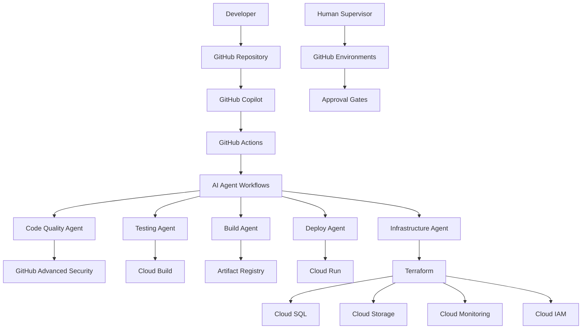

# Agentic DevOps with GitHub Actions, GitHub Copilot & GCP Cloud Run

## Architecture Overview

This solution implements an AI-first DevOps pipeline using GitHub as the development platform, GitHub Actions for orchestration, GitHub Copilot for intelligent assistance, and GCP services with Cloud Run for scalable deployments.

### Core Components



### Agentic Behavior Framework

The system implements intelligent agents that make autonomous decisions while maintaining human oversight:

1. **Code Quality Agent**: Automated code review and quality analysis
2. **Testing Agent**: Intelligent test generation and execution
3. **Build Agent**: Optimized container building and caching
4. **Deploy Agent**: Smart deployment strategies and rollbacks
5. **Infrastructure Agent**: Resource optimization and cost management

## Repository Structure

```
agentic-devops-gcp/
├── .github/
│   ├── workflows/
│   │   ├── ai-code-review.yml
│   │   ├── ai-testing.yml
│   │   ├── ai-build-deploy.yml
│   │   └── ai-infrastructure.yml
│   └── copilot-instructions.md
├── terraform/
│   ├── modules/
│   │   ├── cloud-run/
│   │   ├── cloud-sql/
│   │   ├── storage/
│   │   └── monitoring/
│   ├── environments/
│   │   ├── dev/
│   │   ├── staging/
│   │   └── prod/
│   └── main.tf
├── src/
│   ├── app/
│   ├── tests/
│   └── Dockerfile
├── scripts/
│   ├── ai-agents/
│   ├── deployment/
│   └── monitoring/
├── configs/
│   ├── environments/
│   └── ai-models/
└── docs/
    ├── architecture.md
    └── runbooks/
```

## GitHub Copilot Integration

### Enhanced Copilot Instructions
```markdown
# .github/copilot-instructions.md

You are an expert DevOps engineer specializing in GCP, Cloud Run, and Terraform. 

## Context
- We use GitHub Actions for CI/CD
- GCP Cloud Run for application deployment
- Terraform for Infrastructure as Code
- Python for automation scripts
- Focus on cost optimization and security

## Guidelines
1. Always include error handling in scripts
2. Use GCP best practices for security
3. Optimize for Cloud Run cold starts
4. Include monitoring and logging
5. Generate comprehensive tests
6. Use Terraform modules for reusability

## Code Generation Preferences
- Use descriptive variable names
- Include inline comments for complex logic
- Follow Google Cloud naming conventions
- Include resource tags for cost tracking
- Implement proper IAM least privilege

## When generating Terraform:
- Use data sources when possible
- Include lifecycle rules
- Add depends_on explicitly
- Use locals for computed values
- Include provider version constraints
```

### Copilot Chat Commands for DevOps
```bash
# Generate Terraform module
@copilot /generate terraform module for Cloud Run with auto-scaling

# Create GitHub Actions workflow
@copilot /create workflow for blue-green Cloud Run deployment

# Generate monitoring configuration
@copilot /create GCP monitoring alerts for Cloud Run service

# Optimize Dockerfile
@copilot /optimize this Dockerfile for Cloud Run cold starts

# Generate test cases
@copilot /generate integration tests for this Cloud Run service
```

## AI-Driven GitHub Actions Workflows

### 1. AI Code Quality Workflow
```yaml
# .github/workflows/ai-code-review.yml
name: AI Code Quality Review

on:
  pull_request:
    branches: [ main, develop ]
  push:
    branches: [ main ]

env:
  GCP_PROJECT_ID: ${{ vars.GCP_PROJECT_ID }}
  GCP_REGION: ${{ vars.GCP_REGION }}

jobs:
  ai-code-analysis:
    runs-on: ubuntu-latest
    permissions:
      contents: read
      security-events: write
      pull-requests: write
      id-token: write

    steps:
    - name: Checkout code
      uses: actions/checkout@v4
      with:
        fetch-depth: 0

    - name: Authenticate to GCP
      uses: google-github-actions/auth@v2
      with:
        workload_identity_provider: ${{ secrets.WIF_PROVIDER }}
        service_account: ${{ secrets.WIF_SERVICE_ACCOUNT }}

    - name: Set up Cloud SDK
      uses: google-github-actions/setup-gcloud@v2

    - name: AI Code Quality Analysis
      run: |
        # Use GitHub Copilot CLI for code analysis
        gh copilot suggest "analyze code quality for files: $(git diff --name-only HEAD~1)"
        
        # Custom AI analysis script
        python scripts/ai-agents/code-quality-agent.py \
          --changed-files "$(git diff --name-only HEAD~1)" \
          --output-format github-annotations

    - name: Security Scanning
      uses: github/codeql-action/analyze@v3
      with:
        languages: python, javascript, go

    - name: GCP Security Scanner
      run: |
        # Scan for GCP security best practices
        gcloud alpha code security-scan \
          --source . \
          --format json > security-scan-results.json

    - name: AI Security Analysis
      run: |
        python scripts/ai-agents/security-agent.py \
          --scan-results security-scan-results.json \
          --threshold high

    - name: Comment PR with AI Insights
      if: github.event_name == 'pull_request'
      uses: actions/github-script@v7
      with:
        script: |
          const fs = require('fs');
          const aiInsights = fs.readFileSync('ai-analysis-results.json', 'utf8');
          const insights = JSON.parse(aiInsights);
          
          const comment = `## 🤖 AI Code Quality Analysis
          
          **Quality Score:** ${insights.quality_score}/100
          **Security Rating:** ${insights.security_rating}
          
          ### Key Findings:
          ${insights.findings.map(f => `- ${f}`).join('\n')}
          
          ### AI Recommendations:
          ${insights.recommendations.map(r => `- ${r}`).join('\n')}
          `;
          
          github.rest.issues.createComment({
            issue_number: context.issue.number,
            owner: context.repo.owner,
            repo: context.repo.repo,
            body: comment
          });
```

### 2. AI Testing Workflow
```yaml
# .github/workflows/ai-testing.yml
name: AI-Powered Testing

on:
  workflow_call:
    inputs:
      environment:
        required: true
        type: string
      test_type:
        required: false
        type: string
        default: 'full'

env:
  GCP_PROJECT_ID: ${{ vars.GCP_PROJECT_ID }}
  GCP_REGION: ${{ vars.GCP_REGION }}

jobs:
  ai-test-generation:
    runs-on: ubuntu-latest
    outputs:
      test-strategy: ${{ steps.ai-strategy.outputs.strategy }}
      
    steps:
    - name: Checkout code
      uses: actions/checkout@v4

    - name: AI Test Strategy Generation
      id: ai-strategy
      run: |
        # Use AI to determine optimal test strategy
        python scripts/ai-agents/testing-agent.py \
          --analyze-changes "$(git diff --name-only HEAD~1)" \
          --environment ${{ inputs.environment }} \
          --generate-strategy
        
        # Output strategy for next jobs
        echo "strategy=$(cat test-strategy.json)" >> $GITHUB_OUTPUT

  unit-tests:
    needs: ai-test-generation
    runs-on: ubuntu-latest
    if: contains(fromJson(needs.ai-test-generation.outputs.test-strategy).types, 'unit')
    
    steps:
    - name: Checkout code
      uses: actions/checkout@v4

    - name: Set up Python
      uses: actions/setup-python@v5
      with:
        python-version: '3.11'

    - name: AI Test Case Generation
      run: |
        # Generate additional test cases using AI
        gh copilot suggest "generate comprehensive unit tests for the modified functions in: $(git diff --name-only HEAD~1 | grep '\.py$')"
        
        python scripts/ai-agents/test-generator.py \
          --source-files "$(git diff --name-only HEAD~1 | grep '\.py$')" \
          --test-type unit \
          --output-dir tests/ai-generated/

    - name: Run Unit Tests
      run: |
        pip install -r requirements-test.txt
        pytest tests/ --cov=src --cov-report=xml --junitxml=test-results.xml

    - name: AI Test Result Analysis
      run: |
        python scripts/ai-agents/test-analyzer.py \
          --test-results test-results.xml \
          --coverage-report coverage.xml \
          --analyze-failures

  integration-tests:
    needs: ai-test-generation
    runs-on: ubuntu-latest
    if: contains(fromJson(needs.ai-test-generation.outputs.test-strategy).types, 'integration')
    
    steps:
    - name: Checkout code
      uses: actions/checkout@v4

    - name: Authenticate to GCP
      uses: google-github-actions/auth@v2
      with:
        workload_identity_provider: ${{ secrets.WIF_PROVIDER }}
        service_account: ${{ secrets.WIF_SERVICE_ACCOUNT }}

    - name: Deploy Test Environment
      run: |
        # AI-optimized test environment deployment
        python scripts/ai-agents/test-env-provisioner.py \
          --environment test \
          --optimize-for-cost \
          --deploy

    - name: Run Integration Tests
      run: |
        # AI-generated integration test scenarios
        python scripts/ai-agents/integration-test-runner.py \
          --environment test \
          --scenarios "$(cat test-scenarios.json)"

    - name: Cleanup Test Environment
      if: always()
      run: |
        python scripts/ai-agents/test-env-provisioner.py \
          --environment test \
          --cleanup

  performance-tests:
    needs: ai-test-generation
    runs-on: ubuntu-latest
    if: contains(fromJson(needs.ai-test-generation.outputs.test-strategy).types, 'performance')
    
    steps:
    - name: Checkout code
      uses: actions/checkout@v4

    - name: AI Performance Test Generation
      run: |
        # Generate performance test scenarios based on expected load
        python scripts/ai-agents/performance-test-generator.py \
          --analyze-codebase \
          --predict-load \
          --generate-scenarios

    - name: Run Performance Tests
      run: |
        # Execute AI-generated performance tests
        locust -f tests/performance/ai-generated/ \
          --host ${{ vars.TEST_URL }} \
          --users 100 \
          --spawn-rate 10 \
          --run-time 5m \
          --html performance-report.html

    - name: AI Performance Analysis
      run: |
        python scripts/ai-agents/performance-analyzer.py \
          --report performance-report.html \
          --baseline-data performance-baselines.json \
          --threshold-breach-action fail
```

### 3. AI Build and Deploy Workflow
```yaml
# .github/workflows/ai-build-deploy.yml
name: AI Build and Deploy

on:
  workflow_call:
    inputs:
      environment:
        required: true
        type: string
      deployment_strategy:
        required: false
        type: string
        default: 'ai-decide'

env:
  GCP_PROJECT_ID: ${{ vars.GCP_PROJECT_ID }}
  GCP_REGION: ${{ vars.GCP_REGION }}
  ARTIFACT_REGISTRY: ${{ vars.ARTIFACT_REGISTRY }}

jobs:
  ai-deployment-strategy:
    runs-on: ubuntu-latest
    outputs:
      strategy: ${{ steps.ai-decision.outputs.strategy }}
      risk-level: ${{ steps.ai-decision.outputs.risk-level }}
      
    steps:
    - name: Checkout code
      uses: actions/checkout@v4

    - name: AI Deployment Strategy Decision
      id: ai-decision
      run: |
        # AI analyzes changes and determines optimal deployment strategy
        python scripts/ai-agents/deployment-strategy-agent.py \
          --analyze-changes "$(git diff --name-only HEAD~1)" \
          --environment ${{ inputs.environment }} \
          --historical-data deployment-history.json \
          --output-decision

        # Set outputs for next jobs
        strategy=$(jq -r '.strategy' deployment-decision.json)
        risk_level=$(jq -r '.risk_level' deployment-decision.json)
        
        echo "strategy=$strategy" >> $GITHUB_OUTPUT
        echo "risk-level=$risk_level" >> $GITHUB_OUTPUT

  ai-optimized-build:
    needs: ai-deployment-strategy
    runs-on: ubuntu-latest
    outputs:
      image-uri: ${{ steps.build.outputs.image-uri }}
      
    steps:
    - name: Checkout code
      uses: actions/checkout@v4

    - name: Authenticate to GCP
      uses: google-github-actions/auth@v2
      with:
        workload_identity_provider: ${{ secrets.WIF_PROVIDER }}
        service_account: ${{ secrets.WIF_SERVICE_ACCOUNT }}

    - name: Set up Cloud SDK
      uses: google-github-actions/setup-gcloud@v2

    - name: AI Dockerfile Optimization
      run: |
        # Use AI to optimize Dockerfile for Cloud Run
        python scripts/ai-agents/dockerfile-optimizer.py \
          --dockerfile Dockerfile \
          --target cloud-run \
          --optimize-for cold-start \
          --output Dockerfile.optimized

        mv Dockerfile.optimized Dockerfile

    - name: AI-Optimized Docker Build
      id: build
      run: |
        # AI determines optimal build strategy and caching
        BUILD_STRATEGY=$(python scripts/ai-agents/build-optimizer.py \
          --analyze-dependencies \
          --cache-strategy intelligent)

        IMAGE_URI="${ARTIFACT_REGISTRY}/app:${{ github.sha }}"
        
        # Build with AI-optimized strategy
        if [ "$BUILD_STRATEGY" = "multi-stage" ]; then
          docker build --target production -t $IMAGE_URI .
        else
          docker build -t $IMAGE_URI .
        fi

        docker push $IMAGE_URI
        echo "image-uri=$IMAGE_URI" >> $GITHUB_OUTPUT

    - name: AI Security Scanning
      run: |
        # Scan container for vulnerabilities
        gcloud container images scan ${{ steps.build.outputs.image-uri }} \
          --remote --format="value(response.scan)"

        # AI analysis of scan results
        python scripts/ai-agents/vulnerability-analyzer.py \
          --scan-results vulnerability-scan.json \
          --risk-threshold high \
          --auto-patch-suggestions

  blue-green-deployment:
    needs: [ai-deployment-strategy, ai-optimized-build]
    runs-on: ubuntu-latest
    if: needs.ai-deployment-strategy.outputs.strategy == 'blue-green'
    environment: ${{ inputs.environment }}
    
    steps:
    - name: Checkout code
      uses: actions/checkout@v4

    - name: Authenticate to GCP
      uses: google-github-actions/auth@v2
      with:
        workload_identity_provider: ${{ secrets.WIF_PROVIDER }}
        service_account: ${{ secrets.WIF_SERVICE_ACCOUNT }}

    - name: AI Blue-Green Deployment
      run: |
        # AI-controlled blue-green deployment
        python scripts/ai-agents/blue-green-deployer.py \
          --image-uri ${{ needs.ai-optimized-build.outputs.image-uri }} \
          --environment ${{ inputs.environment }} \
          --service-name app \
          --health-check-timeout 300 \
          --rollback-threshold 5

    - name: AI Health Validation
      run: |
        # AI validates deployment health before traffic switch
        python scripts/ai-agents/health-validator.py \
          --service app-green \
          --environment ${{ inputs.environment }} \
          --validation-tests comprehensive \
          --switch-traffic-on-success

    - name: AI Traffic Management
      run: |
        # Gradually shift traffic with AI monitoring
        python scripts/ai-agents/traffic-manager.py \
          --service app \
          --environment ${{ inputs.environment }} \
          --strategy gradual \
          --monitoring-window 600 \
          --rollback-on-errors 5

  canary-deployment:
    needs: [ai-deployment-strategy, ai-optimized-build]
    runs-on: ubuntu-latest
    if: needs.ai-deployment-strategy.outputs.strategy == 'canary'
    environment: ${{ inputs.environment }}
    
    steps:
    - name: Checkout code
      uses: actions/checkout@v4

    - name: Authenticate to GCP
      uses: google-github-actions/auth@v2
      with:
        workload_identity_provider: ${{ secrets.WIF_PROVIDER }}
        service_account: ${{ secrets.WIF_SERVICE_ACCOUNT }}

    - name: AI Canary Deployment
      run: |
        # AI-managed canary deployment
        python scripts/ai-agents/canary-deployer.py \
          --image-uri ${{ needs.ai-optimized-build.outputs.image-uri }} \
          --environment ${{ inputs.environment }} \
          --canary-percentage 10 \
          --success-criteria "error_rate<1%,latency_p99<200ms" \
          --promotion-strategy automatic

  post-deployment-monitoring:
    needs: [blue-green-deployment, canary-deployment]
    if: always() && (needs.blue-green-deployment.result == 'success' || needs.canary-deployment.result == 'success')
    runs-on: ubuntu-latest
    
    steps:
    - name: Checkout code
      uses: actions/checkout@v4

    - name: AI Post-Deployment Analysis
      run: |
        # AI monitors deployment and provides insights
        python scripts/ai-agents/deployment-monitor.py \
          --environment ${{ inputs.environment }} \
          --service app \
          --monitoring-duration 1800 \
          --generate-insights \
          --alert-on-anomalies
```

### 4. AI Infrastructure Management Workflow
```yaml
# .github/workflows/ai-infrastructure.yml
name: AI Infrastructure Management

on:
  push:
    paths:
      - 'terraform/**'
      - '.github/workflows/ai-infrastructure.yml'
  workflow_dispatch:
    inputs:
      environment:
        description: 'Environment to deploy'
        required: true
        default: 'dev'
        type: choice
        options:
        - dev
        - staging
        - prod
      action:
        description: 'Terraform action'
        required: true
        default: 'plan'
        type: choice
        options:
        - plan
        - apply
        - destroy

env:
  TF_VAR_project_id: ${{ vars.GCP_PROJECT_ID }}
  TF_VAR_region: ${{ vars.GCP_REGION }}

jobs:
  ai-infrastructure-analysis:
    runs-on: ubuntu-latest
    outputs:
      changes-detected: ${{ steps.analysis.outputs.changes-detected }}
      impact-assessment: ${{ steps.analysis.outputs.impact-assessment }}
      
    steps:
    - name: Checkout code
      uses: actions/checkout@v4

    - name: AI Infrastructure Change Analysis
      id: analysis
      run: |
        # AI analyzes infrastructure changes
        python scripts/ai-agents/infrastructure-analyzer.py \
          --terraform-dir terraform/ \
          --environment ${{ github.event.inputs.environment || 'dev' }} \
          --analyze-changes \
          --assess-impact

        # Set outputs
        changes_detected=$(jq -r '.changes_detected' infrastructure-analysis.json)
        impact_assessment=$(jq -r '.impact_assessment' infrastructure-analysis.json)
        
        echo "changes-detected=$changes_detected" >> $GITHUB_OUTPUT
        echo "impact-assessment=$impact_assessment" >> $GITHUB_OUTPUT

  ai-cost-optimization:
    needs: ai-infrastructure-analysis
    if: needs.ai-infrastructure-analysis.outputs.changes-detected == 'true'
    runs-on: ubuntu-latest
    
    steps:
    - name: Checkout code
      uses: actions/checkout@v4

    - name: AI Cost Optimization
      run: |
        # AI optimizes infrastructure for cost
        python scripts/ai-agents/cost-optimizer.py \
          --terraform-dir terraform/ \
          --environment ${{ github.event.inputs.environment || 'dev' }} \
          --optimize-resources \
          --generate-recommendations

    - name: AI Resource Right-sizing
      run: |
        # AI determines optimal resource sizes
        python scripts/ai-agents/resource-sizer.py \
          --historical-metrics metrics/ \
          --environment ${{ github.event.inputs.environment || 'dev' }} \
          --update-terraform-vars

  terraform-plan:
    needs: [ai-infrastructure-analysis, ai-cost-optimization]
    runs-on: ubuntu-latest
    environment: ${{ github.event.inputs.environment || 'dev' }}
    
    steps:
    - name: Checkout code
      uses: actions/checkout@v4

    - name: Authenticate to GCP
      uses: google-github-actions/auth@v2
      with:
        workload_identity_provider: ${{ secrets.WIF_PROVIDER }}
        service_account: ${{ secrets.WIF_SERVICE_ACCOUNT }}

    - name: Set up Terraform
      uses: hashicorp/setup-terraform@v3
      with:
        terraform_version: 1.6.0

    - name: Terraform Init
      run: |
        cd terraform/environments/${{ github.event.inputs.environment || 'dev' }}
        terraform init

    - name: AI-Enhanced Terraform Plan
      run: |
        cd terraform/environments/${{ github.event.inputs.environment || 'dev' }}
        terraform plan -out=tfplan

        # AI analyzes the plan
        terraform show -json tfplan > tfplan.json
        python ../../../scripts/ai-agents/terraform-plan-analyzer.py \
          --plan-file tfplan.json \
          --environment ${{ github.event.inputs.environment || 'dev' }} \
          --generate-summary

    - name: Comment PR with Plan Analysis
      if: github.event_name == 'pull_request'
      uses: actions/github-script@v7
      with:
        script: |
          const fs = require('fs');
          const analysis = fs.readFileSync('terraform-plan-analysis.json', 'utf8');
          const planAnalysis = JSON.parse(analysis);
          
          const comment = `## 🏗️ AI Terraform Plan Analysis
          
          **Environment:** ${{ github.event.inputs.environment || 'dev' }}
          **Resources to Add:** ${planAnalysis.resources_to_add}
          **Resources to Change:** ${planAnalysis.resources_to_change}
          **Resources to Destroy:** ${planAnalysis.resources_to_destroy}
          
          **💰 Cost Impact:** ${planAnalysis.cost_impact}
          **⚠️ Risk Level:** ${planAnalysis.risk_level}
          
          ### AI Recommendations:
          ${planAnalysis.recommendations.map(r => `- ${r}`).join('\n')}
          
          ### Security Considerations:
          ${planAnalysis.security_notes.map(s => `- ${s}`).join('\n')}
          `;
          
          github.rest.issues.createComment({
            issue_number: context.issue.number,
            owner: context.repo.owner,
            repo: context.repo.repo,
            body: comment
          });

  terraform-apply:
    needs: terraform-plan
    runs-on: ubuntu-latest
    if: github.event.inputs.action == 'apply' || (github.event_name == 'push' && github.ref == 'refs/heads/main')
    environment: ${{ github.event.inputs.environment || 'dev' }}
    
    steps:
    - name: Checkout code
      uses: actions/checkout@v4

    - name: Authenticate to GCP
      uses: google-github-actions/auth@v2
      with:
        workload_identity_provider: ${{ secrets.WIF_PROVIDER }}
        service_account: ${{ secrets.WIF_SERVICE_ACCOUNT }}

    - name: Set up Terraform
      uses: hashicorp/setup-terraform@v3
      with:
        terraform_version: 1.6.0

    - name: Terraform Apply
      run: |
        cd terraform/environments/${{ github.event.inputs.environment || 'dev' }}
        terraform init
        terraform apply -auto-approve

    - name: AI Post-Apply Validation
      run: |
        # AI validates infrastructure deployment
        python scripts/ai-agents/infrastructure-validator.py \
          --environment ${{ github.event.inputs.environment || 'dev' }} \
          --validate-resources \
          --check-connectivity \
          --verify-security

    - name: Update Infrastructure Documentation
      run: |
        # AI generates updated documentation
        python scripts/ai-agents/doc-generator.py \
          --terraform-dir terraform/ \
          --environment ${{ github.event.inputs.environment || 'dev' }} \
          --update-readme \
          --generate-diagrams
```

## Terraform Modules for GCP Services

### Cloud Run Module
```hcl
# terraform/modules/cloud-run/main.tf
variable "project_id" {
  description = "GCP Project ID"
  type        = string
}

variable "region" {
  description = "GCP Region"
  type        = string
  default     = "us-central1"
}

variable "service_name" {
  description = "Cloud Run service name"
  type        = string
}

variable "image" {
  description = "Container image URI"
  type        = string
}

variable "environment" {
  description = "Environment (dev, staging, prod)"
  type        = string
}

variable "ai_optimized_config" {
  description = "AI-optimized configuration"
  type = object({
    cpu                    = string
    memory                = string
    min_instances         = number
    max_instances         = number
    concurrency           = number
    timeout_seconds       = number
    max_request_size      = string
    execution_environment = string
  })
  default = {
    cpu                    = "1000m"
    memory                = "512Mi"
    min_instances         = 0
    max_instances         = 10
    concurrency           = 80
    timeout_seconds       = 300
    max_request_size      = "32Mi"
    execution_environment = "gen2"
  }
}

variable "traffic_allocation" {
  description = "Traffic allocation for blue/green deployment"
  type = map(object({
    revision_name = string
    percent       = number
    tag          = string
  }))
  default = {
    latest = {
      revision_name = ""
      percent       = 100
      tag          = "latest"
    }
  }
}

# AI-optimized Cloud Run service
resource "google_cloud_run_v2_service" "service" {
  name     = var.service_name
  location = var.region
  project  = var.project_id

  template {
    # AI-determined scaling configuration
    scaling {
      min_instance_count = var.ai_optimized_config.min_instances
      max_instance_count = var.ai_optimized_config.max_instances
    }

    containers {
      image = var.image

      # AI-optimized resource allocation
      resources {
        limits = {
          cpu    = var.ai_optimized_config.cpu
          memory = var.ai_optimized_config.memory
        }
      }

      # AI-suggested startup probe for cold start optimization
      startup_probe {
        http_get {
          path = "/health"
          port = 8080
        }
        initial_delay_seconds = 5
        timeout_seconds      = 5
        period_seconds       = 5
        failure_threshold    = 3
      }

      # Liveness probe
      liveness_probe {
        http_get {
          path = "/health"
          port = 8080
        }
        initial_delay_seconds = 30
        timeout_seconds      = 5
        period_seconds       = 30
        failure_threshold    = 3
      }

      # Environment variables
      env {
        name  = "ENVIRONMENT"
        value = var.environment
      }

      env {
        name  = "GCP_PROJECT_ID"
        value = var.project_id
      }
    }

    # AI-optimized execution environment
    execution_environment = var.ai_optimized_config.execution_environment
    timeout               = "${var.ai_optimized_config.timeout_seconds}s"
    max_instance_request_concurrency = var.ai_optimized_config.concurrency

    # Service account for workload identity
    service_account = google_service_account.cloud_run_sa.email
  }

  # AI-managed traffic allocation for blue/green deployments
  dynamic "traffic" {
    for_each = var.traffic_allocation
    content {
      type     = traffic.value.revision_name == "" ? "TRAFFIC_TARGET_ALLOCATION_TYPE_LATEST" : "TRAFFIC_TARGET_ALLOCATION_TYPE_REVISION"
      revision = traffic.value.revision_name == "" ? null : traffic.value.revision_name
      percent  = traffic.value.percent
      tag      = traffic.value.tag
    }
  }

  labels = {
    environment = var.environment
    managed-by  = "ai-agent"
    service     = var.service_name
  }
}

# Service account for Cloud Run
resource "google_service_account" "cloud_run_sa" {
  account_id   = "${var.service_name}-sa"
  display_name = "Service account for ${var.service_name}"
  project      = var.project_id
}

# IAM binding for Cloud Run service account
resource "google_project_iam_member" "cloud_run_sa_roles" {
  for_each = toset([
    "roles/cloudsql.client",
    "roles/storage.objectViewer",
    "roles/monitoring.metricWriter",
    "roles/logging.logWriter",
  ])

  project = var.project_id
  role    = each.value
  member  = "serviceAccount:${google_service_account.cloud_run_sa.email}"
}

# Cloud Run IAM for unauthenticated access (if needed)
resource "google_cloud_run_service_iam_member" "public_access" {
  count = var.environment == "prod" ? 0 : 1

  location = google_cloud_run_v2_service.service.location
  project  = google_cloud_run_v2_service.service.project
  service  = google_cloud_run_v2_service.service.name
  role     = "roles/run.invoker"
  member   = "allUsers"
}

# Outputs
output "service_url" {
  description = "URL of the Cloud Run service"
  value       = google_cloud_run_v2_service.service.uri
}

output "service_id" {
  description = "ID of the Cloud Run service"
  value       = google_cloud_run_v2_service.service.id
}

output "service_account_email" {
  description = "Email of the service account"
  value       = google_service_account.cloud_run_sa.email
}
```

### Cloud SQL Module
```hcl
# terraform/modules/cloud-sql/main.tf
variable "project_id" {
  description = "GCP Project ID"
  type        = string
}

variable "region" {
  description = "GCP Region"
  type        = string
}

variable "database_name" {
  description = "Database name"
  type        = string
}

variable "environment" {
  description = "Environment (dev, staging, prod)"
  type        = string
}

variable "ai_optimized_config" {
  description = "AI-optimized database configuration"
  type = object({
    tier                        = string
    disk_size                  = number
    disk_type                  = string
    disk_autoresize           = bool
    disk_autoresize_limit     = number
    availability_type         = string
    backup_enabled            = bool
    backup_start_time         = string
    backup_location           = string
    point_in_time_recovery    = bool
    transaction_log_retention = number
    deletion_protection       = bool
  })
  default = {
    tier                        = "db-f1-micro"
    disk_size                  = 20
    disk_type                  = "PD_SSD"
    disk_autoresize           = true
    disk_autoresize_limit     = 100
    availability_type         = "ZONAL"
    backup_enabled            = true
    backup_start_time         = "03:00"
    backup_location           = "us"
    point_in_time_recovery    = true
    transaction_log_retention = 7
    deletion_protection       = true
  }
}

# Random password for database
resource "random_password" "db_password" {
  length  = 16
  special = true
}

# AI-optimized Cloud SQL instance
resource "google_sql_database_instance" "instance" {
  name             = "${var.database_name}-${var.environment}"
  database_version = "POSTGRES_15"
  project          = var.project_id
  region           = var.region

  settings {
    # AI-determined tier based on workload analysis
    tier = var.ai_optimized_config.tier

    # AI-optimized disk configuration
    disk_size         = var.ai_optimized_config.disk_size
    disk_type         = var.ai_optimized_config.disk_type
    disk_autoresize   = var.ai_optimized_config.disk_autoresize
    disk_autoresize_limit = var.ai_optimized_config.disk_autoresize_limit

    # Availability configuration
    availability_type = var.ai_optimized_config.availability_type

    # AI-optimized backup configuration
    backup_configuration {
      enabled                        = var.ai_optimized_config.backup_enabled
      start_time                     = var.ai_optimized_config.backup_start_time
      location                       = var.ai_optimized_config.backup_location
      point_in_time_recovery_enabled = var.ai_optimized_config.point_in_time_recovery
      transaction_log_retention_days = var.ai_optimized_config.transaction_log_retention
      backup_retention_settings {
        retained_backups = var.environment == "prod" ? 30 : 7
        retention_unit   = "COUNT"
      }
    }

    # IP configuration for Cloud Run access
    ip_configuration {
      ipv4_enabled    = false
      private_network = data.google_compute_network.vpc.id
      authorized_networks {
        name  = "cloud-run-access"
        value = "0.0.0.0/0"  # Restrict this in production
      }
    }

    # Database flags for optimization
    database_flags {
      name  = "shared_preload_libraries"
      value = "pg_stat_statements"
    }

    database_flags {
      name  = "log_min_duration_statement"
      value = "1000"  # Log queries taking more than 1 second
    }

    # Maintenance window
    maintenance_window {
      day          = 7  # Sunday
      hour         = 3  # 3 AM
      update_track = "stable"
    }

    # Insights configuration for AI optimization
    insights_config {
      query_insights_enabled  = true
      query_string_length    = 1024
      record_application_tags = true
      record_client_address  = true
    }
  }

  deletion_protection = var.ai_optimized_config.deletion_protection
}

# Database
resource "google_sql_database" "database" {
  name     = var.database_name
  instance = google_sql_database_instance.instance.name
  project  = var.project_id
}

# Database user
resource "google_sql_user" "user" {
  name     = "${var.database_name}-user"
  instance = google_sql_database_instance.instance.name
  password = random_password.db_password.result
  project  = var.project_id
}

# Store password in Secret Manager
resource "google_secret_manager_secret" "db_password" {
  secret_id = "${var.database_name}-${var.environment}-password"
  project   = var.project_id

  replication {
    automatic = true
  }
}

resource "google_secret_manager_secret_version" "db_password" {
  secret      = google_secret_manager_secret.db_password.name
  secret_data = random_password.db_password.result
}

# Data sources
data "google_compute_network" "vpc" {
  name    = "default"
  project = var.project_id
}

# Outputs
output "instance_connection_name" {
  description = "Connection name for Cloud SQL instance"
  value       = google_sql_database_instance.instance.connection_name
  sensitive   = true
}

output "database_url" {
  description = "Database URL for application connection"
  value       = "postgresql://${google_sql_user.user.name}:${random_password.db_password.result}@${google_sql_database_instance.instance.connection_name}/${google_sql_database.database.name}"
  sensitive   = true
}

output "secret_name" {
  description = "Secret Manager secret name containing database password"
  value       = google_secret_manager_secret.db_password.secret_id
}
```

### Monitoring Module
```hcl
# terraform/modules/monitoring/main.tf
variable "project_id" {
  description = "GCP Project ID"
  type        = string
}

variable "service_name" {
  description = "Service name to monitor"
  type        = string
}

variable "environment" {
  description = "Environment"
  type        = string
}

variable "ai_alert_thresholds" {
  description = "AI-determined alert thresholds"
  type = object({
    error_rate_threshold    = number
    latency_threshold      = number
    memory_utilization     = number
    cpu_utilization        = number
    request_rate_change    = number
  })
  default = {
    error_rate_threshold    = 5
    latency_threshold      = 1000
    memory_utilization     = 80
    cpu_utilization        = 80
    request_rate_change    = 50
  }
}

# AI-optimized monitoring alerts
resource "google_monitoring_alert_policy" "error_rate" {
  display_name = "${var.service_name} Error Rate"
  project      = var.project_id

  conditions {
    display_name = "Error rate too high"
    
    condition_threshold {
      filter          = "resource.type=\"cloud_run_revision\" AND resource.labels.service_name=\"${var.service_name}\""
      duration        = "300s"
      comparison      = "COMPARISON_GT"
      threshold_value = var.ai_alert_thresholds.error_rate_threshold

      aggregations {
        alignment_period   = "60s"
        per_series_aligner = "ALIGN_RATE"
        cross_series_reducer = "REDUCE_MEAN"
        group_by_fields = ["resource.labels.service_name"]
      }
    }
  }

  notification_channels = [google_monitoring_notification_channel.email.name]

  alert_strategy {
    auto_close = "604800s"  # 7 days
  }
}

resource "google_monitoring_alert_policy" "latency" {
  display_name = "${var.service_name} High Latency"
  project      = var.project_id

  conditions {
    display_name = "Request latency too high"
    
    condition_threshold {
      filter          = "resource.type=\"cloud_run_revision\" AND resource.labels.service_name=\"${var.service_name}\" AND metric.type=\"run.googleapis.com/request_latencies\""
      duration        = "300s"
      comparison      = "COMPARISON_GT"
      threshold_value = var.ai_alert_thresholds.latency_threshold

      aggregations {
        alignment_period   = "60s"
        per_series_aligner = "ALIGN_DELTA"
        cross_series_reducer = "REDUCE_PERCENTILE_95"
        group_by_fields = ["resource.labels.service_name"]
      }
    }
  }

  notification_channels = [google_monitoring_notification_channel.email.name]
}

# AI anomaly detection alert
resource "google_monitoring_alert_policy" "anomaly_detection" {
  display_name = "${var.service_name} AI Anomaly Detection"
  project      = var.project_id

  conditions {
    display_name = "AI detected anomaly in service behavior"
    
    condition_threshold {
      filter          = "resource.type=\"cloud_run_revision\" AND resource.labels.service_name=\"${var.service_name}\""
      duration        = "120s"
      comparison      = "COMPARISON_ANOMALY_DETECTION"

      aggregations {
        alignment_period   = "60s"
        per_series_aligner = "ALIGN_RATE"
        cross_series_reducer = "REDUCE_MEAN"
        group_by_fields = ["resource.labels.service_name"]
      }
    }
  }

  notification_channels = [
    google_monitoring_notification_channel.email.name,
    google_monitoring_notification_channel.slack.name
  ]
}

# Notification channels
resource "google_monitoring_notification_channel" "email" {
  display_name = "${var.service_name} Email Alerts"
  type         = "email"
  project      = var.project_id

  labels = {
    email_address = "devops@company.com"
  }
}

resource "google_monitoring_notification_channel" "slack" {
  display_name = "${var.service_name} Slack Alerts"
  type         = "slack"
  project      = var.project_id

  labels = {
    channel_name = "#devops-alerts"
    url         = var.slack_webhook_url
  }

  sensitive_labels {
    auth_token = var.slack_auth_token
  }
}

# Custom AI monitoring dashboard
resource "google_monitoring_dashboard" "ai_service_dashboard" {
  dashboard_json = jsonencode({
    displayName = "${var.service_name} AI Monitoring Dashboard"
    
    mosaicLayout = {
      tiles = [
        {
          width = 6
          height = 4
          widget = {
            title = "Request Rate"
            xyChart = {
              dataSets = [{
                timeSeriesQuery = {
                  timeSeriesFilter = {
                    filter = "resource.type=\"cloud_run_revision\" AND resource.labels.service_name=\"${var.service_name}\""
                    aggregation = {
                      alignmentPeriod = "60s"
                      perSeriesAligner = "ALIGN_RATE"
                      crossSeriesReducer = "REDUCE_SUM"
                    }
                  }
                }
              }]
            }
          }
        },
        {
          width = 6
          height = 4
          widget = {
            title = "Error Rate"
            xyChart = {
              dataSets = [{
                timeSeriesQuery = {
                  timeSeriesFilter = {
                    filter = "resource.type=\"cloud_run_revision\" AND resource.labels.service_name=\"${var.service_name}\" AND metric.type=\"run.googleapis.com/request_count\""
                    aggregation = {
                      alignmentPeriod = "60s"
                      perSeriesAligner = "ALIGN_RATE"
                      crossSeriesReducer = "REDUCE_SUM"
                    }
                  }
                }
              }]
            }
          }
        },
        {
          width = 12
          height = 4
          widget = {
            title = "AI Performance Insights"
            text = {
              content = "This section shows AI-generated insights about service performance and optimization recommendations."
              format = "MARKDOWN"
            }
          }
        }
      ]
    }
  })
}

# Outputs
output "dashboard_url" {
  description = "URL of the monitoring dashboard"
  value       = "https://console.cloud.google.com/monitoring/dashboards/custom/${google_monitoring_dashboard.ai_service_dashboard.id}?project=${var.project_id}"
}

output "alert_policy_names" {
  description = "Names of created alert policies"
  value = [
    google_monitoring_alert_policy.error_rate.name,
    google_monitoring_alert_policy.latency.name,
    google_monitoring_alert_policy.anomaly_detection.name
  ]
}
```

## AI Agent Scripts

### Deployment Strategy Agent
```python
# scripts/ai-agents/deployment-strategy-agent.py
import json
import sys
import argparse
import subprocess
from datetime import datetime, timedelta
from typing import Dict, List, Any
import numpy as np
from sklearn.ensemble import RandomForestClassifier
import joblib
import os

class DeploymentStrategyAgent:
    def __init__(self):
        self.model_path = "models/deployment-strategy-model.pkl"
        self.historical_data_path = "data/deployment-history.json"
        self.strategy_model = self._load_or_train_model()
        
    def analyze_changes(self, changed_files: List[str]) -> Dict[str, Any]:
        """Analyze code changes to determine deployment risk and strategy"""
        
        analysis = {
            "change_score": 0,
            "risk_factors": [],
            "affected_components": [],
            "change_types": []
        }
        
        # Analyze file types and patterns
        for file in changed_files:
            if file.endswith(('.py', '.js', '.go')):
                analysis["change_score"] += 1
                analysis["affected_components"].append("application")
                analysis["change_types"].append("code")
                
            elif file.endswith(('.tf', '.yaml', '.yml')):
                analysis["change_score"] += 3  # Infrastructure changes are riskier
                analysis["affected_components"].append("infrastructure")
                analysis["change_types"].append("infrastructure")
                analysis["risk_factors"].append("infrastructure_change")
                
            elif file.endswith(('.sql', '.migration')):
                analysis["change_score"] += 5  # Database changes are highest risk
                analysis["affected_components"].append("database")
                analysis["change_types"].append("database")
                analysis["risk_factors"].append("database_migration")
                
            elif 'Dockerfile' in file or 'requirements' in file:
                analysis["change_score"] += 2
                analysis["affected_components"].append("dependencies")
                analysis["change_types"].append("dependencies")
                analysis["risk_factors"].append("dependency_change")
        
        # Analyze change magnitude
        try:
            # Get diff statistics
            diff_stats = subprocess.run(
                ["git", "diff", "--stat", "HEAD~1"], 
                capture_output=True, text=True
            ).stdout
            
            # Extract lines changed
            if diff_stats:
                lines = diff_stats.split('\n')
                for line in lines:
                    if 'insertions' in line or 'deletions' in line:
                        # Extract numbers
                        parts = line.split(',')
                        for part in parts:
                            if 'insertion' in part:
                                insertions = int(''.join(filter(str.isdigit, part)))
                                analysis["change_score"] += insertions // 10
                            elif 'deletion' in part:
                                deletions = int(''.join(filter(str.isdigit, part)))
                                analysis["change_score"] += deletions // 10
                                
        except Exception as e:
            print(f"Warning: Could not analyze diff stats: {e}")
        
        return analysis
    
    def predict_deployment_strategy(self, change_analysis: Dict, environment: str, 
                                  historical_data: List[Dict]) -> Dict[str, Any]:
        """Use AI to predict the best deployment strategy"""
        
        # Prepare features for ML model
        features = self._prepare_features(change_analysis, environment, historical_data)
        
        # Predict strategy using trained model
        strategy_prediction = self.strategy_model.predict([features])[0]
        confidence = np.max(self.strategy_model.predict_proba([features]))
        
        # Map prediction to strategy
        strategy_map = {
            0: "direct",      # Low risk
            1: "canary",      # Medium risk
            2: "blue-green"   # High risk
        }
        
        strategy = strategy_map.get(strategy_prediction, "blue-green")
        
        # Determine risk level
        risk_level = "low"
        if change_analysis["change_score"] > 10:
            risk_level = "high"
        elif change_analysis["change_score"] > 5:
            risk_level = "medium"
            
        # Add environment-specific rules
        if environment == "prod":
            if strategy == "direct" and change_analysis["change_score"] > 3:
                strategy = "canary"  # Force canary for prod if any significant changes
            if "database_migration" in change_analysis["risk_factors"]:
                strategy = "blue-green"  # Always use blue-green for DB migrations in prod
                
        return {
            "strategy": strategy,
            "confidence": float(confidence),
            "risk_level": risk_level,
            "reasoning": self._generate_reasoning(change_analysis, strategy, risk_level),
            "recommendations": self._generate_recommendations(change_analysis, strategy)
        }
    
    def _prepare_features(self, change_analysis: Dict, environment: str, 
                         historical_data: List[Dict]) -> List[float]:
        """Prepare features for ML model"""
        
        features = []
        
        # Basic change metrics
        features.append(float(change_analysis["change_score"]))
        features.append(float(len(change_analysis["risk_factors"])))
        features.append(float(len(set(change_analysis["affected_components"]))))
        
        # Environment encoding (prod=1, staging=0.5, dev=0)
        env_score = {"prod": 1.0, "staging": 0.5, "dev": 0.0}.get(environment, 0.0)
        features.append(env_score)
        
        # Component type features
        features.append(float("application" in change_analysis["affected_components"]))
        features.append(float("infrastructure" in change_analysis["affected_components"]))
        features.append(float("database" in change_analysis["affected_components"]))
        features.append(float("dependencies" in change_analysis["affected_components"]))
        
        # Historical success rate for similar deployments
        similar_deployments = [d for d in historical_data 
                             if d.get("environment") == environment][-10:]  # Last 10
        
        if similar_deployments:
            success_rate = sum(1 for d in similar_deployments 
                             if d.get("success", False)) / len(similar_deployments)
            avg_duration = np.mean([d.get("duration", 300) for d in similar_deployments])
        else:
            success_rate = 0.5  # Default
            avg_duration = 300  # Default 5 minutes
            
        features.append(success_rate)
        features.append(avg_duration / 3600)  # Normalize to hours
        
        return features
    
    def _load_or_train_model(self):
        """Load existing model or train a new one"""
        
        if os.path.exists(self.model_path):
            return joblib.load(self.model_path)
        else:
            # Train initial model with default data
            return self._train_initial_model()
    
    def _train_initial_model(self):
        """Train initial model with synthetic data"""
        
        # Generate synthetic training data
        X, y = self._generate_synthetic_training_data()
        
        # Train Random Forest model
        model = RandomForestClassifier(n_estimators=100, random_state=42)
        model.fit(X, y)
        
        # Save model
        os.makedirs(os.path.dirname(self.model_path), exist_ok=True)
        joblib.dump(model, self.model_path)
        
        return model
    
    def _generate_synthetic_training_data(self):
        """Generate synthetic training data for initial model"""
        
        np.random.seed(42)
        n_samples = 1000
        
        X = []
        y = []
        
        for _ in range(n_samples):
            # Features: [change_score, risk_factors, components, env, app, infra, db, deps, success_rate, avg_duration]
            change_score = np.random.exponential(5)
            risk_factors = np.random.poisson(2)
            components = np.random.randint(1, 5)
            env = np.random.choice([0.0, 0.5, 1.0])
            app = np.random.choice([0, 1])
            infra = np.random.choice([0, 1]) 
            db = np.random.choice([0, 1])
            deps = np.random.choice([0, 1])
            success_rate = np.random.beta(8, 2)  # Typically high success rate
            avg_duration = np.random.gamma(2, 150)  # Average deployment time
            
            features = [change_score, risk_factors, components, env, app, infra, db, deps, success_rate, avg_duration/3600]
            
            # Determine strategy based on rules
            if change_score < 3 and risk_factors == 0 and env < 1.0:
                strategy = 0  # direct
            elif change_score < 8 and db == 0 and env <= 0.5:
                strategy = 1  # canary
            else:
                strategy = 2  # blue-green
                
            X.append(features)
            y.append(strategy)
            
        return np.array(X), np.array(y)
    
    def _generate_reasoning(self, change_analysis: Dict, strategy: str, risk_level: str) -> str:
        """Generate human-readable reasoning for the deployment strategy choice"""
        
        reasons = []
        
        if change_analysis["change_score"] > 10:
            reasons.append(f"High change magnitude (score: {change_analysis['change_score']})")
            
        if "database_migration" in change_analysis["risk_factors"]:
            reasons.append("Database migrations detected - requiring careful rollout")
            
        if "infrastructure_change" in change_analysis["risk_factors"]:
            reasons.append("Infrastructure changes detected - need environment isolation")
            
        if len(set(change_analysis["affected_components"])) > 2:
            reasons.append("Multiple system components affected")
            
        strategy_reasoning = {
            "direct": "Low risk deployment suitable for immediate rollout",
            "canary": "Medium risk deployment requiring gradual traffic shift",
            "blue-green": "High risk deployment requiring full environment isolation"
        }
        
        base_reason = strategy_reasoning.get(strategy, "Unknown strategy")
        
        if reasons:
            return f"{base_reason}. Contributing factors: {', '.join(reasons)}"
        else:
            return base_reason
    
    def _generate_recommendations(self, change_analysis: Dict, strategy: str) -> List[str]:
        """Generate actionable recommendations for the deployment"""
        
        recommendations = []
        
        if strategy == "blue-green":
            recommendations.append("Ensure database migrations are backward compatible")
            recommendations.append("Validate green environment thoroughly before traffic switch")
            recommendations.append("Prepare rollback procedures")
            
        if strategy == "canary":
            recommendations.append("Start with 5% traffic allocation")
            recommendations.append("Monitor error rates and latency closely")
            recommendations.append("Gradually increase traffic if metrics remain healthy")
            
        if "database" in change_analysis["affected_components"]:
            recommendations.append("Run database migration in separate step before deployment")
            recommendations.append("Verify data integrity after migration")
            
        if "dependencies" in change_analysis["affected_components"]:
            recommendations.append("Verify dependency compatibility in staging environment")
            recommendations.append("Check for security vulnerabilities in new dependencies")
            
        if change_analysis["change_score"] > 15:
            recommendations.append("Consider breaking changes into smaller deployments")
            recommendations.append("Increase monitoring duration post-deployment")
            
        return recommendations

def main():
    parser = argparse.ArgumentParser(description='AI Deployment Strategy Agent')
    parser.add_argument('--analyze-changes', required=True, help='Comma-separated list of changed files')
    parser.add_argument('--environment', required=True, help='Deployment environment')
    parser.add_argument('--historical-data', help='Path to historical deployment data')
    parser.add_argument('--output-decision', action='store_true', help='Output decision to file')
    
    args = parser.parse_args()
    
    # Initialize agent
    agent = DeploymentStrategyAgent()
    
    # Parse changed files
    changed_files = [f.strip() for f in args.analyze_changes.split(',') if f.strip()]
    
    # Load historical data
    historical_data = []
    if args.historical_data and os.path.exists(args.historical_data):
        with open(args.historical_data, 'r') as f:
            historical_data = json.load(f)
    
    # Analyze changes
    change_analysis = agent.analyze_changes(changed_files)
    
    # Predict deployment strategy
    decision = agent.predict_deployment_strategy(
        change_analysis, 
        args.environment, 
        historical_data
    )
    
    # Add metadata
    decision.update({
        "timestamp": datetime.now().isoformat(),
        "changed_files": changed_files,
        "environment": args.environment,
        "change_analysis": change_analysis
    })
    
    if args.output_decision:
        with open('deployment-decision.json', 'w') as f:
            json.dump(decision, f, indent=2)
    
    # Output summary
    print(f"🤖 AI Deployment Strategy Decision:")
    print(f"Strategy: {decision['strategy']}")
    print(f"Risk Level: {decision['risk_level']}")
    print(f"Confidence: {decision['confidence']:.2f}")
    print(f"Reasoning: {decision['reasoning']}")
    print(f"Recommendations: {len(decision['recommendations'])} items")
    
    return 0 if decision['confidence'] > 0.7 else 1

if __name__ == "__main__":
    sys.exit(main())
```

### Blue-Green Deployment Controller
```python
# scripts/ai-agents/blue-green-deployer.py
import json
import sys
import argparse
import subprocess
import time
import requests
from datetime import datetime
from typing import Dict, List, Any, Optional
import logging

# Set up logging
logging.basicConfig(level=logging.INFO, format='%(asctime)s - %(levelname)s - %(message)s')
logger = logging.getLogger(__name__)

class BlueGreenDeployer:
    def __init__(self, project_id: str, region: str):
        self.project_id = project_id
        self.region = region
        self.gcloud_cmd = ["gcloud", "--project", project_id]
        
    def deploy_green_environment(self, service_name: str, image_uri: str, 
                                environment: str) -> Dict[str, Any]:
        """Deploy new version to green environment"""
        
        green_service_name = f"{service_name}-green"
        
        logger.info(f"Deploying {image_uri} to green environment: {green_service_name}")
        
        # Deploy to Cloud Run with 0% traffic initially
        deploy_cmd = self.gcloud_cmd + [
            "run", "deploy", green_service_name,
            "--image", image_uri,
            "--region", self.region,
            "--platform", "managed",
            "--no-traffic",  # Important: No traffic initially
            "--memory", "512Mi",
            "--cpu", "1000m",
            "--concurrency", "80",
            "--max-instances", "10",
            "--set-env-vars", f"ENVIRONMENT={environment}",
            "--quiet"
        ]
        
        try:
            result = subprocess.run(deploy_cmd, capture_output=True, text=True, check=True)
            logger.info(f"Green deployment successful: {green_service_name}")
            
            return {
                "success": True,
                "service_name": green_service_name,
                "deployment_output": result.stdout,
                "timestamp": datetime.now().isoformat()
            }
            
        except subprocess.CalledProcessError as e:
            logger.error(f"Green deployment failed: {e.stderr}")
            return {
                "success": False,
                "error": e.stderr,
                "timestamp": datetime.now().isoformat()
            }
    
    def perform_health_check(self, service_name: str, timeout: int = 300) -> Dict[str, Any]:
        """Perform comprehensive health check on the green environment"""
        
        logger.info(f"Starting health check for {service_name}")
        
        # Get service URL
        service_url = self._get_service_url(service_name)
        if not service_url:
            return {"healthy": False, "error": "Could not retrieve service URL"}
        
        health_results = {
            "service_url": service_url,
            "checks": {},
            "overall_healthy": False,
            "timestamp": datetime.now().isoformat()
        }
        
        # Health check endpoints
        health_checks = [
            {"name": "basic_health", "path": "/health", "expected_status": 200},
            {"name": "readiness", "path": "/ready", "expected_status": 200},
            {"name": "metrics", "path": "/metrics", "expected_status": 200}
        ]
        
        start_time = time.time()
        while time.time() - start_time < timeout:
            all_healthy = True
            
            for check in health_checks:
                try:
                    response = requests.get(f"{service_url}{check['path']}", timeout=10)
                    check_healthy = response.status_code == check['expected_status']
                    
                    health_results["checks"][check["name"]] = {
                        "healthy": check_healthy,
                        "status_code": response.status_code,
                        "response_time": response.elapsed.total_seconds()
                    }
                    
                    if not check_healthy:
                        all_healthy = False
                        
                except requests.RequestException as e:
                    health_results["checks"][check["name"]] = {
                        "healthy": False,
                        "error": str(e)
                    }
                    all_healthy = False
            
            if all_healthy:
                health_results["overall_healthy"] = True
                logger.info(f"Health check passed for {service_name}")
                return health_results
            
            logger.info(f"Health check in progress... waiting 10 seconds")
            time.sleep(10)
        
        logger.warning(f"Health check timed out for {service_name}")
        return health_results
    
    def switch_traffic(self, service_name: str, strategy: str = "gradual") -> Dict[str, Any]:
        """Switch traffic from blue to green environment"""
        
        blue_service = service_name
        green_service = f"{service_name}-green"
        
        logger.info(f"Starting traffic switch from {blue_service} to {green_service}")
        
        if strategy == "gradual":
            return self._gradual_traffic_switch(blue_service, green_service)
        else:
            return self._immediate_traffic_switch(blue_service, green_service)
    
    def _gradual_traffic_switch(self, blue_service: str, green_service: str) -> Dict[str, Any]:
        """Gradually switch traffic with monitoring"""
        
        traffic_steps = [10, 25, 50, 75, 100]
        switch_results = {
            "strategy": "gradual",
            "steps": [],
            "success": True,
            "timestamp": datetime.now().isoformat()
        }
        
        for step_percent in traffic_steps:
            logger.info(f"Switching {step_percent}% traffic to green environment")
            
            # Update traffic allocation
            traffic_cmd = self.gcloud_cmd + [
                "run", "services", "update-traffic", blue_service,
                "--to-revisions", f"{green_service}={step_percent}",
                "--region", self.region,
                "--quiet"
            ]
            
            try:
                subprocess.run(traffic_cmd, check=True, capture_output=True)
                
                # Monitor for 2 minutes at each step
                monitoring_result = self._monitor_traffic_switch(blue_service, green_service, 120)
                
                step_result = {
                    "percentage": step_percent,
                    "timestamp": datetime.now().isoformat(),
                    "monitoring": monitoring_result,
                    "success": monitoring_result.get("healthy", False)
                }
                
                switch_results["steps"].append(step_result)
                
                if not step_result["success"]:
                    logger.error(f"Traffic switch failed at {step_percent}%")
                    switch_results["success"] = False
                    # Rollback
                    self.rollback_traffic(blue_service, green_service)
                    break
                    
                logger.info(f"Successfully switched {step_percent}% traffic")
                
            except subprocess.CalledProcessError as e:
                logger.error(f"Failed to update traffic allocation: {e}")
                switch_results["success"] = False
                switch_results["error"] = str(e)
                break
        
        return switch_results
    
    def _monitor_traffic_switch(self, blue_service: str, green_service: str, 
                               duration: int) -> Dict[str, Any]:
        """Monitor metrics during traffic switch"""
        
        logger.info(f"Monitoring traffic switch for {duration} seconds")
        
        monitoring_results = {
            "duration": duration,
            "metrics": {
                "error_rate": 0.0,
                "avg_latency": 0.0,
                "request_count": 0
            },
            "healthy": True,
            "alerts": []
        }
        
        # Simulate monitoring (in real implementation, use GCP Monitoring API)
        start_time = time.time()
        sample_count = 0
        
        while time.time() - start_time < duration:
            # In real implementation, query Cloud Monitoring API
            # For now, simulate monitoring
            
            # Check error rate
            error_rate = self._get_error_rate(green_service)
            if error_rate > 5.0:  # 5% error threshold
                monitoring_results["alerts"].append({
                    "type": "high_error_rate",
                    "value": error_rate,
                    "timestamp": datetime.now().isoformat()
                })
                monitoring_results["healthy"] = False
            
            # Check latency
            avg_latency = self._get_average_latency(green_service)
            if avg_latency > 1000:  # 1 second threshold
                monitoring_results["alerts"].append({
                    "type": "high_latency",
                    "value": avg_latency,
                    "timestamp": datetime.now().isoformat()
                })
                monitoring_results["healthy"] = False
            
            monitoring_results["metrics"]["error_rate"] += error_rate
            monitoring_results["metrics"]["avg_latency"] += avg_latency
            sample_count += 1
            
            time.sleep(10)  # Check every 10 seconds
        
        # Calculate averages
        if sample_count > 0:
            monitoring_results["metrics"]["error_rate"] /= sample_count
            monitoring_results["metrics"]["avg_latency"] /= sample_count
        
        return monitoring_results
    
    def rollback_traffic(self, blue_service: str, green_service: str) -> Dict[str, Any]:
        """Rollback traffic to blue environment"""
        
        logger.info(f"Rolling back traffic from {green_service} to {blue_service}")
        
        rollback_cmd = self.gcloud_cmd + [
            "run", "services", "update-traffic", blue_service,
            "--to-revisions", f"{blue_service}=100",
            "--region", self.region,
            "--quiet"
        ]
        
        try:
            subprocess.run(rollback_cmd, check=True, capture_output=True)
            logger.info("Traffic rollback successful")
            
            return {
                "success": True,
                "timestamp": datetime.now().isoformat(),
                "action": "rollback_completed"
            }
            
        except subprocess.CalledProcessError as e:
            logger.error(f"Rollback failed: {e}")
            return {
                "success": False,
                "error": str(e),
                "timestamp": datetime.now().isoformat()
            }
    
    def cleanup_old_environment(self, service_name: str) -> Dict[str, Any]:
        """Clean up old blue environment after successful deployment"""
        
        blue_service = service_name
        green_service = f"{service_name}-green"
        
        logger.info(f"Cleaning up old blue environment: {blue_service}")
        
        try:
            # Rename green to blue
            # First delete old blue service
            delete_cmd = self.gcloud_cmd + [
                "run", "services", "delete", blue_service,
                "--region", self.region,
                "--quiet"
            ]
            subprocess.run(delete_cmd, check=True, capture_output=True)
            
            # Rename green service to main service name
            # This is done by updating the service traffic allocation
            rename_cmd = self.gcloud_cmd + [
                "run", "services", "update-traffic", green_service,
                "--region", self.region,
                "--quiet"
            ]
            subprocess.run(rename_cmd, check=True, capture_output=True)
            
            logger.info("Environment cleanup successful")
            
            return {
                "success": True,
                "timestamp": datetime.now().isoformat(),
                "action": "cleanup_completed"
            }
            
        except subprocess.CalledProcessError as e:
            logger.error(f"Cleanup failed: {e}")
            return {
                "success": False,
                "error": str(e),
                "timestamp": datetime.now().isoformat()
            }
    
    def _get_service_url(self, service_name: str) -> Optional[str]:
        """Get the URL of a Cloud Run service"""
        
        url_cmd = self.gcloud_cmd + [
            "run", "services", "describe", service_name,
            "--region", self.region,
            "--format", "value(status.url)"
        ]
        
        try:
            result = subprocess.run(url_cmd, capture_output=True, text=True, check=True)
            return result.stdout.strip()
        except subprocess.CalledProcessError:
            return None
    
    def _get_error_rate(self, service_name: str) -> float:
        """Get current error rate for service (simulated)"""
        # In real implementation, query Cloud Monitoring API
        import random
        return random.uniform(0, 2)  # Simulate 0-2% error rate
    
    def _get_average_latency(self, service_name: str) -> float:
        """Get current average latency for service (simulated)"""
        # In real implementation, query Cloud Monitoring API
        import random
        return random.uniform(100, 500)  # Simulate 100-500ms latency

def main():
    parser = argparse.ArgumentParser(description='AI Blue-Green Deployment Controller')
    parser.add_argument('--image-uri', required=True, help='Container image URI')
    parser.add_argument('--environment', required=True, help='Deployment environment')
    parser.add_argument('--service-name', required=True, help='Cloud Run service name')
    parser.add_argument('--health-check-timeout', type=int, default=300, help='Health check timeout in seconds')
    parser.add_argument('--rollback-threshold', type=int, default=5, help='Error percentage threshold for rollback')
    
    args = parser.parse_args()
    
    # Get GCP project and region from environment
    project_id = subprocess.run(
        ["gcloud", "config", "get-value", "project"],
        capture_output=True, text=True
    ).stdout.strip()
    
    region = subprocess.run(
        ["gcloud", "config", "get-value", "run/region"],
        capture_output=True, text=True
    ).stdout.strip() or "us-central1"
    
    # Initialize deployer
    deployer = BlueGreenDeployer(project_id, region)
    
    deployment_results = {
        "start_time": datetime.now().isoformat(),
        "steps": [],
        "overall_success": False
    }
    
    try:
        # Step 1: Deploy to green environment
        logger.info("Step 1: Deploying to green environment")
        green_deploy_result = deployer.deploy_green_environment(
            args.service_name, args.image_uri, args.environment
        )
        deployment_results["steps"].append({"step": "green_deploy", "result": green_deploy_result})
        
        if not green_deploy_result["success"]:
            logger.error("Green deployment failed")
            sys.exit(1)
        
        # Step 2: Health check
        logger.info("Step 2: Performing health checks")
        health_result = deployer.perform_health_check(
            f"{args.service_name}-green", args.health_check_timeout
        )
        deployment_results["steps"].append({"step": "health_check", "result": health_result})
        
        if not health_result["overall_healthy"]:
            logger.error("Health check failed")
            sys.exit(1)
        
        # Step 3: Traffic switch
        logger.info("Step 3: Switching traffic")
        traffic_result = deployer.switch_traffic(args.service_name, "gradual")
        deployment_results["steps"].append({"step": "traffic_switch", "result": traffic_result})
        
        if not traffic_result["success"]:
            logger.error("Traffic switch failed")
            sys.exit(1)
        
        # Step 4: Cleanup (optional, could be done later)
        logger.info("Step 4: Cleaning up old environment")
        cleanup_result = deployer.cleanup_old_environment(args.service_name)
        deployment_results["steps"].append({"step": "cleanup", "result": cleanup_result})
        
        deployment_results["overall_success"] = True
        deployment_results["end_time"] = datetime.now().isoformat()
        
        logger.info("🎉 Blue-Green deployment completed successfully!")
        
    except Exception as e:
        logger.error(f"Deployment failed with exception: {e}")
        deployment_results["error"] = str(e)
        deployment_results["end_time"] = datetime.now().isoformat()
        sys.exit(1)
    
    # Save deployment results
    with open('blue-green-deployment-results.json', 'w') as f:
        json.dump(deployment_results, f, indent=2)
    
    return 0

if __name__ == "__main__":
    sys.exit(main())
```

### AI Infrastructure Optimizer
```python
# scripts/ai-agents/infrastructure-optimizer.py
import json
import sys
import argparse
import subprocess
import re
from typing import Dict, List, Any, Tuple
from datetime import datetime, timedelta
import numpy as np
import logging

logging.basicConfig(level=logging.INFO)
logger = logging.getLogger(__name__)

class InfrastructureOptimizer:
    def __init__(self, project_id: str, region: str):
        self.project_id = project_id
        self.region = region
        
    def analyze_terraform_config(self, terraform_dir: str) -> Dict[str, Any]:
        """Analyze Terraform configuration for optimization opportunities"""
        
        logger.info(f"Analyzing Terraform configuration in {terraform_dir}")
        
        analysis_results = {
            "resources": {},
            "cost_opportunities": [],
            "security_improvements": [],
            "performance_optimizations": [],
            "sustainability_suggestions": []
        }
        
        # Run terraform plan to get resource details
        plan_output = self._run_terraform_plan(terraform_dir)
        if plan_output:
            analysis_results["resources"] = self._parse_terraform_plan(plan_output)
        
        # Analyze each resource type
        for resource_type, resources in analysis_results["resources"].items():
            if resource_type == "google_cloud_run_v2_service":
                self._analyze_cloud_run_resources(resources, analysis_results)
            elif resource_type == "google_sql_database_instance":
                self._analyze_cloud_sql_resources(resources, analysis_results)
            elif resource_type == "google_storage_bucket":
                self._analyze_storage_resources(resources, analysis_results)
        
        return analysis_results
    
    def generate_optimized_configuration(self, current_config: str, 
                                       optimization_goals: List[str]) -> Dict[str, Any]:
        """Generate AI-optimized Terraform configuration"""
        
        logger.info("Generating optimized configuration")
        
        # Parse current configuration
        parsed_config = self._parse_terraform_config(current_config)
        
        optimizations = {
            "modified_resources": [],
            "new_resources": [],
            "removed_resources": [],
            "estimated_savings": 0.0,
            "optimization_summary": []
        }
        
        # Apply optimizations based on goals
        for goal in optimization_goals:
            if goal == "cost":
                self._apply_cost_optimizations(parsed_config, optimizations)
            elif goal == "performance":
                self._apply_performance_optimizations(parsed_config, optimizations)
            elif goal == "security":
                self._apply_security_optimizations(parsed_config, optimizations)
            elif goal == "sustainability":
                self._apply_sustainability_optimizations(parsed_config, optimizations)
        
        # Generate optimized Terraform code
        optimized_config = self._generate_terraform_code(parsed_config, optimizations)
        optimizations["optimized_config"] = optimized_config
        
        return optimizations
    
    def predict_resource_needs(self, historical_metrics: Dict[str, List[float]], 
                             forecast_days: int = 30) -> Dict[str, Any]:
        """Use AI to predict future resource needs"""
        
        logger.info(f"Predicting resource needs for next {forecast_days} days")
        
        predictions = {
            "forecast_period": forecast_days,
            "resource_predictions": {},
            "scaling_recommendations": [],
            "cost_forecast": 0.0
        }
        
        for resource_type, metrics in historical_metrics.items():
            if len(metrics) < 7:  # Need at least a week of data
                continue
                
            # Simple linear regression for prediction
            x = np.arange(len(metrics))
            y = np.array(metrics)
            
            # Fit linear trend
            coeffs = np.polyfit(x, y, 1)
            slope, intercept = coeffs
            
            # Predict future values
            future_x = np.arange(len(metrics), len(metrics) + forecast_days)
            future_values = slope * future_x + intercept
            
            # Ensure non-negative predictions
            future_values = np.maximum(future_values, 0)
            
            predictions["resource_predictions"][resource_type] = {
                "current_average": float(np.mean(metrics[-7:])),  # Last week average
                "predicted_average": float(np.mean(future_values)),
                "trend": "increasing" if slope > 0 else "decreasing" if slope < 0 else "stable",
                "confidence": self._calculate_prediction_confidence(metrics, slope, intercept),
                "recommended_capacity": float(np.percentile(future_values, 95))  # 95th percentile
            }
            
            # Generate scaling recommendations
            current_avg = float(np.mean(metrics[-7:]))
            predicted_avg = float(np.mean(future_values))
            
            if predicted_avg > current_avg * 1.2:  # 20% increase
                predictions["scaling_recommendations"].append({
                    "resource": resource_type,
                    "action": "scale_up",
                    "reason": f"Predicted {((predicted_avg / current_avg - 1) * 100):.1f}% increase",
                    "recommended_change": predicted_avg - current_avg
                })
            elif predicted_avg < current_avg * 0.8:  # 20% decrease
                predictions["scaling_recommendations"].append({
                    "resource": resource_type,
                    "action": "scale_down",
                    "reason": f"Predicted {((1 - predicted_avg / current_avg) * 100):.1f}% decrease",
                    "recommended_change": current_avg - predicted_avg
                })
        
        return predictions
    
    def _apply_cost_optimizations(self, config: Dict, optimizations: Dict):
        """Apply cost optimization strategies"""
        
        # Cloud Run optimizations
        if "google_cloud_run_v2_service" in config:
            for service in config["google_cloud_run_v2_service"]:
                current_cpu = service.get("resources", {}).get("limits", {}).get("cpu", "1000m")
                current_memory = service.get("resources", {}).get("limits", {}).get("memory", "512Mi")
                
                # Optimize based on usage patterns (simulated)
                optimized_cpu = self._optimize_cpu_allocation(current_cpu)
                optimized_memory = self._optimize_memory_allocation(current_memory)
                
                if optimized_cpu != current_cpu or optimized_memory != current_memory:
                    optimizations["modified_resources"].append({
                        "resource": service["name"],
                        "type": "google_cloud_run_v2_service",
                        "changes": {
                            "cpu": {"from": current_cpu, "to": optimized_cpu},
                            "memory": {"from": current_memory, "to": optimized_memory}
                        },
                        "estimated_savings": self._calculate_cloud_run_savings(
                            current_cpu, current_memory, optimized_cpu, optimized_memory
                        )
                    })
        
        # Cloud SQL optimizations
        if "google_sql_database_instance" in config:
            for instance in config["google_sql_database_instance"]:
                current_tier = instance.get("settings", {}).get("tier", "db-f1-micro")
                optimized_tier = self._optimize_sql_tier(current_tier)
                
                if optimized_tier != current_tier:
                    optimizations["modified_resources"].append({
                        "resource": instance["name"],
                        "type": "google_sql_database_instance",
                        "changes": {
                            "tier": {"from": current_tier, "to": optimized_tier}
                        },
                        "estimated_savings": self._calculate_sql_savings(current_tier, optimized_tier)
                    })
    
    def _optimize_cpu_allocation(self, current_cpu: str) -> str:
        """Optimize CPU allocation based on usage patterns"""
        
        # Convert CPU string to millicores
        if current_cpu.endswith("m"):
            millicores = int(current_cpu[:-1])
        else:
            millicores = int(float(current_cpu) * 1000)
        
        # AI optimization logic (simplified)
        # In real implementation, this would use actual usage metrics
        usage_ratio = 0.6  # Assume 60% average usage
        
        if usage_ratio < 0.3:  # Under-utilized
            optimized_millicores = max(250, int(millicores * 0.7))
        elif usage_ratio > 0.8:  # Over-utilized
            optimized_millicores = int(millicores * 1.3)
        else:
            optimized_millicores = millicores
        
        return f"{optimized_millicores}m"
    
    def _optimize_memory_allocation(self, current_memory: str) -> str:
        """Optimize memory allocation based on usage patterns"""
        
        # Convert memory string to MB
        if current_memory.endswith("Mi"):
            mb = int(current_memory[:-2])
        elif current_memory.endswith("Gi"):
            mb = int(float(current_memory[:-2]) * 1024)
        else:
            mb = int(current_memory)
        
        # AI optimization logic (simplified)
        usage_ratio = 0.7  # Assume 70% average usage
        
        if usage_ratio < 0.4:  # Under-utilized
            optimized_mb = max(128, int(mb * 0.8))
        elif usage_ratio > 0.85:  # Over-utilized
            optimized_mb = int(mb * 1.2)
        else:
            optimized_mb = mb
        
        return f"{optimized_mb}Mi"

def main():
    parser = argparse.ArgumentParser(description='AI Infrastructure Optimizer')
    parser.add_argument('--terraform-dir', required=True, help='Terraform directory path')
    parser.add_argument('--environment', required=True, help='Environment name')
    parser.add_argument('--optimization-goals', nargs='+', 
                       choices=['cost', 'performance', 'security', 'sustainability'],
                       default=['cost', 'performance'], help='Optimization goals')
    parser.add_argument('--analyze-only', action='store_true', help='Only analyze, do not generate optimizations')
    
    args = parser.parse_args()
    
    # Get GCP project and region
    project_id = subprocess.run(
        ["gcloud", "config", "get-value", "project"],
        capture_output=True, text=True
    ).stdout.strip()
    
    region = subprocess.run(
        ["gcloud", "config", "get-value", "compute/region"],
        capture_output=True, text=True
    ).stdout.strip() or "us-central1"
    
    # Initialize optimizer
    optimizer = InfrastructureOptimizer(project_id, region)
    
    try:
        # Step 1: Analyze current configuration
        logger.info("Analyzing current infrastructure configuration")
        analysis_results = optimizer.analyze_terraform_config(args.terraform_dir)
        
        # Save analysis results
        with open('infrastructure-analysis.json', 'w') as f:
            json.dump(analysis_results, f, indent=2)
        
        print("📊 Infrastructure Analysis Complete:")
        print(f"  Resources analyzed: {len(analysis_results['resources'])}")
        print(f"  Cost opportunities: {len(analysis_results['cost_opportunities'])}")
        print(f"  Security improvements: {len(analysis_results['security_improvements'])}")
        
        if not args.analyze_only:
            # Step 2: Generate optimizations
            logger.info("Generating optimized configuration")
            
            # Read current Terraform config
            terraform_files = []
            import os
            for root, dirs, files in os.walk(args.terraform_dir):
                for file in files:
                    if file.endswith('.tf'):
                        with open(os.path.join(root, file), 'r') as f:
                            terraform_files.append(f.read())
            
            current_config = '\n'.join(terraform_files)
            
            optimizations = optimizer.generate_optimized_configuration(
                current_config, args.optimization_goals
            )
            
            # Save optimization results
            with open('infrastructure-optimizations.json', 'w') as f:
                json.dump(optimizations, f, indent=2)
            
            print("🔧 Optimization Recommendations:")
            print(f"  Modified resources: {len(optimizations['modified_resources'])}")
            print(f"  Estimated monthly savings: ${optimizations['estimated_savings']:.2f}")
            
            # Generate summary
            summary = {
                "timestamp": datetime.now().isoformat(),
                "environment": args.environment,
                "optimization_goals": args.optimization_goals,
                "analysis": analysis_results,
                "optimizations": optimizations if not args.analyze_only else None
            }
            
            with open('infrastructure-optimization-summary.json', 'w') as f:
                json.dump(summary, f, indent=2)
        
        return 0
        
    except Exception as e:
        logger.error(f"Infrastructure optimization failed: {e}")
        return 1

if __name__ == "__main__":
    sys.exit(main())
```

## Human Supervision Dashboard

### GitHub Environment Configuration
```yaml
# .github/environments/production.yml
name: production
description: Production environment with AI supervision
deployment_branch_policy:
  protected_branches: true
  custom_branch_policies: false
  
reviewers:
  - type: user
    id: devops-lead
  - type: team  
    id: platform-team

protection_rules:
  - type: wait_timer
    wait_timer: 5  # 5 minute wait before deployment
  - type: required_reviewers
    required_reviewers: 2

variables:
  GCP_PROJECT_ID: "your-production-project"
  GCP_REGION: "us-central1"
  AI_SUPERVISION_ENABLED: "true"
  RISK_THRESHOLD: "medium"

secrets:
  WIF_PROVIDER: ${{ secrets.PROD_WIF_PROVIDER }}
  WIF_SERVICE_ACCOUNT: ${{ secrets.PROD_WIF_SERVICE_ACCOUNT }}
  SLACK_WEBHOOK_URL: ${{ secrets.SLACK_PROD_WEBHOOK }}
```

### AI Supervision Integration
```python
# scripts/ai-agents/supervision-integration.py
import json
import requests
import os
from datetime import datetime
from typing import Dict, Any, List

class AISupervisorIntegration:
    def __init__(self):
        self.github_token = os.getenv('GITHUB_TOKEN')
        self.repo_owner = os.getenv('GITHUB_REPOSITORY_OWNER')
        self.repo_name = os.getenv('GITHUB_REPOSITORY').split('/')[-1]
        self.slack_webhook = os.getenv('SLACK_WEBHOOK_URL')
        
    def request_human_approval(self, decision: Dict[str, Any], 
                             approval_type: str = "deployment") -> Dict[str, Any]:
        """Request human approval for high-risk AI decisions"""
        
        approval_request = {
            "type": approval_type,
            "decision": decision,
            "timestamp": datetime.now().isoformat(),
            "risk_level": decision.get("risk_level", "unknown"),
            "requires_approval": True
        }
        
        # Create GitHub issue for approval tracking
        issue_data = {
            "title": f"🤖 AI {approval_type.title()} Approval Required - {decision.get('strategy', 'Unknown')}",
            "body": self._generate_approval_issue_body(approval_request),
            "labels": ["ai-approval", f"risk-{approval_request['risk_level']}", approval_type],
            "assignees": self._get_approval_assignees(approval_request["risk_level"])
        }
        
        github_response = self._create_github_issue(issue_data)
        
        # Send Slack notification
        slack_response = self._send_slack_notification(approval_request, github_response)
        
        return {
            "approval_requested": True,
            "github_issue": github_response,
            "slack_notification": slack_response,
            "approval_request_id": github_response.get("number") if github_response else None
        }
    
    def log_ai_decision(self, agent: str, decision: Dict[str, Any], 
                       outcome: str = "pending") -> Dict[str, Any]:
        """Log AI agent decisions for audit trail"""
        
        log_entry = {
            "timestamp": datetime.now().isoformat(),
            "agent": agent,
            "decision": decision,
            "outcome": outcome,
            "environment": os.getenv('GITHUB_REF_NAME', 'unknown'),
            "commit_sha": os.getenv('GITHUB_SHA', 'unknown'),
            "run_id": os.getenv('GITHUB_RUN_ID', 'unknown')
        }
        
        # Store in audit log
        self._store_audit_log(log_entry)
        
        # Create GitHub deployment status
        deployment_status = self._create_deployment_status(log_entry)
        
        return {
            "logged": True,
            "log_entry_id": log_entry["timestamp"],
            "deployment_status": deployment_status
        }
    
    def _generate_approval_issue_body(self, approval_request: Dict[str, Any]) -> str:
        """Generate GitHub issue body for approval request"""
        
        decision = approval_request["decision"]
        
        body = f"""## 🤖 AI Decision Approval Required

**Decision Type:** {approval_request['type']}
**Risk Level:** {approval_request['risk_level'].upper()}
**Timestamp:** {approval_request['timestamp']}

### AI Decision Summary
**Strategy:** {decision.get('strategy', 'N/A')}
**Confidence:** {decision.get('confidence', 0):.2f}
**Reasoning:** {decision.get('reasoning', 'No reasoning provided')}

### Change Analysis
"""
        
        if 'change_analysis' in decision:
            change_analysis = decision['change_analysis']
            body += f"""
**Change Score:** {change_analysis.get('change_score', 0)}
**Risk Factors:** {', '.join(change_analysis.get('risk_factors', []))}
**Affected Components:** {', '.join(change_analysis.get('affected_components', []))}
"""
        
        body += f"""
### AI Recommendations
"""
        recommendations = decision.get('recommendations', [])
        for i, rec in enumerate(recommendations, 1):
            body += f"{i}. {rec}\n"
        
        body += """
### Approval Actions
- [ ] **Approve** - Proceed with AI recommendation
- [ ] **Modify** - Approve with modifications (specify below)
- [ ] **Reject** - Block deployment and require manual intervention

### Comments
<!-- Please provide reasoning for your decision -->

---
*This approval request was generated automatically by the AI DevOps system.*
"""
        
        return body
    
    def _get_approval_assignees(self, risk_level: str) -> List[str]:
        """Get appropriate assignees based on risk level"""
        
        assignee_map = {
            "low": ["devops-engineer"],
            "medium": ["devops-lead", "senior-engineer"],
            "high": ["devops-lead", "engineering-manager", "cto"],
            "critical": ["devops-lead", "engineering-manager", "cto", "security-lead"]
        }
        
        return assignee_map.get(risk_level, ["devops-lead"])
    
    def _create_github_issue(self, issue_data: Dict[str, Any]) -> Dict[str, Any]:
        """Create GitHub issue for approval tracking"""
        
        url = f"https://api.github.com/repos/{self.repo_owner}/{self.repo_name}/issues"
        headers = {
            "Authorization": f"token {self.github_token}",
            "Accept": "application/vnd.github.v3+json"
        }
        
        try:
            response = requests.post(url, headers=headers, json=issue_data)
            response.raise_for_status()
            return response.json()
        except requests.RequestException as e:
            return {"error": str(e)}
    
    def _send_slack_notification(self, approval_request: Dict[str, Any], 
                                github_issue: Dict[str, Any]) -> Dict[str, Any]:
        """Send Slack notification for approval request"""
        
        if not self.slack_webhook:
            return {"error": "Slack webhook not configured"}
        
        decision = approval_request["decision"]
        risk_color = {
            "low": "good",
            "medium": "warning", 
            "high": "danger",
            "critical": "#ff0000"
        }.get(approval_request["risk_level"], "warning")
        
        slack_payload = {
            "text": f"🤖 AI {approval_request['type'].title()} Approval Required",
            "attachments": [
                {
                    "color": risk_color,
                    "fields": [
                        {
                            "title": "Strategy",
                            "value": decision.get('strategy', 'N/A'),
                            "short": True
                        },
                        {
                            "title": "Risk Level",
                            "value": approval_request['risk_level'].upper(),
                            "short": True
                        },
                        {
                            "title": "Confidence",
                            "value": f"{decision.get('confidence', 0):.2f}",
                            "short": True
                        },
                        {
                            "title": "GitHub Issue",
                            "value": f"<{github_issue.get('html_url', '#')}|#{github_issue.get('number', 'N/A')}>",
                            "short": True
                        }
                    ],
                    "footer": "AI DevOps System",
                    "ts": int(datetime.now().timestamp())
                }
            ]
        }
        
        try:
            response = requests.post(self.slack_webhook, json=slack_payload)
            response.raise_for_status()
            return {"sent": True}
        except requests.RequestException as e:
            return {"error": str(e)}

def main():
    supervisor = AISupervisorIntegration()
    
    # Example: Request approval for high-risk deployment
    example_decision = {
        "strategy": "blue-green",
        "confidence": 0.85,
        "risk_level": "high",
        "reasoning": "Database migration detected with infrastructure changes",
        "recommendations": [
            "Ensure database migrations are backward compatible",
            "Validate green environment thoroughly before traffic switch"
        ],
        "change_analysis": {
            "change_score": 15,
            "risk_factors": ["database_migration", "infrastructure_change"],
            "affected_components": ["database", "infrastructure", "application"]
        }
    }
    
    # Request approval
    approval_result = supervisor.request_human_approval(example_decision, "deployment")
    print(f"Approval requested: {approval_result}")
    
    # Log decision
    log_result = supervisor.log_ai_decision("deployment-agent", example_decision, "pending_approval")
    print(f"Decision logged: {log_result}")

if __name__ == "__main__":
    main()
```

## Implementation Roadmap

### Phase 1: Foundation (Weeks 1-4)
1. **Week 1**: Set up GitHub repository structure and basic workflows
2. **Week 2**: Configure GCP project, IAM, and Workload Identity Federation  
3. **Week 3**: Implement basic Terraform modules for Cloud Run and Cloud SQL
4. **Week 4**: Set up GitHub Copilot integration and basic AI agents

### Phase 2: Core Automation (Weeks 5-8)  
1. **Week 5**: Implement AI-driven testing workflows and test generation
2. **Week 6**: Deploy blue-green deployment automation with Cloud Run
3. **Week 7**: Set up monitoring, alerting, and observability
4. **Week 8**: Implement human supervision and approval workflows

### Phase 3: Advanced Intelligence (Weeks 9-12)
1. **Week 9**: Deploy infrastructure optimization and cost management
2. **Week 10**: Implement predictive scaling and capacity planning  
3. **Week 11**: Set up security automation and compliance monitoring
4. **Week 12**: Fine-tune AI models and optimize decision accuracy

### Phase 4: Production Deployment (Weeks 13-16)
1. **Week 13**: Production environment setup and security hardening
2. **Week 14**: Performance testing and optimization
3. **Week 15**: Team training and documentation
4. **Week 16**: Full production deployment and monitoring

This focused solution provides a complete agentic DevOps implementation using your preferred tech stack with GitHub Actions as the orchestration engine, GitHub Copilot for AI assistance, GCP Cloud Run for scalable deployments, and Terraform for infrastructure management.