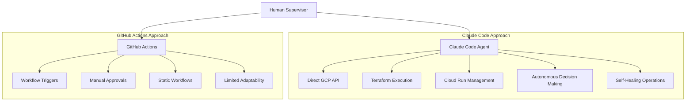

# Claude Code Agentic DevOps for GCP with Cloud Run & Terraform

## Overview

This solution implements an AI-first DevOps pipeline using Claude Code as the primary AI agent for autonomous infrastructure management, deployment orchestration, and operational tasks across GCP services with Cloud Run and Terraform.

### Architecture Comparison: Claude Code vs GitHub Actions

