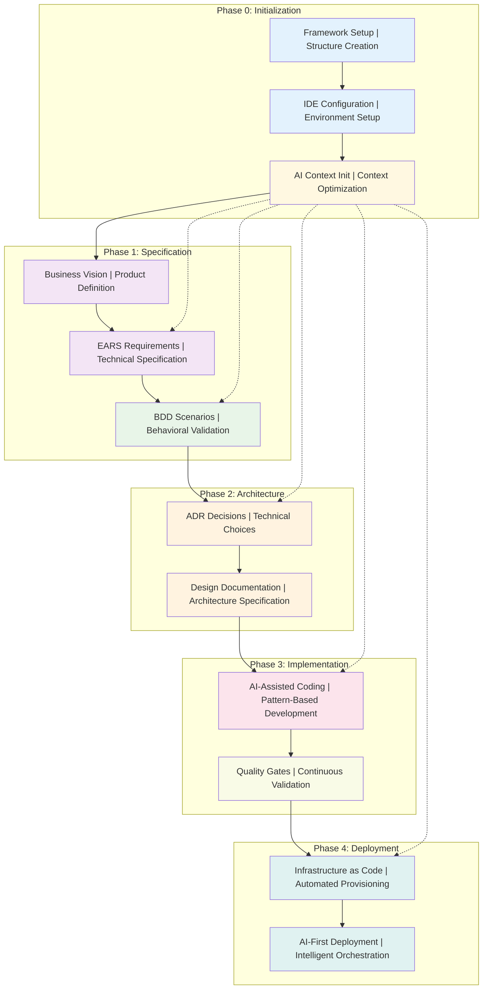
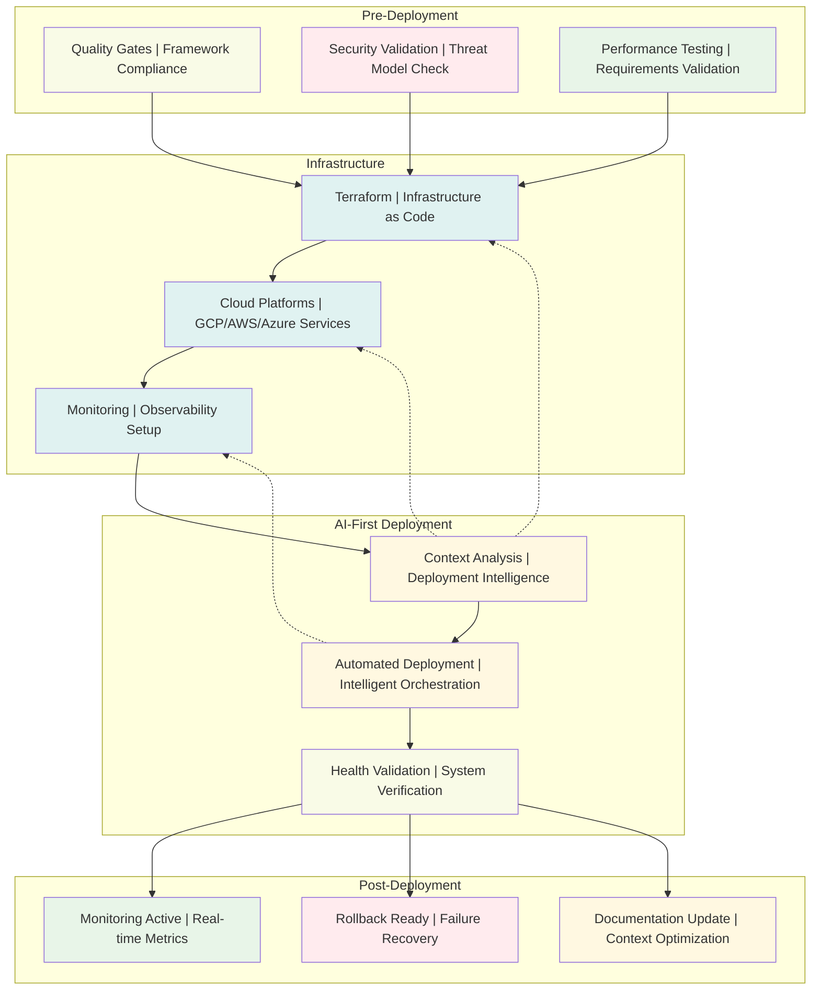

#### **AI Context Implementation Command**

**AI Assistant Action Steps:**

1.  **Implement comprehensive AI context optimization:** Implement comprehensive AI context optimization, including the current project state in `current_context.md`, framework patterns in `team_patterns.md`, domain knowledge in `domain_context.md`, and deployment intelligence in `deployment_context.md`.
```

#- **Development Velocity**: 10x improvement over non-framework development

```mermaid
flowchart LR
    subgraph "Stage 1: Product & Business"
        A1["product.md | Business Vision"]
        A2["docs/prd/ | PRD Files"]
    end
    
    subgraph "Stage 2: Requirements & Validation"
        B1["requirements.md | EARS Requirements"]
        B2["docs/ears/ | EARS Files"]
        B3["docs/bdd/ | BDD Files"]
    end
    
    subgraph "Stage 3: Architecture & Design"
        C1["design.md | Technical Architecture"]
        C2["docs/adr/ | ADR Files"]
    end
    
    subgraph "Stage 4: Specifications & Deployment"
        D1["docs/specs/ | SPECS Files"]
        D2["deployment.md | Deployment Strategy"]
    end
    
    subgraph "Stage 5: Implementation"
        E1["tasks.md | Final Document"]
        E2["AI Assistant | Code Implementation"]
    end
    
    A1 --> A2
    A2 --> B1
    A2 --> B2
    
    B1 --> B2
    B1 --> B3
    A2 --> B3
    B2 --> C1
    B2 --> C2
    B3 --> C1
    B3 --> C2
    
    C1 --> D1
    C2 --> D1
    C1 --> C2
    
    D1 --> E1
    D2 --> E1
    
    E1 --> E2
    
    style A1 fill:#e1f5fe
    style A2 fill:#ffe0b2
    style B1 fill:#f3e5f5
    style B2 fill:#f3e5f5
    style B3 fill:#e8f5e8
    style C1 fill:#fff3e0
    style C2 fill:#fce4ec
    style D1 fill:#e1f5f7
    style D2 fill:#e0f2f1
    style E1 fill:#f1f8e9
    style E2 fill:#f9fbe7
```



### **AI-First Development Lifecycle**



### **Deployment Automation Workflow**



---

## 📋 **Framework v3.7 Complete Structure**

### **Mandatory Framework Files (100% Compliance Required)**

```
project_root/
├── 📄 product.md                      # System vision and business capabilities (basis for PDR decisions)
├── 📄 requirements.md                 # EARS technical requirements 
├── 📄 design.md                       # Technical architecture (basis for ADR decisions)
├── 📄 tasks.md                        # Implementation roadmap with validation
├── 📄 deployment.md                   # AI-first deployment strategy
├── 📁 docs/
│   ├── 📁 ears/                           # EARS requirements by domain
│       ├── 📄 README.md                   # EARS index and status tracking
│       ├── 📄 template.md                 # EARS template 
│   │   ├── 📄 ears_core_requirements.md    # Core system requirements
│   │   ├── 📄 ears_security_requirements.md # Security requirements
│   │   ├── 📄 ears_performance_requirements.md # Performance requirements
│   │   ├── 📄 ears_integration_requirements.md # Integration requirements
        └── 📄 ears-NNNN-requirement.md # Individual EARS requirements

│   ├── 📁 bdd/                            # BDD behavioral scenarios
│       ├── 📄 README.md                   # BDD index and status tracking
│       ├── 📄 template.md                 # BDD template 
│   │   ├── 📄 bdd_core_scenarios.md       # Core system behaviors
│   │   ├── 📄 bdd_security_scenarios.md   # Security validation scenarios
│   │   ├── 📄 bdd_performance_scenarios.md # Performance validation scenarios
│   │   ├── 📄 bdd_integration_scenarios.md # Integration validation scenarios
│   │   ├── 📄 bdd_error_handling_scenarios.md # Error handling behaviors
        └── 📄 bdd-NNNN-requirement.md    # Individual BDD scenarios
│   ├── 📁 adr/                        # Architecture Decision Records
│   │   ├── 📄 README.md              # ADR index and governance
│   │   ├── 📄 template.md            # ADR template 
│   │   └── 📄 adr-NNNN-decision-title.md # Individual ADRs
│   ├── 📁 specs/                       # Technical Specifications (derived from EARS, ADRs, BDDs)
│   │   ├── 📄 README.md                # Specs index and AI generation guidance
        ├── 📄 template.md            # PRD template 
│   │   └── 📄 SPECS-NNNN-component-title.md # Individual SPECS for each component
│   └── 📁 prd/                        # Product Requirements Documents
│       ├── 📄 README.md              # PRD index and status tracking
│       ├── 📄 template.md            # PRD template 
│       └── 📄 prd-NNN-feature.md     # Individual PRDs
├── 📁 .ai_context/                    # AI optimization and context management
│   ├── 📄 current_context.md         # Current sprint/project context
│   ├── 📄 team_patterns.md           # Coding standards and patterns
│   ├── 📄 domain_context.md          # Domain knowledge and terminology
│   └── 📄 deployment_context.md      # Infrastructure and deployment intelligence
├── 📁 deployment/                     # AI-first deployment automation
│   ├── 📁 terraform/                 # Infrastructure-as-code
│   │   ├── 📄 main.tf                # Main infrastructure configuration
│   │   ├── 📄 variables.tf           # Infrastructure variables
│   │   ├── 📄 outputs.tf             # Infrastructure outputs
│   │   └── 📄 modules/               # Reusable infrastructure modules
│   ├── 📁 gcp/                       # Google Cloud Platform configurations
│   │   ├── 📄 cloud-run.yaml         # Cloud Run service configurations
│   │   ├── 📄 cloud-functions.yaml   # Cloud Functions definitions
│   │   ├── 📄 gke-cluster.yaml       # GKE cluster configuration
│   │   └── 📄 load-balancer.yaml     # Cloud Load Balancer setup
│   ├── 📁 aws/                       # Amazon Web Services configurations
│   │   ├── 📄 ecs-service.yaml       # ECS service definitions
│   │   ├── 📄 lambda-functions.yaml  # Lambda function configurations
│   │   ├── 📄 alb-config.yaml        # Application Load Balancer setup
│   │   └── 📄 eks-cluster.yaml       # EKS cluster configuration
│   ├── 📁 azure/                     # Microsoft Azure configurations
│   │   ├── 📄 container-apps.yaml    # Azure Container Apps
│   │   ├── 📄 functions.yaml         # Azure Functions configurations
│   │   ├── 📄 aks-cluster.yaml       # AKS cluster configuration
│   │   └── 📄 app-gateway.yaml       # Application Gateway setup
│   ├── 📁 scripts/                   # Deployment automation scripts
│   │   ├── 📄 deploy.sh              # Main deployment script
│   │   ├── 📄 rollback.sh            # Rollback automation
│   │   └── 📄 validate.sh            # Deployment validation
│   └── 📁 monitoring/                # Cloud-native observability and monitoring
│       ├── 📁 gcp/                   # Google Cloud monitoring configurations
│       │   ├── 📄 cloud-monitoring.yaml # Cloud Monitoring (Stackdriver)
│       │   ├── 📄 cloud-logging.yaml    # Cloud Logging configuration
│       │   └── 📄 alerting-policies.yaml # Alert policies and notifications
│       ├── 📁 aws/                   # AWS monitoring configurations
│       │   ├── 📄 cloudwatch.yaml    # CloudWatch metrics and logs
│       │   ├── 📄 x-ray.yaml         # AWS X-Ray tracing
│       │   └── 📄 sns-alerts.yaml    # SNS alerting configuration
│       └── 📁 azure/                 # Azure monitoring configurations
│           ├── 📄 azure-monitor.yaml # Azure Monitor configuration
│           ├── 📄 log-analytics.yaml # Log Analytics workspace
│           └── 📄 action-groups.yaml # Alert action groups
├── 📁 development/                  # Development framework methodology
│   ├── 📄 readme.md                  # Framework overview and quick start
│   ├── 📄 development_framework_v3.7.md # This framework file
│   ├── 📄 adr_template_v3.7.md       # ADR template v3.7
│   ├── 📄 adr_guide_v3.7.md          # ADR implementation guide v3.7
│   ├── 📄 development_guide_v3.7.md   # Development patterns v3.7
│   ├── 📄 prd_template_v3.7.md       # PRD template v3.7
│   ├── 📄 bdd_integration_guide_v3.7.md # BDD integration guide v3.7
│   ├── 📄 ai_assistant_guide_v3.7.md # AI assistant optimization guide v3.7
│   ├── 📄 ai_system_prompt_v3.7.md   # AI assistant system prompt v3.7
│   └── 📄 ai_prompts_workflow_v3.7.md # Complete workflow prompts v3.7
└── 📁 .instructions/                 # Optional project-specific instructions
    └── 📄 *.md                       # Additional guidance for this specific project
```

### **Framework Compliance Validation**

**Structure Compliance Checklist:**
- [ ] All mandatory files exist in correct locations
- [ ] Directory structure follows v3.7 specification exactly
- [ ] All template files are v3.7 compliant
- [ ] AI context files are current and optimized
- [ ] Deployment automation is configured and tested

---

## 📋 **Major Framework Files - Detailed Specifications**

### **product.md - Business Vision & Product Definition**

**Purpose:** Central document defining the business vision, system capabilities, and stakeholder requirements

**Structure and Content:**
```markdown
# [Product/System Name] - Business Vision

## 1. Executive Summary
- **Business Problem:** Clear statement of the problem being solved
- **Solution Overview:** High-level solution description
- **Value Proposition:** Business value and benefits delivered
- **Success Metrics:** Measurable outcomes and KPIs

## 2. Business Context
### Market Analysis
- **Target Market:** Primary and secondary market segments
- **Market Size:** Addressable market size and opportunity
- **Competitive Landscape:** Key competitors and differentiation
- **Market Trends:** Relevant market trends and drivers

### Business Drivers
- **Strategic Objectives:** Alignment with business strategy
- **Business Case:** ROI justification and financial projections
- **Risk Assessment:** Business risks and mitigation strategies
- **Timeline:** Key business milestones and deadlines

## 3. Stakeholder Analysis
### Primary Stakeholders
- **End Users:** User personas, needs, and pain points
- **Business Sponsors:** Executive sponsors and decision makers
- **Product Team:** Product managers, designers, and analysts
- **Engineering Team:** Technical leads and development teams

### Secondary Stakeholders
- **Operations Team:** DevOps, SRE, and support teams
- **Security Team:** Security architects and compliance officers
- **Legal/Compliance:** Legal requirements and compliance needs
- **External Partners:** Third-party integrations and vendors

## 4. System Capabilities
### Core Capabilities
- **Primary Functions:** Core system functionality and features
- **User Workflows:** Key user journeys and use cases
- **Integration Points:** External system integrations required
- **Data Management:** Data sources, storage, and processing needs

### Technical Capabilities
- **Performance Requirements:** Response time, throughput, scalability
- **Security Requirements:** Authentication, authorization, compliance
- **Reliability Requirements:** Availability, disaster recovery, backup
- **Operational Requirements:** Monitoring, logging, maintenance

## 5. Success Criteria
### Business Metrics
- **Revenue Impact:** Revenue generation or cost savings
- **User Adoption:** User acquisition and engagement metrics
- **Operational Efficiency:** Process improvement and automation
- **Market Position:** Market share and competitive advantage

### Technical Metrics
- **Performance Benchmarks:** System performance targets
- **Quality Metrics:** Defect rates, reliability, security
- **Operational Metrics:** Uptime, response time, scalability
- **Development Metrics:** Velocity, quality, maintainability

## 6. Constraints and Assumptions
### Business Constraints
- **Budget Limitations:** Financial constraints and funding
- **Timeline Constraints:** Launch dates and milestone deadlines
- **Resource Constraints:** Team size and skill limitations
- **Regulatory Constraints:** Compliance and legal requirements

### Technical Constraints
- **Technology Stack:** Required or preferred technologies
- **Integration Constraints:** Existing system limitations
- **Infrastructure Constraints:** Hardware, cloud, and network limitations
- **Security Constraints:** Security policies and requirements

## 7. Framework Integration
### PRD Creation and Mapping
- **PRD Documents:** Links to docs/prd/PRD-XXX-feature.md documents
- **Feature Requirements:** Detailed functional requirements for specific features
- **Business Requirements:** High-level business requirements mapped to PRDs
- **Stakeholder Requirements:** Stakeholder needs translated into PRD documents

### EARS Requirements Mapping
- **PRD → EARS Traceability:** PRD-001 → REQ-CORE-001, REQ-PERF-001
- **Business Requirements:** Links to REQ-BUS-XXX requirements derived from PRDs
- **Functional Requirements:** Links to REQ-FUNC-XXX requirements from PRD specifications
- **Non-Functional Requirements:** Links to REQ-NFR-XXX requirements supporting PRD features

### Quality Gates
- **Business Validation:** Stakeholder approval and sign-off
- **PRD Approval:** Product requirements document validation and approval
- **Technical Feasibility:** Architecture and implementation validation
- **Market Validation:** User research and market testing
- **Compliance Validation:** Legal and regulatory approval
```

**Framework Integration:**
- **PRD Generation:** Creates specific PRD documents in docs/prd/ for detailed feature requirements
- **PRD → EARS Traceability:** PRD requirements flow to EARS requirements in requirements.md
- **Validation:** Business scenarios in docs/bdd/business_scenarios.md validate product vision
- **Architecture:** Influences ADR decisions in docs/adr/ through PRD and EARS requirements
- **AI Context:** Updates .ai_context/domain_context.md with business knowledge and PRD context

---

### **requirements.md - EARS Technical Requirements**

**Purpose:** Central repository for all formal technical requirements using EARS format

**Structure and Content:**
```markdown
# Technical Requirements - EARS Format

## 1. Requirements Overview
### Requirement Categories
- **Core Requirements (REQ-CORE-XXX):** Core system functionality
- **Security Requirements (REQ-SEC-XXX):** Security and compliance
- **Performance Requirements (REQ-PERF-XXX):** Performance and scalability
- **Integration Requirements (REQ-INT-XXX):** External system integration
- **Operational Requirements (REQ-OPS-XXX):** Operations and maintenance

### EARS Format Standard
**Format:** WHEN [trigger] THE [system] SHALL [behavior] WITHIN/WITH [constraint]

**Example:**
REQ-CORE-001: WHEN a user submits a login request THE authentication system SHALL validate credentials and return a response WITHIN 2 seconds WITH proper error handling.

## 2. Core Functional Requirements
### REQ-CORE-001 through REQ-CORE-999
- **REQ-CORE-001:** User Authentication
  - **EARS:** WHEN a user submits valid credentials THE system SHALL authenticate the user and create a secure session WITHIN 2 seconds
  - **Priority:** High
  - **Source:** product.md Section 4.1
  - **BDD Scenarios:** docs/bdd/core_scenarios.md - User Authentication
  - **Acceptance Criteria:**
    - Successful authentication with valid credentials
    - Proper error handling for invalid credentials
    - Session management and timeout handling

### REQ-CORE-002: Data Processing
- **EARS:** WHEN data is submitted for processing THE system SHALL validate, process, and store the data WITHIN 5 seconds WITH data integrity verification
- **Priority:** High
- **Source:** product.md Section 4.2
- **BDD Scenarios:** docs/bdd/core_scenarios.md - Data Processing
- **Dependencies:** REQ-SEC-001 (Data Validation), REQ-PERF-001 (Processing Time)

## 3. Security Requirements
### REQ-SEC-001 through REQ-SEC-999
- **REQ-SEC-001:** Input Validation
  - **EARS:** WHEN any data is received from external sources THE system SHALL validate and sanitize all input data WITH comprehensive security checks
  - **Priority:** Critical
  - **Source:** Threat Model, product.md Section 4.3
  - **BDD Scenarios:** docs/bdd/security_scenarios.md - Input Validation
  - **Security Controls:** OWASP Top 10 compliance, injection prevention

### REQ-SEC-002: Data Encryption
- **EARS:** WHEN sensitive data is stored or transmitted THE system SHALL encrypt the data WITH AES-256 encryption standards
- **Priority:** Critical
- **Source:** Compliance requirements, product.md Section 4.3
- **BDD Scenarios:** docs/bdd/security_scenarios.md - Data Encryption

## 4. Performance Requirements
### REQ-PERF-001 through REQ-PERF-999
- **REQ-PERF-001:** Response Time
  - **EARS:** WHEN a user request is received THE system SHALL respond WITHIN 3 seconds WITH 95% of requests meeting this target
  - **Priority:** High
  - **Source:** product.md Section 5.2
  - **BDD Scenarios:** docs/bdd/performance_scenarios.md - Response Time
  - **Measurement:** Response time monitoring, performance testing

### REQ-PERF-002: Throughput
- **EARS:** WHEN the system is under normal load THE system SHALL process at least 1000 requests per second WITH no degradation in response quality
- **Priority:** High
- **Source:** product.md Section 5.2
- **BDD Scenarios:** docs/bdd/performance_scenarios.md - Throughput

## 5. Integration Requirements
### REQ-INT-001 through REQ-INT-999
- **REQ-INT-001:** External API Integration
  - **EARS:** WHEN integrating with external APIs THE system SHALL handle API failures gracefully WITH automatic retry and fallback mechanisms
  - **Priority:** Medium
  - **Source:** product.md Section 4.4
  - **BDD Scenarios:** docs/bdd/integration_scenarios.md - API Integration
  - **Dependencies:** REQ-OPS-001 (Error Handling)

## 6. Operational Requirements
### REQ-OPS-001 through REQ-OPS-999
- **REQ-OPS-001:** Monitoring and Logging
  - **EARS:** WHEN system events occur THE system SHALL log all events and metrics WITH comprehensive monitoring and alerting
  - **Priority:** High
  - **Source:** product.md Section 4.5
  - **BDD Scenarios:** docs/bdd/operational_scenarios.md - Monitoring
  - **Implementation:** Structured logging, metrics collection, alerting

## 7. Requirements Traceability Matrix
### PRD → EARS Requirements Mapping
- docs/prd/PRD-001-user-authentication.md → REQ-CORE-001, REQ-SEC-001
- docs/prd/PRD-002-data-processing.md → REQ-CORE-002, REQ-PERF-001
- docs/prd/PRD-003-api-integration.md → REQ-INT-001, REQ-PERF-002
- docs/prd/PRD-004-security-controls.md → REQ-SEC-001, REQ-SEC-002

### Business Vision Mapping
- product.md Section 4.1 → PRD-001, PRD-002 → REQ-CORE-001, REQ-CORE-002, REQ-SEC-001
- product.md Section 5.2 → PRD-002, PRD-003 → REQ-PERF-001, REQ-PERF-002
- product.md Section 4.3 → PRD-004 → REQ-SEC-001, REQ-SEC-002

### BDD Scenario Mapping
- docs/bdd/core_scenarios.md → REQ-CORE-001, REQ-CORE-002 ← PRD-001, PRD-002
- docs/bdd/security_scenarios.md → REQ-SEC-001, REQ-SEC-002 ← PRD-001, PRD-004
- docs/bdd/performance_scenarios.md → REQ-PERF-001, REQ-PERF-002 ← PRD-002, PRD-003

### ADR Decision Mapping
- docs/adr/ADR-0001-Architecture-Foundation.md → REQ-CORE-001, REQ-PERF-001 ← PRD-001, PRD-002
- docs/adr/ADR-0002-Security-Architecture.md → REQ-SEC-001, REQ-SEC-002 ← PRD-001, PRD-004

## 8. Framework Integration
### Quality Gates
- **Requirements Review:** Stakeholder validation of all requirements
- **EARS Compliance:** 100% requirements in proper EARS format
- **Traceability Validation:** Complete mapping to business vision and BDD scenarios
- **Technical Feasibility:** Architecture team validation of requirements

### AI Context Integration
- **Pattern Recognition:** Updates .ai_context/team_patterns.md with requirement patterns
- **Domain Knowledge:** Updates .ai_context/domain_context.md with technical context
- **Implementation Guidance:** Links to implementation tasks in tasks.md
```

**Framework Integration:**
- **Source:** Derived from PRD documents in docs/prd/ and business vision in product.md
- **PRD → EARS Flow:** PRD requirements translate to formal EARS technical requirements
- **Validation:** BDD scenarios in docs/bdd/ validate each EARS requirement and its PRD source
- **Architecture:** EARS requirements influence ADR decisions in docs/adr/
- **Implementation:** Guides technical design in design.md and implementation tasks in tasks.md
- **AI Context:** Updates .ai_context/ with requirement patterns, PRD context, and domain knowledge

---

### **design.md - Technical Architecture & Design**

**Purpose:** Comprehensive technical architecture documentation with ADR integration

**Structure and Content:**
```markdown
# Technical Architecture & Design

## 1. Architecture Overview
### System Architecture
- **Architecture Style:** [Microservices/Monolith/Event-Driven/etc.]
- **Technology Stack:** Programming languages, frameworks, databases
- **Deployment Architecture:** Cloud platform, containers, orchestration
- **Integration Architecture:** APIs, messaging, data flow

### Architecture Principles
- **Scalability:** Horizontal and vertical scaling strategies
- **Reliability:** Fault tolerance, disaster recovery, backup strategies
- **Security:** Defense in depth, zero trust, encryption strategies
- **Performance:** Optimization, caching, load balancing strategies

## 2. System Components
### Core Components
- **Authentication Service**
  - **Purpose:** User authentication and authorization
  - **Technology:** [JWT, OAuth, etc.]
  - **ADR Reference:** docs/adr/ADR-0003-Authentication-Strategy.md
  - **Requirements:** REQ-CORE-001, REQ-SEC-001
  - **Interfaces:** REST API, database integration

- **Data Processing Engine**
  - **Purpose:** Core business logic and data processing
  - **Technology:** [Processing framework, languages]
  - **ADR Reference:** docs/adr/ADR-0004-Data-Processing-Architecture.md
  - **Requirements:** REQ-CORE-002, REQ-PERF-001
  - **Interfaces:** Message queues, database, external APIs

### Infrastructure Components
- **Database Layer**
  - **Technology:** [Database type, version]
  - **ADR Reference:** docs/adr/ADR-0005-Database-Selection.md
  - **Purpose:** Data persistence, querying, transactions
  - **Requirements:** REQ-PERF-002, REQ-SEC-002

- **Caching Layer**
  - **Technology:** [Redis, Memcached, etc.]
  - **Purpose:** Performance optimization, session storage
  - **Requirements:** REQ-PERF-001

## 3. Data Architecture
### Data Model
- **Entity Relationships:** Core business entities and relationships
- **Data Flow:** Data movement through system components
- **Data Storage:** Database schemas, partitioning, indexing strategies
- **Data Security:** Encryption, access controls, data classification

### Data Integration
- **External Data Sources:** Third-party APIs, databases, file systems
- **Data Synchronization:** Real-time vs. batch processing strategies
- **Data Quality:** Validation, cleansing, monitoring strategies
- **Data Governance:** Policies, compliance, audit trails

## 4. Security Architecture
### Security Controls
- **Authentication & Authorization**
  - **Implementation:** [RBAC, ABAC, etc.]
  - **ADR Reference:** docs/adr/ADR-0003-Authentication-Strategy.md
  - **Requirements:** REQ-SEC-001
  - **BDD Scenarios:** docs/bdd/security_scenarios.md

- **Data Protection**
  - **Encryption:** At rest and in transit
  - **Key Management:** Key rotation, storage, access
  - **Requirements:** REQ-SEC-002
  - **Compliance:** [GDPR, HIPAA, SOC2, etc.]

### Threat Model Integration
- **Attack Vectors:** Identified threats and attack scenarios
- **Mitigation Strategies:** Security controls and countermeasures
- **Security Testing:** Penetration testing, vulnerability scanning
- **Incident Response:** Detection, containment, recovery procedures

## 5. Performance Architecture
### Performance Strategy
- **Scalability Patterns**
  - **Horizontal Scaling:** Load balancing, auto-scaling
  - **Vertical Scaling:** Resource optimization, capacity planning
  - **Requirements:** REQ-PERF-001, REQ-PERF-002
  - **BDD Scenarios:** docs/bdd/performance_scenarios.md

- **Optimization Techniques**
  - **Caching:** Multi-level caching strategy
  - **Database Optimization:** Query optimization, indexing
  - **Content Delivery:** CDN, static asset optimization
  - **Code Optimization:** Profiling, optimization techniques

### Performance Monitoring
- **Metrics Collection:** Response time, throughput, resource utilization
- **Alerting:** Performance threshold monitoring and alerting
- **Capacity Planning:** Growth projections and resource planning
- **Performance Testing:** Load testing, stress testing, capacity testing

## 6. Integration Architecture
### External Integrations
- **API Integrations**
  - **REST APIs:** External service integrations
  - **GraphQL:** Data aggregation and querying
  - **WebSocket:** Real-time communication
  - **Requirements:** REQ-INT-001
  - **BDD Scenarios:** docs/bdd/integration_scenarios.md

- **Message-Based Integration**
  - **Message Queues:** Asynchronous processing
  - **Event Streaming:** Real-time event processing
  - **Pub/Sub:** Event-driven architecture patterns

### Internal Integration
- **Service Communication:** Inter-service communication patterns
- **Data Consistency:** Transaction management, eventual consistency
- **Error Handling:** Retry policies, circuit breakers, fallback strategies
- **Monitoring:** Distributed tracing, service mesh observability

## 7. Deployment Architecture
### Infrastructure Design
- **Cloud Platform:** [AWS, GCP, Azure] service selection
- **Container Strategy:** Docker with cloud-native services (Cloud Run, ECS, Container Apps)
- **ADR Reference:** docs/adr/ADR-0007-Deployment-Architecture.md
- **Networking:** VPC, subnets, security groups, load balancers

### CI/CD Pipeline
- **Build Pipeline:** Code compilation, testing, artifact generation
- **Deployment Pipeline:** Environment promotion, rollback strategies
- **Infrastructure as Code:** Terraform, CloudFormation, Helm charts
- **Monitoring:** Deployment monitoring, health checks, alerting

## 8. Operational Architecture
### Monitoring & Observability
- **Logging Strategy**
  - **Structured Logging:** Log format, centralization, retention
  - **Log Analysis:** Search, dashboards, alerting
  - **Requirements:** REQ-OPS-001
  - **Tools:** [ELK Stack, Splunk, etc.]

- **Metrics & Monitoring**
  - **Application Metrics:** Business and technical metrics
  - **Infrastructure Metrics:** Resource utilization, performance
  - **Alerting:** Threshold-based and anomaly detection
  - **Dashboards:** Real-time visibility and reporting

### Disaster Recovery
- **Backup Strategy:** Data backup, retention, testing
- **Recovery Procedures:** RTO/RPO targets, recovery testing
- **Business Continuity:** Failover strategies, data replication
- **Documentation:** Runbooks, incident response procedures

## 9. Framework Integration
### ADR Traceability
- **Architecture Decisions:** Complete list of ADRs supporting this design
- **Decision Rationale:** Links to specific ADR documents with reasoning
- **Trade-off Analysis:** Alternative approaches considered and rejected
- **Impact Assessment:** Dependencies and implications of decisions

### Requirements Mapping
- **Functional Requirements:** How design satisfies functional requirements
- **Non-Functional Requirements:** Architecture patterns supporting NFRs
- **Constraint Satisfaction:** How design addresses technical constraints
- **Quality Attributes:** Architecture support for quality goals

### BDD Scenario Support
- **Behavioral Validation:** How architecture enables BDD scenario execution
- **Testing Strategy:** Integration points for behavioral testing
- **Performance Testing:** Architecture support for performance validation
- **Security Testing:** Architecture enabling security scenario testing

## 10. Implementation Guidance
### Development Guidelines
- **Coding Standards:** Language-specific coding standards and patterns
- **Framework Patterns:** Reusable architectural patterns and components
- **API Design:** RESTful API design principles and standards
- **Database Guidelines:** Schema design, query optimization, migration strategies

### Quality Assurance
- **Testing Strategy:** Unit, integration, end-to-end testing approaches
- **Code Review:** Review processes, quality gates, automation
- **Performance Testing:** Load testing, profiling, optimization procedures
- **Security Testing:** Security scanning, penetration testing, code analysis

### AI Context Integration
- **Pattern Documentation:** Architecture patterns for .ai_context/team_patterns.md
- **Implementation Context:** Technical context for .ai_context/domain_context.md
- **Development Guidance:** Implementation guidance for development teams
```

**Framework Integration:**
- **PRD Support:** Implements feature requirements from docs/prd/ through EARS requirements
- **Requirements:** Implements EARS requirements from requirements.md derived from PRD documents
- **Architecture Decisions:** References and implements ADR decisions from docs/adr/
- **Behavioral Support:** Enables BDD scenario execution from docs/bdd/ validating PRD and EARS requirements
- **Implementation Guide:** Provides foundation for implementation tasks in tasks.md

---

### **tasks.md - Implementation Roadmap & Task Management**

**Purpose:** Comprehensive implementation roadmap with task dependencies and validation

**Structure and Content:**
```markdown
# Implementation Roadmap & Task Management

## 1. Implementation Overview
### Project Phases (AI-Driven Development)
- **Phase 1:** Foundation Setup (AI-driven autonomous execution)
- **Phase 2:** Core Development (AI agent collaboration with specialized expertise)
- **Phase 3:** Integration & Testing (Automated validation and quality assurance)
- **Phase 4:** Deployment & Launch (AI-first deployment automation)

### Success Criteria (AI-Driven Development)
- **Framework Compliance:** 100% adherence to framework v3.7 structure
- **Requirements Coverage:** All EARS requirements implemented and validated
- **Quality Gates:** All quality gates passed before phase completion
- **BDD Validation:** All BDD scenarios passing before production deployment
- **AI Collaboration:** Effective use of specialized AI agents for autonomous execution
- **Development Velocity:** 2-3x improvement through AI context optimization

### AI-Driven Development Principles
- **No Time Estimates:** AI-driven development executes tasks based on complexity, not predetermined timelines
- **Agent Specialization:** Use specialized AI agents (security-auditor, performance-optimizer, etc.) for domain expertise
- **Autonomous Execution:** AI agents execute tasks autonomously with human approval at phase gates
- **Quality-First Approach:** Focus on deliverable quality and framework compliance over speed
- **Collaborative Intelligence:** Combine multiple AI agents for complex tasks requiring cross-domain expertise
- **Hybrid Session Management:** Implement session lifecycle management with cumulative tracking and clean session focus

### Session Management Integration
- **Three-Tier Tracking System:** Session-level (TODOS.md) + Project-level (framework_tasks.md) + Framework-level (ai_assistant_tasks_development.md)
- **Session Lifecycle:** Start Protocol → During Protocol → End Protocol with automated archiving
- **Cross-Project Compatibility:** Session management designed for reuse across all Framework v3.7 projects
- **TodoWrite Integration:** Real-time session tracking with tool-based status management
- **Historical Continuity:** Complete session archive with cumulative progress metrics

## 2. Phase 1: Foundation Setup (AI-Driven Autonomous Execution)
### Infrastructure Tasks
- **TASK-001: Environment Setup**
  - **Description:** Set up development, staging, and production environments
  - **Requirements:** REQ-OPS-001, REQ-SEC-001
  - **ADR Reference:** docs/adr/ADR-0007-Deployment-Architecture.md
  - **BDD Scenarios:** docs/bdd/operational_scenarios.md - Environment Setup
  - **Dependencies:** None
  - **AI Agent:** `cloud-devops-expert`
  - **Execution:** Autonomous with quality gate validation
  - **Validation:** Environment health checks, security scans

- **TASK-002: Database Setup**
  - **Description:** Database installation, configuration, and schema creation
  - **Requirements:** REQ-CORE-002, REQ-SEC-002, REQ-PERF-002
  - **ADR Reference:** docs/adr/ADR-0005-Database-Selection.md
  - **BDD Scenarios:** docs/bdd/core_scenarios.md - Data Storage
  - **Dependencies:** TASK-001
  - **AI Agent:** `database-specialist`
  - **Execution:** Autonomous with performance validation
  - **Validation:** Schema validation, performance benchmarks

### Security Foundation
- **TASK-003: Security Framework Setup**
  - **Description:** Implement core security controls and authentication
  - **Requirements:** REQ-SEC-001, REQ-SEC-002
  - **ADR Reference:** docs/adr/ADR-0003-Authentication-Strategy.md
  - **BDD Scenarios:** docs/bdd/security_scenarios.md - Authentication
  - **Dependencies:** TASK-001, TASK-002
  - **AI Agent Combination:** `security-auditor + coder-agent`
  - **Execution:** Collaborative AI implementation with security validation
  - **Validation:** Security testing, penetration testing

## 3. Phase 2: Core Development (Weeks 3-8)
### Core Functionality
- **TASK-004: User Authentication Module**
  - **Description:** Implement user authentication and session management
  - **Requirements:** REQ-CORE-001, REQ-SEC-001
  - **Design Reference:** design.md Section 2.1 - Authentication Service
  - **BDD Scenarios:** docs/bdd/core_scenarios.md - User Authentication
  - **Dependencies:** TASK-003
  - **Effort:** 5 days
  - **Assignee:** Backend Team
  - **Validation:** Unit tests, integration tests, security tests

- **TASK-005: Data Processing Engine**
  - **Description:** Implement core business logic and data processing
  - **Requirements:** REQ-CORE-002, REQ-PERF-001
  - **Design Reference:** design.md Section 2.2 - Data Processing Engine
  - **BDD Scenarios:** docs/bdd/core_scenarios.md - Data Processing
  - **Dependencies:** TASK-002, TASK-004
  - **Effort:** 8 days
  - **Assignee:** Backend Team
  - **Validation:** Performance testing, load testing, functional testing

### API Development
- **TASK-006: REST API Implementation**
  - **Description:** Implement RESTful APIs for core functionality
  - **Requirements:** REQ-INT-001, REQ-PERF-001
  - **Design Reference:** design.md Section 6.1 - API Integrations
  - **BDD Scenarios:** docs/bdd/integration_scenarios.md - API Testing
  - **Dependencies:** TASK-004, TASK-005
  - **Effort:** 6 days
  - **Assignee:** Backend Team
  - **Validation:** API testing, contract testing, performance testing

### Frontend Development
- **TASK-007: User Interface Implementation**
  - **Description:** Implement user interface and user experience
  - **Requirements:** REQ-CORE-001, REQ-PERF-001
  - **Design Reference:** design.md Section 2.1 - User Interface
  - **BDD Scenarios:** docs/bdd/core_scenarios.md - User Interface
  - **Dependencies:** TASK-006
  - **Effort:** 10 days
  - **Assignee:** Frontend Team
  - **Validation:** UI testing, accessibility testing, cross-browser testing

## 4. Phase 3: Integration & Testing (Weeks 9-12)
### System Integration
- **TASK-008: External API Integration**
  - **Description:** Integrate with external APIs and third-party services
  - **Requirements:** REQ-INT-001
  - **Design Reference:** design.md Section 6.1 - External Integrations
  - **BDD Scenarios:** docs/bdd/integration_scenarios.md - External APIs
  - **Dependencies:** TASK-006
  - **Effort:** 5 days
  - **Assignee:** Integration Team
  - **Validation:** Integration testing, contract testing, error handling testing

### Comprehensive Testing
- **TASK-009: Performance Testing**
  - **Description:** Execute comprehensive performance and load testing
  - **Requirements:** REQ-PERF-001, REQ-PERF-002
  - **BDD Scenarios:** docs/bdd/performance_scenarios.md - All scenarios
  - **Dependencies:** TASK-007, TASK-008
  - **Effort:** 4 days
  - **Assignee:** QA Team + Performance Team
  - **Validation:** Performance benchmarks, scalability testing

- **TASK-010: Security Testing**
  - **Description:** Execute comprehensive security testing and validation
  - **Requirements:** REQ-SEC-001, REQ-SEC-002
  - **BDD Scenarios:** docs/bdd/security_scenarios.md - All scenarios
  - **Dependencies:** TASK-007, TASK-008
  - **Effort:** 3 days
  - **Assignee:** Security Team + QA Team
  - **Validation:** Vulnerability scanning, penetration testing

### Quality Assurance
- **TASK-011: End-to-End Testing**
  - **Description:** Execute comprehensive end-to-end testing scenarios
  - **Requirements:** All REQ-CORE, REQ-PERF, REQ-SEC requirements
  - **BDD Scenarios:** All scenarios in docs/bdd/
  - **Dependencies:** TASK-009, TASK-010
  - **Effort:** 6 days
  - **Assignee:** QA Team
  - **Validation:** Complete BDD scenario execution, user acceptance testing

## 5. Phase 4: Deployment & Launch (Weeks 13-16)
### Production Preparation
- **TASK-012: Production Environment Setup**
  - **Description:** Configure and validate production environment
  - **Requirements:** REQ-OPS-001, REQ-SEC-001
  - **Design Reference:** design.md Section 7 - Deployment Architecture
  - **Dependencies:** TASK-011
  - **Effort:** 3 days
  - **Assignee:** DevOps Team
  - **Validation:** Environment validation, security compliance

- **TASK-013: Monitoring & Alerting Setup**
  - **Description:** Implement comprehensive monitoring and alerting
  - **Requirements:** REQ-OPS-001
  - **Design Reference:** design.md Section 8.1 - Monitoring & Observability
  - **BDD Scenarios:** docs/bdd/operational_scenarios.md - Monitoring
  - **Dependencies:** TASK-012
  - **Effort:** 2 days
  - **Assignee:** DevOps Team
  - **Validation:** Monitoring validation, alert testing

### Production Deployment
- **TASK-014: Production Deployment**
  - **Description:** Deploy application to production environment
  - **Requirements:** All requirements
  - **Dependencies:** TASK-012, TASK-013
  - **Effort:** 1 day
  - **Assignee:** DevOps Team + Release Manager
  - **Validation:** Deployment validation, smoke testing, monitoring verification

- **TASK-015: Post-Launch Validation**
  - **Description:** Monitor system performance and validate production operation
  - **Requirements:** REQ-OPS-001, REQ-PERF-001
  - **Dependencies:** TASK-014
  - **Effort:** 3 days
  - **Assignee:** Full Team
  - **Validation:** Performance monitoring, error monitoring, user feedback

## 6. Task Dependencies & Critical Path
### Dependency Matrix
```
TASK-001 → TASK-002 → TASK-003 → TASK-004 → TASK-005 → TASK-006 → TASK-007
                                                              ↓
TASK-008 → TASK-009 → TASK-011 → TASK-012 → TASK-013 → TASK-014 → TASK-015
           ↓
         TASK-010 ↗
```

### Critical Path Analysis
- **Critical Path:** TASK-001 → TASK-002 → TASK-003 → TASK-004 → TASK-005 → TASK-006 → TASK-007 → TASK-008 → TASK-011 → TASK-012 → TASK-013 → TASK-014 → TASK-015
- **Total Duration:** 16 weeks
- **Buffer Time:** 2 weeks built into estimates
- **Risk Mitigation:** Parallel execution where possible, early integration testing

## 7. Session Management & Cross-Project Protocols

### Hybrid Session Management Implementation

**Required Files for Every Framework v3.7 Project:**
```markdown
project_root/
├── TODOS.md                    # Hybrid session management with cumulative tracking
├── framework_tasks.md          # Project-specific framework implementation tracking
├── tasks.md                    # Technical implementation roadmap
└── development/               # Development framework methodology
    ├── development_framework_v3.7.md
    ├── AI_ASSISTANT_STARTUP.md
    └── ai_assistant_tasks_development.md
```

### Session Lifecycle Protocols

#### **Session Start Protocol (Universal)**
```markdown
1. **Context Loading:** Read TODOS.md for complete project context and session history
2. **Session Archiving:** Move completed tasks from previous session to SESSION ARCHIVE
3. **Current Session Reset:** Clear CURRENT SESSION TODOS section
4. **Session Info Update:** Increment session number, update date and timestamp
5. **Priority Setting:** Load next priorities from framework_tasks.md alignment
6. **Goal Definition:** Set specific objectives for current session based on framework phase
```

#### **During Session Protocol (Universal)**
```markdown
1. **Single Focus Rule:** Maintain only ONE task as "IN_PROGRESS" at any time
2. **Real-Time Updates:** Use TodoWrite tool for immediate status updates
3. **Cross-Reference Validation:** Ensure session tasks align with framework_tasks.md phases
4. **Progress Tracking:** Update cumulative metrics and framework compliance status
5. **Quality Gate Validation:** Validate deliverables before marking tasks completed
6. **Documentation Discipline:** Maintain session notes and achievement tracking
```

#### **Session End Protocol (Universal)**
```markdown
1. **Task Completion:** Complete or properly hand-off all IN_PROGRESS items
2. **Session Archiving:** Move completed work to SESSION ARCHIVE with summary
3. **Metrics Update:** Refresh cumulative progress and compliance metrics
4. **Next Session Planning:** Set priorities and goals for subsequent session
5. **Git Commitment:** Commit all session changes with comprehensive session summary
6. **Context Preparation:** Update AI context files for next session continuity
```

### TODOS.md Template Structure (Universal)

**All Framework v3.7 projects must implement this TODOS.md structure:**
```markdown
# [Project Name] - Project TODOs

## AI Assistant Hybrid Session Management System

## 🎯 **CURRENT SESSION TODOS** (Session N - YYYY-MM-DD HH:MM EST)
### **Active Tasks (In Progress)** ← REFRESHED EACH SESSION
### **Pending Tasks (Next Up)** ← REFRESHED EACH SESSION
### **Session Goals** ← DEFINED EACH SESSION

**DateTime Format Standard:** Always use precise datetime format "Session N - YYYY-MM-DD HH:MM EST" for session identification and tracking

## 📋 **PHASE TRACKING** (Cumulative Progress)
### **✅ COMPLETED PHASES** ← ACCUMULATES
### **🚀 CURRENT PHASE** ← UPDATES
### **⏳ NEXT MAJOR PHASE** ← UPDATES

## 📊 **PROGRESS TRACKING** (Cumulative Metrics)
### **Overall Progress Summary** ← ACCUMULATES
### **Framework Compliance Status** ← ACCUMULATES
### **[Project-Specific] Status** ← ACCUMULATES

## 🔄 **SESSION HISTORY** (Cumulative Record)
### **Session Timeline** ← ACCUMULATES
### **Key Achievements by Session** ← ACCUMULATES
### **Development Velocity Metrics** ← ACCUMULATES

## 📜 **SESSION ARCHIVE** (Historical Tasks)
### **Session N Archive (YYYY-MM-DD HH:MM AM/PM) - COMPLETED ✅** ← ACCUMULATES

## 🎯 **SESSION MANAGEMENT PROTOCOLS**
### **Session Lifecycle Rules** ← PERSISTENT
### **TODO Status Definitions** ← PERSISTENT
### **Priority Levels** ← PERSISTENT
```

### Cross-Project Session Management Benefits

**For AI Assistants:**
- **Consistent Experience:** Same session management across all projects
- **Context Continuity:** Seamless understanding of project progress
- **Quality Assurance:** Standardized validation and compliance tracking
- **Focus Management:** Single-task discipline across all development work

**For Human Developers:**
- **Project Visibility:** Clear understanding of progress across multiple projects
- **Session Transparency:** Real-time view of AI assistant work and focus
- **Historical Tracking:** Complete archive of all development sessions
- **Framework Compliance:** Guaranteed adherence to Framework v3.7 methodology

**For Project Management:**
- **Cross-Project Metrics:** Standardized progress tracking across portfolio
- **Resource Planning:** Understanding of AI assistant utilization and velocity
- **Quality Validation:** Consistent framework compliance across all projects
- **Audit Trails:** Complete documentation for compliance and review

### TodoWrite Tool Integration Requirements

**All Framework v3.7 projects must support:**
```markdown
# TodoWrite Tool Integration Protocol:
1. **Status Management:** All session tasks managed through TodoWrite tool
2. **Single Focus Enforcement:** Tool prevents multiple IN_PROGRESS tasks
3. **Real-Time Updates:** Immediate status changes reflected in TODOS.md
4. **Cross-Reference Validation:** Tool checks alignment with framework_tasks.md
5. **Session Boundary Management:** Tool supports session lifecycle protocols
```

## 8. Quality Gates & Validation
### Phase Gate Requirements
- **Phase 1 Gate:** Environment setup validated, security baseline established, **Phase 1 validation report created**
- **Phase 2 Gate:** Core functionality implemented, unit tests passing, performance baseline established, **Phase 2 validation report created**
- **Phase 3 Gate:** All BDD scenarios passing, security testing complete, performance validated, **Phase 3 validation report created**, **validated architecture document created**
- **Phase 4 Gate:** Production deployment successful, monitoring active, post-launch validation complete, **Phase 4 validation report created**

### **MANDATORY: Validation Reports Framework**

**Required Validation Reports for Every Phase:**
```markdown
docs/validation/
├── phase_1_completion_report.md     # Requirements & Specification validation
├── phase_2_completion_report.md     # BDD scenario coverage validation  
├── phase_3_completion_report.md     # Architecture & ADR validation
├── validated_architecture.md        # MANDATORY: Consolidated architecture document (Phase 3)
├── phase_4_completion_report.md     # Implementation & code validation
├── phase_5_completion_report.md     # Testing & quality assurance validation
├── phase_6_completion_report.md     # Deployment preparation validation
├── phase_7_completion_report.md     # Production deployment validation
├── phase_8_completion_report.md     # Operations & maintenance validation
└── final_project_validation.md     # Complete project validation summary
```

**Validation Report Structure (Mandatory Template):**
```markdown
# Phase N Completion Validation Report

## Phase Overview
- **Phase Name:** [Phase Name]
- **Completion Date:** [YYYY-MM-DD HH:MM EST]
- **Session Number:** [Session N]
- **AI Assistant:** [Agent combinations used]

## Requirements Coverage
- **Total Requirements:** [Number]
- **Requirements Met:** [Number]
- **Coverage Percentage:** [XX%]
- **Missing Requirements:** [List or "None"]

## Deliverables Validation
- **Expected Deliverables:** [List]
- **Completed Deliverables:** [List with status]
- **Quality Assessment:** [PASS/FAIL with details]

## Framework Compliance
- **Structure Compliance:** [PASS/FAIL]
- **Documentation Standards:** [PASS/FAIL]  
- **Traceability Matrix:** [PASS/FAIL]
- **Quality Gates:** [PASS/FAIL]

## Risk Assessment
- **Identified Risks:** [List]
- **Mitigation Status:** [Status for each]
- **Outstanding Issues:** [List or "None"]

## Human Approval Checkpoint
- **Approval Status:** [PENDING/APPROVED/REJECTED]
- **Approval Date:** [YYYY-MM-DD]
- **Approver Comments:** [Comments or "None"]

## Next Phase Readiness
- **Ready for Next Phase:** [YES/NO]
- **Prerequisites Met:** [List with status]
- **Recommendations:** [List or "None"]
```

### **MANDATORY: Phase 3 Validated Architecture Document**

**Required for Phase 3 Completion:**
Every Phase 3 completion MUST include a validated architecture document that consolidates all architectural decisions and design components into a single implementation-ready specification.

**Validated Architecture Requirements:**
```markdown
docs/validation/validated_architecture.md Structure:
├── Executive Summary                 # Mission-critical platform overview
├── Validated System Architecture     # Complete enterprise architecture flow
├── Multi-Agent Coordination         # Agent ecosystem with performance targets
├── Data Architecture                 # Database and storage architecture
├── Security Architecture             # Complete security framework
├── Performance Architecture          # Optimization and scaling strategies
├── Integration Architecture          # External systems and APIs
├── Deployment Architecture           # Infrastructure and operations
├── Framework Compliance              # Framework v3.7 adherence validation
└── Implementation Readiness          # Technical readiness assessment
```

**Content Requirements:**
- **ADR Integration:** All architectural decisions from ADRs consolidated
- **Design Consolidation:** Complete integration with design.md architecture
- **Implementation Guidance:** Technical specifications ready for development
- **Decision Rationale:** Clear reasoning for all architectural choices
- **Performance Validation:** Confirmed targets and optimization strategies
- **Security Validation:** Complete compliance and security framework
- **Framework Compliance:** Full Framework v3.7 methodology adherence

**Quality Standards:**
- **Completeness:** All ADRs and design decisions integrated
- **Consistency:** No conflicting architectural decisions
- **Implementability:** Clear technical guidance for development teams
- **Traceability:** Complete mapping to requirements and BDD scenarios
- **Validation:** Architecture quality assessment and readiness confirmation

### **MANDATORY: Phase 4 Technical Specifications Framework**

**Required for Phase 4 Completion:**
Every Phase 4 completion MUST include detailed technical specifications using the standardized SPECS-NNNN format for all system components and implementation guidance.

**🚨 CRITICAL ARCHITECTURAL COMPONENT REQUIREMENT:**
Each architectural component identified in Phase 3 (Architecture & ADRs) MUST have its own dedicated technical specification. This ensures complete traceability from architectural decisions to implementation guidance and enables component-based development with clear ownership and boundaries.

**🚨 MANDATORY ONE-TO-ONE COMPONENT MAPPING:**
- **WRONG APPROACH:** Grouping multiple components into shared SPECS files (e.g., "7 API components → SPECS-0001")
- **CORRECT APPROACH:** Each individual component gets its own SPECS file (e.g., "API Gateway → SPECS-0001", "Load Balancer → SPECS-0002", "RESTful API → SPECS-0003")
- **RESULT:** If 68 architectural components are identified, then 68 individual SPECS files (SPECS-0001 through SPECS-0068) must be created

**🚨 MANDATORY PRE-PHASE 4 REQUIREMENTS:**

1. **Architectural Component Identification:** Create complete architectural component mapping document that identifies ALL components from Phase 3 validated architecture and design.md. This document ensures 100% component coverage and proper one-to-one assignment to individual SPECS documents.

**🔥 CRITICAL MAPPING REQUIREMENTS:**
- **Individual Component Analysis:** Each architectural element (service, database, agent, API endpoint, security layer, etc.) must be identified as a separate component
- **One-to-One Mapping:** Each component maps to exactly one SPECS-NNNN file 
- **Sequential Numbering:** SPECS-0001, SPECS-0002, SPECS-0003... up to SPECS-[TOTAL_COMPONENTS]
- **No Component Grouping:** Never group multiple components into a single SPECS file
- **Product Phase Prioritization:** Components must be prioritized using product release phases (MVP, V1, V2, V3) instead of technical priorities for stakeholder clarity

**📋 PRODUCT PHASE PRIORITY SYSTEM:**
- **MVP (Minimum Viable Product):** Core life-safety functionality essential for initial deployment
- **V1 (Version 1):** Enhanced capabilities for full operational deployment
- **V2 (Version 2):** Advanced intelligence and optimization features  
- **V3 (Version 3):** Enterprise scalability and advanced compliance features

2. **SPECS Document List Creation:** After identifying all architectural components, create a complete list of ALL required SPECS-NNNN documents with their individual component assignments, priorities, and coverage scope. This list serves as the master plan for Phase 4 implementation.

**Product Phase-Driven Specifications Structure:**
```markdown
docs/specs/
├── ARCHITECTURAL_COMPONENT_MAPPING.md         # Maps all 79 components to Product Phases
├── SPECS_DOCUMENT_LIST.md                     # Master plan for selected Product Phase
└── [SELECTED PRODUCT PHASE SPECS]/
    ├── SPECS-NNNN-[component-name].md         # Each component gets individual SPECS file
    ├── SPECS-NNNN-[component-name].md         # SPECS numbers from mapping document
    └── ...                                    # Only components for selected Product Phase

HUMAN DEVELOPER SELECTION REQUIRED:
- MVP: 20 component SPECS files for core life-safety functionality
- V1: 44 component SPECS files for full operational deployment  
- V2: 12 component SPECS files for advanced intelligence features
- V3: 3 component SPECS files for enterprise scalability

SPECS numbering follows ARCHITECTURAL_COMPONENT_MAPPING.md assignments
```

**SPECS-NNNN Format Requirements:**
- **Numbering:** Sequential numbering starting from SPECS-0001
- **Component Focus:** Each specification covers a single system component or domain
- **Implementation Ready:** Complete technical guidance for development teams
- **Architecture Integration:** All specifications aligned with validated architecture
- **Requirements Mapping:** Complete traceability to EARS requirements and ADRs
- **BDD Support:** Specifications enable execution of all BDD scenarios

**🚨 MANDATORY ARCHITECTURAL COMPONENT MAPPING:**
Every architectural component from Phase 3 validated architecture MUST have corresponding technical specifications:

- **Component Identification:** List all architectural components from design.md and ADRs
- **Specification Assignment:** Assign each component to appropriate SPECS-NNNN document
- **Component Boundaries:** Define clear interfaces and responsibilities for each component
- **Implementation Traceability:** Map architectural decisions to specific implementation guidance
- **Cross-Component Integration:** Document component interactions and dependencies
- **Quality Requirements:** Define component-specific performance, security, and quality criteria

**Component-to-Specification Mapping Template:**
```markdown
## Architectural Component Mapping

| Component | SPECS Document | ADR References | Implementation Priority |
|-----------|---------------|----------------|------------------------|
| [Component Name] | SPECS-NNNN | ADR-XXXX | [High/Medium/Low] |
| API Gateway | SPECS-0001 | ADR-0001, ADR-0015 | High |
| Data Layer | SPECS-0002 | ADR-0003, ADR-0008 | High |
| Security Framework | SPECS-0005 | ADR-0009, ADR-0015 | Critical |
```

**Specification Content Standards:**
- **Technical Depth:** Implementation-ready technical details and code examples
- **Interface Definitions:** Complete API definitions, data schemas, system interfaces
- **Quality Requirements:** Performance targets, security controls, validation criteria
- **Implementation Guidance:** Development patterns, best practices, code standards
- **Testing Integration:** Unit test requirements, integration test patterns, BDD scenario support
- **Operational Support:** Deployment procedures, monitoring requirements, maintenance guidelines

**Quality Assurance Requirements:**
- **Completeness:** All system components covered with detailed specifications
- **Consistency:** No conflicting technical requirements across specifications
- **Implementability:** Clear technical guidance ready for immediate development
- **Traceability:** Complete mapping to requirements, ADRs, and BDD scenarios
- **Validation:** Technical feasibility assessment and implementation readiness

### Validation Criteria
- **Framework Compliance:** 100% adherence to framework v3.7 requirements
- **Requirements Coverage:** All EARS requirements implemented and tested
- **BDD Scenario Coverage:** 100% of BDD scenarios passing
- **Quality Metrics:** Code coverage >90%, defect rate <1%, performance targets met

## 8. Risk Management
### Technical Risks
- **Integration Complexity:** External API dependencies and integration challenges
- **Performance Risks:** Scalability and performance under load
- **Security Risks:** Security vulnerabilities and compliance gaps
- **Mitigation:** Early integration testing, performance benchmarking, security reviews

### Project Risks
- **Resource Availability:** Team member availability and skill gaps
- **Timeline Risks:** Scope creep, technical complexity, external dependencies
- **Quality Risks:** Insufficient testing, technical debt, requirement changes
- **Mitigation:** Resource planning, scope management, quality gates, change control

## 9. Framework Integration
### AI Context Updates
- **Team Patterns:** Document implementation patterns in .ai_context/team_patterns.md
- **Domain Context:** Update domain knowledge in .ai_context/domain_context.md
- **Current Context:** Maintain current sprint context in .ai_context/current_context.md
- **Deployment Context:** Update deployment knowledge in .ai_context/deployment_context.md

### Continuous Integration
- **Requirements Traceability:** Maintain links to requirements.md throughout implementation
- **Design Validation:** Validate implementation against design.md specifications
- **BDD Integration:** Continuous execution of BDD scenarios for validation
- **Quality Monitoring:** Continuous monitoring of framework compliance and quality metrics

## 10. Success Metrics
### Delivery Metrics
- **On-Time Delivery:** 100% of phases completed on schedule
- **Quality Delivery:** 100% of quality gates passed
- **Scope Delivery:** 100% of requirements implemented and validated
- **Framework Compliance:** 100% adherence to framework v3.7

### Post-Launch Metrics
- **Performance:** Response time <3 seconds, throughput >1000 req/sec
- **Reliability:** Uptime >99.9%, error rate <0.1%
- **Security:** Zero critical vulnerabilities, compliance validation passed
- **User Satisfaction:** User feedback scores >4.5/5, adoption rate >80%
```

**Framework Integration:**
- **PRD Implementation:** Implements feature requirements from docs/prd/ through structured task breakdown
- **Requirements:** Implements all EARS requirements from requirements.md derived from PRD documents
- **Design:** Follows architecture and design from design.md supporting PRD and EARS requirements
- **Product Vision:** Aligns with business objectives from product.md through PRD specifications
- **Quality Assurance:** Validates through BDD scenarios in docs/bdd/ testing PRD, EARS, and design compliance
- **Architecture Decisions:** Implements ADR decisions from docs/adr/ based on design.md architecture, supporting the complete PRD → EARS → BDD → Design → ADR → Implementation flow

---

## 🎯 **Phase 1: Framework Setup & Structure Validation**

### **1.1 Complete Framework Structure Implementation**

**AI Assistant Action Steps:**

1.  **Initialize the framework structure:** Create the complete Framework v3.7 structure, including all the mandatory files and directories.
2.  **Validate the framework structure:** Validate that the framework structure is 100% compliant with the v3.7 specification.

**Framework Setup Requirements:**
- **Structure Compliance:** 100% adherence to v3.7 directory specification
- **File Templates:** All files created from v3.7 templates with proper headers
- **Framework Integration:** Complete traceability mapping established
- **AI Context Setup:** All context files initialized with current project state
- **Deployment Preparation:** Infrastructure automation framework configured

### **1.2 Project-Specific Instructions Integration (Optional)**

```bash
# Check for optional project-specific instructions
"general-purpose: Check for .instructions/ directory and review any project-specific instructions, guidance, or constraints that supplement the framework v3.7 methodology"
```

**Project-Specific Instructions Guidelines:**
- **Optional Directory:** `.instructions/` may or may not exist in projects
- **Supplemental Guidance:** Contains project-specific instructions that complement framework methodology
- **Framework Compatibility:** All project instructions must align with framework v3.7 principles
- **Integration Approach:** Project instructions enhance but never override framework requirements
- **AI Context Integration:** Include relevant project instructions in `.ai_context/current_context.md`

**When .instructions/ Directory Exists:**
- [ ] **Review All Files:** Read all markdown files in `.instructions/` for project-specific guidance
- [ ] **Framework Alignment:** Ensure project instructions complement framework methodology
- [ ] **AI Context Update:** Integrate relevant guidance into AI context files
- [ ] **Requirements Impact:** Consider project instructions in EARS requirements development
- [ ] **Implementation Guidelines:** Apply project-specific patterns alongside framework patterns

**When .instructions/ Directory Absent:**
- [ ] **Standard Framework:** Apply framework v3.7 methodology without modification
- [ ] **Pure Framework Implementation:** Use only framework-provided templates and guides
- [ ] **No Additional Constraints:** Follow framework compliance requirements only

### **1.3 IDE Configuration & Development Environment Setup**

```bash
# Detect and configure IDE for framework v3.7 development
"general-purpose: Analyze project structure, file types, and existing configuration files to determine the IDE being used (VS Code, IntelliJ, PyCharm, etc.). If unable to determine IDE, ask the human developer what IDE will be used for this project"

# Create framework-optimized IDE configuration
"general-purpose: Create IDE-specific configuration files for [detected/specified IDE] including settings optimized for the project using framework v3.7 for code formatting, linting, debugging, testing, and AI assistant integration following framework v3.7 development patterns"
```

**IDE Configuration Requirements:**
- **IDE Detection:** Automatic detection based on project structure and existing configuration files
- **Human Fallback:** Ask developer if IDE cannot be automatically determined
- **Framework Integration:** IDE settings optimized for the project using framework v3.7 workflow
- **Development Tools:** Configuration for formatting, linting, debugging, and testing
- **AI Integration:** IDE settings that enhance AI assistant effectiveness
- **Compliance Tools:** IDE integration for framework compliance validation

**Common IDE Configurations:**
- **VS Code:** `.vscode/` directory with settings.json, launch.json, tasks.json, extensions.json
  - **settings.json:** Python analysis paths, formatting, linting configuration for framework development
  - **launch.json:** Debug configurations for testing, local startup, and deployment validation
  - **tasks.json:** Build tasks for dependency management, testing, deployment, and framework validation
  - **extensions.json:** Recommended extensions for Python development, cloud tools, documentation
  - **snippets.code-snippets:** Framework-specific code snippets for ADR templates, BDD scenarios, test patterns
- **IntelliJ/PyCharm:** `.idea/` directory with project configuration and code style settings  
- **Sublime Text:** Project-specific settings and build systems
- **Vim/Neovim:** Configuration files for framework development patterns
- **Emacs:** Project-specific configuration for framework compliance

### **1.4 Requirements Traceability Foundation**

```bash
# Establish complete requirements traceability matrix
"project-manager: Create comprehensive traceability matrix mapping business vision (product.md) → EARS requirements (requirements.md) → BDD scenarios (docs/bdd/) → ADR decisions (docs/adr/) → implementation tasks (tasks.md) ensuring complete framework compliance"
```

**Traceability Components:**
1. **Business Vision → EARS Requirements:** Clear mapping of business capabilities to technical requirements
2. **EARS Requirements → BDD Scenarios:** Behavioral validation for each requirement
3. **BDD Scenarios → Technical Design:** Architecture design supporting behavioral requirements
4. **Technical Design → ADR Decisions:** Architectural decisions based on design.md architecture
5. **ADR Decisions → Technical Specifications:** Detailed implementation specs based on architectural decisions
6. **Technical Specifications → Implementation Tasks:** Implementation tasks derived from technical specifications
7. **Implementation Tasks → Deployment Strategy:** Deployment considerations for each implementation component

### **1.3 AI Context Optimization for Framework v3.7**

```bash
# Optimize AI context for maximum development acceleration
"general-purpose: Initialize and optimize .ai_context/ files for framework v3.7 including current_context.md with project state, team_patterns.md with coding standards, domain_context.md with domain knowledge, deployment_context.md with infrastructure intelligence"
```

**AI Context Components:**
- **current_context.md:** Current sprint context, active requirements, implementation progress
- **team_patterns.md:** Framework-compliant coding standards, patterns, and best practices
- **domain_context.md:** Domain-specific terminology, business logic, and technical concepts
- **deployment_context.md:** Infrastructure patterns, deployment procedures, and operational knowledge

**Target AI Performance Metrics:**
- **Context Loading:** <5 seconds for complete framework context
- **Code Generation Accuracy:** >90% first-time correctness with framework patterns
- **Pattern Consistency:** >95% adherence to established team patterns
- **Framework Compliance:** 100% generated code follows framework standards

---

## 📊 **Phase 2: EARS Requirements & BDD Behavioral Validation**

### **2.1 EARS Requirements Documentation (Complete Implementation)**

The framework implements a comprehensive EARS (Easy Approach to Requirements Syntax) methodology with complete BDD integration.

#### **EARS Format Structure (Production Standard)**
```markdown
REQ-[DOMAIN]-[NUMBER]: WHEN [trigger condition] 
THE [system/component] SHALL [required behavior] 
WITHIN [performance constraint] / WITH [quality constraint]

- Priority: [Critical/High/Medium/Low]
- Acceptance Criteria: [Specific measurable criteria]
- BDD Scenario Reference: [Scenario file and scenario name]
- ADR Reference: [Related architectural decisions]
- Validation Method: [Testing approach and automation]
- Security Implications: [Security considerations and controls]
```

#### **EARS Requirements Implementation Command**
```bash
# Create comprehensive EARS requirements with BDD integration
"api-design-architect + security-auditor: Create comprehensive EARS requirements in docs/ears/ covering core functionality, security, performance, and integration requirements, ensuring each requirement has corresponding BDD scenario and security analysis"
```

**Requirements Domain Categories:**
- **Core Requirements (REQ-CORE-XXX):** Primary system functionality and capabilities
- **Security Requirements (REQ-SEC-XXX):** Security controls, authentication, authorization, encryption
- **Performance Requirements (REQ-PERF-XXX):** Response times, throughput, scalability, availability
- **Integration Requirements (REQ-INT-XXX):** External system integration, API compatibility, data exchange

### **2.2 BDD Behavioral Scenarios (Complete Integration)**

#### **BDD Scenario Structure (Framework v3.7 Standard)**
```gherkin
Feature: [Business capability description]
As a [stakeholder], I want [capability] so that [business outcome]

Background: [Common setup for all scenarios in this feature]
Given [framework prerequisites and context]

Scenario: [Specific behavior description]
Given [precondition matching EARS requirement context]
And [additional setup with framework considerations]
When [action that triggers the EARS requirement]
Then [expected outcome validating EARS requirement]
And [additional validation with performance constraints]
And [security validation where applicable]
And [framework compliance validation]

# Example annotations linking to framework components
# @requirement: REQ-CORE-001
# @adr: ADR-0005
# @security: Validates authentication controls
# @performance: <8 seconds response time
```

#### **BDD Scenario Implementation Command**
```bash
# Create comprehensive BDD scenarios for all EARS requirements
"test-engineer: Create comprehensive BDD scenarios in docs/bdd/ that validate all EARS requirements, ensuring complete behavioral coverage, performance validation, security scenario testing, and framework compliance verification"
```

**BDD Scenario Categories:**
- **Core Scenarios:** Primary system behaviors validating core functionality
- **Security Scenarios:** Security control validation and threat model testing
- **Performance Scenarios:** Performance requirement validation and load testing
- **Integration Scenarios:** External system integration and API contract testing
- **Error Handling Scenarios:** Failure modes, recovery behaviors, and degraded operations

### **2.3 Requirements-BDD Traceability Validation**

```bash
# Validate complete requirements-to-BDD traceability
"project-manager: Validate 100% traceability from EARS requirements to BDD scenarios ensuring every requirement has corresponding behavioral validation, every scenario validates specific requirements, and complete coverage analysis is documented"
```

**Traceability Validation Requirements:**
- **Forward Traceability:** Every EARS requirement → corresponding BDD scenario(s)
- **Backward Traceability:** Every BDD scenario → validates specific EARS requirement(s)
- **Coverage Analysis:** 100% requirement coverage by behavioral scenarios
- **Gap Analysis:** Identification and resolution of any traceability gaps
- **Validation Matrix:** Comprehensive mapping document with status tracking

---

## 🏛️ **Phase 3: Architecture Decision Records (ADR) Integration**

### **3.1 ADR Framework Integration (Production Implementation)**

#### **ADR v3.7 Template Integration**
The framework implements enhanced ADR templates with complete framework integration including:

- **Framework Compliance:** All ADRs follow v3.7 template with framework-specific sections
- **AI Context Integration:** ADRs specify required updates to AI context files
- **BDD Scenario Requirements:** ADRs identify behavioral scenarios needed for validation
- **Deployment Impact Analysis:** ADRs analyze impact on deployment automation and infrastructure
- **Security Integration:** ADRs include security-by-design implications and threat model updates

#### **ADR Implementation Command**
```bash
# Create foundational ADRs using v3.7 template
"gcp-ai-architect: Create foundational ADRs using template v3.7 for key architectural decisions including technology selection, framework adoption, security architecture, deployment strategy, and AI context optimization, ensuring complete framework compliance"
```

**Foundational ADRs (Required for v3.7 Implementation):**
1. **ADR-0001:** Framework v3.7 Adoption and Structure Compliance
2. **ADR-0002:** EARS Requirements and BDD Scenario Integration  
3. **ADR-0003:** AI-First Development and Context Optimization Strategy
4. **ADR-0004:** AI-First Deployment and Infrastructure Automation
5. **ADR-0005:** Security-by-Design Architecture and Threat Modeling
6. **ADR-0006:** Quality Gates and Framework Compliance Validation

### **3.2 ADR-Requirements-BDD Integration**

```bash
# Ensure complete ADR integration with requirements and BDD scenarios
"project-manager: Validate that all ADRs properly reference related EARS requirements, specify required BDD scenarios for validation, and include framework compliance considerations"
```

**ADR Integration Requirements:**
- **Requirements Linkage:** ADRs reference specific EARS requirements they address
- **BDD Scenario Specification:** ADRs identify behavioral scenarios needed for architectural validation
- **Framework Impact Analysis:** ADRs analyze impact on framework structure, AI context, and deployment
- **Implementation Guidance:** ADRs provide specific implementation guidance for developers
- **Quality Gate Integration:** ADRs specify quality validation requirements and success criteria

---

## 🤖 **Phase 4: AI-First Development Implementation**

### 🚨 **MANDATORY AI ASSISTANT REQUIREMENT - CRITICAL**

**⚠️ FRAMEWORK COMPLIANCE REQUIREMENT:** AI assistants **MUST** start from checking the project structure at first and define the missing files and documents in respect with the framework before proceeding with any development work.

#### **Required AI Assistant Process (CANNOT BE SKIPPED):**

1. **Project Structure Analysis (MANDATORY FIRST STEP)**
   ```bash
   # AI assistants MUST execute this analysis first
   find . -maxdepth 1 -name "*.md" | sort  # Check root framework files
   find docs/ -type d | sort               # Check documentation structure  
   ls -la .ai_context/ development/ deployment/ operations/ 2>/dev/null  # Check framework directories
   ```

2. **Framework Compliance Validation (MANDATORY SECOND STEP)**
   - Verify all Framework v3.7 root files exist: product.md, requirements.md, design.md, tasks.md, deployment.md
   - Check required directories: docs/adr/, docs/ears/, docs/bdd/, docs/prd/, docs/specs/, .ai_context/, deployment/
   - Identify missing framework components and document gaps
   - Create compliance status report before proceeding

3. **Gap Remediation (MANDATORY THIRD STEP)**
   - Create missing framework files following v3.7 specifications
   - Populate empty required directories with appropriate content
   - Update existing files to meet framework compliance standards
   - Achieve 100% framework structure compliance before development tasks

4. **Only After 100% Compliance: Proceed with Development Tasks**
   - Begin phase-specific implementation only after framework compliance achieved
   - Follow systematic development approach with human oversight
   - Maintain framework compliance throughout all development activities

**🚨 VIOLATION CONSEQUENCE:** AI assistants that skip project structure analysis and framework compliance validation will produce non-compliant implementations that must be rejected and restarted.**

### **4.1 AI Context Optimization (Production Configuration)**

#### **AI Context Management Strategy**
The framework implements sophisticated AI context management for maximum development acceleration:

**Context Loading Performance Targets:**
- **Initial Context Load:** <5 seconds for complete framework context
- **Context Updates:** <2 seconds for incremental updates
- **Pattern Recognition:** <1 second for pattern matching and suggestion
- **Code Generation:** >90% first-time correctness with framework compliance

#### **AI Context Implementation Command**

**AI Assistant Action Steps:**

1.  **Implement comprehensive AI context optimization:** Implement comprehensive AI context optimization, including the current project state in `current_context.md`, framework patterns in `team_patterns.md`, domain knowledge in `domain_context.md`, and deployment intelligence in `deployment_context.md`.

**AI Context Components (Detailed Specification):**

**current_context.md Structure:**
```markdown
# Current Project Context v3.7

## Active Sprint Information
- Sprint: [Current sprint number and dates]
- Active Requirements: [Currently implementing EARS requirements]
- Current BDD Scenarios: [Scenarios being validated]
- Active ADRs: [Architectural decisions in progress]

## Implementation Progress
- Completed Components: [List with framework compliance status]
- In Progress: [Current development work with framework considerations]
- Blocked Items: [Blockers and resolution plans]

## Framework Compliance Status
- Structure Compliance: [100% target, current %]
- Requirements Traceability: [Complete mapping status]
- BDD Coverage: [Scenario coverage percentage]
- ADR Documentation: [Decision documentation status]

## AI Assistant Guidance
- Priority Focus: [Current development priorities]
- Framework Patterns: [Specific patterns to apply]
- Quality Gates: [Current validation requirements]
- Security Considerations: [Active security requirements]
```

**team_patterns.md Structure:**
```markdown
# Team Patterns and Standards v3.7

## Framework Compliance Patterns
- [Specific framework compliance patterns]
- [Code organization standards]
- [Documentation requirements]

## Code Quality Standards
- [Code style and formatting]
- [Naming conventions aligned with framework]
- [Error handling patterns]
- [Testing standards with BDD integration]

## Security Patterns
- [Security-by-design implementation patterns]
- [Authentication and authorization patterns]
- [Input validation and sanitization patterns]

## Performance Patterns
- [Performance optimization patterns]
- [Caching strategies]
- [Resource management patterns]
```

### **4.2 Multi-Agent Framework Collaboration**

#### **Agent Coordination Patterns (Framework v3.7)**

**AI Assistant Action Steps:**

1.  **Implement multi-agent coordination:** Coordinate the multi-agent development workflow, including the `coder-agent` for implementation, the `security-auditor` for security validation, the `test-engineer` for BDD scenario creation, and the `database-specialist` for data layer compliance. Ensure complete framework integration.

**Framework-Compliant Agent Collaboration Patterns:**

**Development Implementation Pattern:**
```bash
# Framework-compliant feature implementation
"coder-agent: Implement [specific functionality] following EARS requirement REQ-[ID], ensuring BDD scenario validation, ADR decision compliance, framework pattern adherence, and security-by-design implementation"
```

**Security Integration Pattern:**
```bash
# Security-by-design validation with framework integration
"security-auditor: Validate [implementation] against security requirements from threat model, ensuring framework security patterns, BDD security scenario compliance, and ADR security decision implementation"
```

**BDD Validation Pattern:**
```bash
# BDD scenario validation with framework compliance
"test-engineer: Create and execute BDD scenarios validating EARS requirement REQ-[ID], ensuring behavioral coverage, framework compliance verification, and automated testing integration"
```

**Quality Assurance Pattern:**
```bash
# Comprehensive quality validation with framework compliance
"code-reviewer + performance-optimizer: Validate [implementation] for framework compliance, code quality standards, performance requirements, and overall production readiness"
```

### **4.3 Framework Quality Gates Integration**

#### **Comprehensive Quality Gate Framework

**AI Assistant Action Steps:**

1.  **Implement comprehensive framework quality gates:** Implement comprehensive quality gates, including EARS compliance validation, BDD scenario execution, ADR decision adherence, security-by-design verification, and deployment readiness assessment.

**Framework Quality Gates (Production Standard):**

**Requirements Gate (100% Required):**
- [ ] EARS requirements format compliance validated
- [ ] Requirements traceability matrix complete
- [ ] Business requirements mapping verified
- [ ] Performance constraints specified and validated

**Behavioral Gate (95% Coverage Required):**
- [ ] BDD scenarios created for all requirements
- [ ] Scenario execution successful (>95% pass rate)
- [ ] Behavioral coverage analysis complete
- [ ] Edge case and error scenario coverage verified

**Architecture Gate (100% Required):**
- [ ] ADR decisions documented for all architectural choices
- [ ] Framework compliance verified
- [ ] Security-by-design implementation validated
- [ ] Integration impact analysis complete

**Implementation Gate (90% Required):**
- [ ] Code implementation follows framework patterns
- [ ] Security controls implemented per threat model
- [ ] Performance requirements met and validated
- [ ] Error handling and resilience implemented

**Deployment Gate (95% Required):**
- [ ] Infrastructure automation tested and validated
- [ ] Deployment procedures documented and verified
- [ ] Monitoring and observability implemented
- [ ] Rollback procedures tested and documented

---

## 🚀 **Phase 5: AI-First Deployment Automation**

### **5.1 Infrastructure-as-Code with AI Intelligence**

#### **Deployment Automation Framework (Production Implementation)

**AI Assistant Action Steps:**

1.  **Implement comprehensive deployment automation:** Implement complete deployment automation, including Terraform infrastructure-as-code, cloud platform configurations (GCP/AWS/Azure), deployment scripts, monitoring configuration, and AI-first deployment orchestration.

**Deployment Automation Components:**

**Infrastructure-as-Code (deployment/terraform/):**
```hcl
# Example Terraform structure for framework v3.7
terraform {
  required_version = ">= 1.0"
  backend "gcs" {
    bucket = "framework-terraform-state"
    prefix = "v3.7/infrastructure"
  }
}

# AI-optimized infrastructure with framework considerations
module "framework_infrastructure" {
  source = "./modules/framework-base"
  
  # Framework-specific configuration
  framework_version = "3.7"
  environment = var.environment
  
  # AI context optimization
  ai_context_enabled = true
  ai_optimization_level = "production"
  
  # Security-by-design implementation
  security_controls = var.security_controls
  threat_model_compliance = true
  
  # Performance optimization
  performance_targets = var.performance_targets
  monitoring_enabled = true
}
```

**Cloud Platform Configuration (deployment/gcp/):**
```yaml
# Framework v3.7 Google Cloud Run deployment
apiVersion: serving.knative.dev/v1
kind: Service
metadata:
  name: framework-application
  labels:
    framework.version: "v3.7"
    cloud.google.com/location: us-central1
  annotations:
    run.googleapis.com/ingress: all
    run.googleapis.com/execution-environment: gen2
spec:
  template:
    metadata:
      labels:
        framework.version: "v3.7"
      annotations:
        autoscaling.knative.dev/minScale: "1"
        autoscaling.knative.dev/maxScale: "100"
        run.googleapis.com/cpu-throttling: "false"
    spec:
      containerConcurrency: 1000
      timeoutSeconds: 300
      containers:
      - name: framework-app
        image: gcr.io/PROJECT_ID/framework-app:v3.7
        env:
        - name: FRAMEWORK_VERSION
          value: "3.7"
        - name: AI_CONTEXT_ENABLED
          value: "true"
        - name: SECURITY_MODE
          value: "production"
        - name: GOOGLE_CLOUD_PROJECT
          value: "PROJECT_ID"
        resources:
          limits:
            memory: "2Gi"
            cpu: "2"
        ports:
        - containerPort: 8080
        livenessProbe:
          httpGet:
            path: /health/framework
            port: 8080
          initialDelaySeconds: 30
          periodSeconds: 10
        readinessProbe:
          httpGet:
            path: /health/ready
            port: 8080
          initialDelaySeconds: 10
          periodSeconds: 5
```

### **5.2 Deployment Pipeline with Framework Integration**

#### **CI/CD Pipeline Implementation**
```bash
# Create framework-integrated CI/CD pipeline
"cloud-devops-expert: Create comprehensive CI/CD pipeline including framework compliance validation, EARS requirements testing, BDD scenario execution, security scanning, performance testing, and automated deployment with rollback capabilities"
```

**Pipeline Stages (Framework v3.7 Standard):**

1. **Framework Compliance Stage:**
   - Structure compliance validation
   - Requirements traceability verification
   - ADR documentation completeness check
   - AI context synchronization validation

2. **Code Quality Stage:**
   - Static analysis with framework pattern validation
   - Security scanning with threat model compliance
   - Performance analysis with requirements validation
   - Code coverage analysis with BDD scenario integration

3. **Behavioral Validation Stage:**
   - BDD scenario execution and validation
   - Integration testing with external systems
   - Performance testing against EARS requirements
   - Security testing with penetration testing

4. **Deployment Stage:**
   - Infrastructure provisioning with Terraform
   - Application deployment with cloud platforms (GCP/AWS/Azure)
   - Configuration management with framework standards
   - Monitoring and observability activation

5. **Validation Stage:**
   - Post-deployment framework compliance verification
   - Performance validation against requirements
   - Security control verification
   - AI context effectiveness measurement

### **5.3 Monitoring and Observability**

#### **Framework Effectiveness Monitoring**
```bash
# Implement comprehensive monitoring for framework effectiveness
"cloud-ops-engineer: Implement comprehensive monitoring including framework compliance metrics, AI context effectiveness tracking, deployment success rates, and business requirement satisfaction measurement"
```

**Monitoring Components (deployment/monitoring/):**

**Framework Cloud Monitoring (Google Cloud Monitoring Configuration):**
```yaml
# Framework v3.7 Google Cloud Monitoring configuration
apiVersion: monitoring.coreos.com/v1
kind: ServiceMonitor
metadata:
  name: framework-metrics
  labels:
    framework.version: "v3.7"
spec:
  selector:
    matchLabels:
      app: framework-application
  endpoints:
  - port: http-metrics
    path: /metrics/framework
    interval: 30s
  - port: http-metrics
    path: /metrics/ai-context
    interval: 30s
  - port: http-metrics
    path: /metrics/bdd
    interval: 60s
  - port: http-metrics
    path: /metrics/deployment
    interval: 60s

# Cloud Logging configuration
kind: ConfigMap
apiVersion: v1
metadata:
  name: fluent-bit-config
data:
  fluent-bit.conf: |
    [SERVICE]
        Flush         1
        Log_Level     info
        Daemon        off
        Parsers_File  parsers.conf
        HTTP_Server   On
        HTTP_Listen   0.0.0.0
        HTTP_Port     2020

    [INPUT]
        Name              tail
        Path              /var/log/containers/*framework*.log
        Parser            docker
        Tag               framework.*
        Refresh_Interval  5

    [OUTPUT]
        Name              stackdriver
        Match             framework.*
        google_service_credentials /var/secrets/google/key.json
        project_id        ${GOOGLE_CLOUD_PROJECT}
```

**Framework Cloud Dashboards:**

- **Cloud Monitoring Dashboard:** Real-time framework compliance and performance metrics
- **Cloud Logging Dashboard:** Centralized log analysis and search capabilities  
- **Cloud Trace Dashboard:** Distributed tracing for AI context and deployment flows
- **Cloud Error Reporting Dashboard:** Error tracking and alerting for framework operations

---

## 🛡️ **Phase 6: Security-by-Design Integration**

### **6.1 Threat Modeling and Security Architecture**

#### **Framework Security Integration**

```bash
# Implement comprehensive security-by-design architecture
"gcp-ai-architect + security-auditor: Design comprehensive security architecture with threat modeling for framework v3.7, including data flow security, attack surface analysis, security controls implementation, and compliance validation"
```

**Security Architecture Components:**

**Threat Model Implementation:**

- **Asset Identification:** Framework components, AI context, deployment automation, business data
- **Threat Analysis:** Attack vectors specific to AI-first development and deployment
- **Vulnerability Assessment:** Framework-specific security vulnerabilities and mitigation
- **Risk Assessment:** Business impact analysis and security control prioritization
- **Security Controls:** Implementation of controls aligned with framework components

**Security Control Framework:**

- **Authentication:** Multi-factor authentication with framework integration
- **Authorization:** Role-based access control with framework permissions
- **Encryption:** End-to-end encryption for framework components and AI context
- **Input Validation:** Comprehensive input validation with framework standards
- **Audit Logging:** Complete audit trail for framework operations and changes

### **6.2 Security Validation with BDD Scenarios**

#### **Security BDD Integration**

```bash
# Create comprehensive security BDD scenarios
"security-auditor + test-engineer: Create comprehensive security BDD scenarios validating all security controls, threat model mitigation, authentication mechanisms, authorization controls, and framework security integration"
```

**Security BDD Scenario Categories:**

**Authentication Scenarios:**

```gherkin
Feature: Framework Authentication Security
As a security administrator, I want robust authentication to protect framework components

Scenario: Multi-factor authentication validation
Given the framework application is deployed
And multi-factor authentication is enabled
When a user attempts to access framework components
Then they must provide valid primary credentials
And they must provide valid secondary authentication factor
And access is granted only after successful multi-factor validation
And all authentication attempts are logged for audit
```

**Authorization Scenarios:**

```gherkin
Feature: Framework Authorization Controls
As a security administrator, I want granular access control for framework operations

Scenario: Role-based access control validation
Given multiple user roles are defined (admin, developer, viewer)
And framework components have role-based permissions
When users attempt to access framework functions
Then access is granted only for authorized role permissions
And unauthorized access attempts are blocked and logged
And privilege escalation attempts are detected and prevented
```

**Data Protection Scenarios:**

```gherkin
Feature: Framework Data Protection
As a security administrator, I want all sensitive data protected

Scenario: AI context data encryption validation
Given AI context contains sensitive development information
And encryption is enabled for AI context storage
When AI context data is stored or transmitted
Then all data is encrypted using approved algorithms
And encryption keys are managed securely
And data access requires proper decryption authorization
```

### **6.3 Security Integration with Deployment Pipeline**

#### **Security Automation Integration**

```bash
# Integrate security scanning and validation into deployment pipeline
"cloud-devops-expert + security-auditor: Integrate comprehensive security scanning into deployment pipeline including SAST, DAST, dependency scanning, infrastructure security validation, and security control verification"
```

**Security Pipeline Integration:**

- **Static Application Security Testing (SAST):** Code analysis for security vulnerabilities
- **Dynamic Application Security Testing (DAST):** Runtime security testing
- **Dependency Scanning:** Third-party library vulnerability assessment
- **Infrastructure Security:** Terraform and cloud platform security validation
- **Container Security:** Container image scanning and runtime protection

---

## 🎯 **Phase 7: Framework Compliance and Quality Assurance**

### **7.1 Comprehensive Framework Compliance Validation**

#### **Framework Compliance Framework**

```bash
# Implement comprehensive framework compliance validation
"project-manager: Implement comprehensive framework compliance validation including structure verification, requirements traceability confirmation, BDD coverage analysis, ADR completeness validation, AI context optimization verification, and deployment readiness assessment"
```

**Framework Compliance Components:**

**Structure Compliance (100% Required):**

- [ ] All mandatory files exist in correct locations
- [ ] Directory structure exactly matches v3.7 specification
- [ ] All templates use v3.7 versions with proper headers
- [ ] Framework metadata is complete and accurate
- [ ] Version control integration is properly configured

**Requirements Compliance (100% Required):**

- [ ] All requirements follow EARS format specification
- [ ] Requirements traceability matrix is complete and accurate
- [ ] Business requirements are properly mapped to technical requirements
- [ ] Performance constraints are specified and measurable
- [ ] Security requirements are integrated with threat model

**Behavioral Compliance (95% Coverage Required):**

- [ ] BDD scenarios exist for all EARS requirements
- [ ] Scenario coverage analysis shows >95% coverage
- [ ] All scenarios execute successfully in automated testing
- [ ] Edge case and error scenarios are comprehensively covered
- [ ] Performance scenarios validate all timing requirements

**Architecture Compliance (100% Required):**

- [ ] ADR decisions exist for all significant architectural choices
- [ ] ADRs follow v3.7 template with complete framework integration
- [ ] Architecture decisions align with framework principles
- [ ] Security architecture implements complete threat model
- [ ] Deployment architecture supports AI-first automation

**Implementation Compliance (90% Required):**

- [ ] Code follows framework patterns and standards
- [ ] Security controls are implemented per threat model
- [ ] Performance requirements are met and validated
- [ ] AI context is optimized and effective
- [ ] Error handling and resilience are comprehensive

### **7.2 Quality Gate Enforcement**

#### **Automated Quality Gate Implementation**

```bash
# Implement automated quality gate enforcement
"cloud-devops-expert: Implement automated quality gate enforcement in CI/CD pipeline including framework compliance verification, code quality validation, security scanning, performance testing, and deployment readiness assessment with automatic blocking of non-compliant changes"
```

**Quality Gate Automation:**

**Pre-Commit Gates:**

- Framework structure compliance validation
- Code quality and standards verification
- Security pattern compliance checking
- AI context synchronization validation

**Build Gates:**

- Comprehensive testing with BDD scenario execution
- Security scanning and vulnerability assessment
- Performance testing against EARS requirements
- Framework compliance comprehensive validation

**Deployment Gates:**

- Infrastructure security validation
- Deployment automation testing
- Monitoring and observability verification
- Framework effectiveness measurement

### **7.3 Continuous Improvement and Framework Evolution**

#### **Framework Optimization and Evolution**

```bash
# Implement framework effectiveness monitoring and continuous improvement
"project-manager: Implement framework effectiveness monitoring including development velocity tracking, quality metrics analysis, security posture assessment, and continuous improvement recommendations for framework evolution"
```

**Framework Effectiveness Metrics:**

**Development Velocity Metrics:**

- **AI Context Loading Speed:** Target <5 seconds, Measure actual performance
- **Code Generation Accuracy:** Target >90%, Measure first-time correctness
- **Development Cycle Time:** Target 2-3x improvement, Measure sprint velocity
- **Framework Compliance Time:** Target <10% overhead, Measure compliance effort

**Quality Metrics:**

- **Requirements Coverage:** Target 100%, Measure EARS-to-BDD traceability
- **Behavioral Coverage:** Target >95%, Measure BDD scenario coverage
- **Security Coverage:** Target >95%, Measure threat model implementation
- **Deployment Success Rate:** Target >95%, Measure automated deployment success

**Business Impact Metrics:**

- **Time to Market:** Measure feature delivery acceleration
- **Quality Improvement:** Measure defect reduction and customer satisfaction
- **Security Posture:** Measure security incident reduction
- **Operational Efficiency:** Measure deployment frequency and reliability

---

## 📈 **Framework v3.7 Success Metrics and KPIs**

### **Development Acceleration Metrics (Primary KPIs)**

- **AI Context Loading Speed:** <5 seconds (v3.7 target)
- **Code Generation Accuracy:** >90% first-time correctness
- **Development Velocity:** 2-3x improvement over non-framework development
- **Framework Compliance Overhead:** <10% of total development time
- **Pattern Recognition and Application:** <1 second for pattern matching

### **Quality Assurance Metrics (Quality KPIs)**

- **Requirements Coverage:** 100% EARS-to-BDD traceability
- **Behavioral Coverage:** >95% BDD scenario coverage of requirements
- **Architecture Documentation:** 100% ADR coverage of architectural decisions
- **Security Coverage:** >95% threat model implementation coverage
- **Code Quality Score:** >80/100 with automated quality analysis

### **Deployment Automation Metrics (Deployment KPIs)**

- **Deployment Success Rate:** >95% automated deployment success
- **Infrastructure Provisioning Time:** <30 minutes for standard environments
- **Deployment Pipeline Execution:** <45 minutes for complete pipeline
- **Rollback Time:** <5 minutes for automated rollback procedures
- **Monitoring Coverage:** 100% framework effectiveness tracking

### **Security Integration Metrics (Security KPIs)**

- **Threat Model Coverage:** 100% identified threats have implemented controls
- **Security Scan Success:** 0 critical vulnerabilities in production deployments
- **Security Control Validation:** >95% automated security control verification
- **Incident Response:** <15 minutes detection to initial response
- **Compliance Validation:** 100% regulatory and framework compliance

### **Business Impact Metrics (Business KPIs)**

- **Time to Market Improvement:** 50-70% reduction in feature delivery time
- **Quality Improvement:** 60-80% reduction in post-deployment defects
- **Security Posture Enhancement:** 90%+ reduction in security incidents
- **Operational Efficiency:** 40-60% improvement in deployment reliability
- **Developer Satisfaction:** >85% satisfaction with framework productivity

---

## 🔄 **Framework Implementation and Migration Workflow**

### **Phase 1: Framework Setup and Initialization (Week 1)**

#### **Day 1-2: Structure Implementation**

```bash
# Complete framework structure setup
"general-purpose: Create complete framework v3.7 structure with all mandatory files and directories, initialize templates, and validate structure compliance"
```

**Setup Tasks:**

- [ ] Create all mandatory files and directories
- [ ] Initialize all templates with v3.7 versions
- [ ] Setup version control integration
- [ ] Configure AI context optimization
- [ ] Validate structure compliance (100%)

#### **Day 3-4: Requirements Foundation**

```bash
# Establish requirements foundation with EARS and BDD
"api-design-architect + test-engineer: Create foundational EARS requirements and corresponding BDD scenarios for core system functionality"
```

**Requirements Tasks:**

- [ ] Create core EARS requirements in docs/ears/
- [ ] Develop foundational BDD scenarios in docs/bdd/
- [ ] Establish requirements-to-scenario traceability
- [ ] Validate EARS format compliance
- [ ] Initialize requirements coverage analysis

#### **Day 5: Architecture Foundation**

```bash
# Create foundational ADRs and security architecture
"gcp-ai-architect + security-auditor: Create foundational ADRs for framework adoption and security architecture with threat modeling"
```

**Architecture Tasks:**

- [ ] Create foundational ADRs using v3.7 template
- [ ] Develop security architecture and threat model
- [ ] Establish ADR-to-requirements traceability
- [ ] Initialize security-by-design implementation
- [ ] Document architecture decisions and rationale

### **Phase 2: Core Implementation with Framework Compliance (Weeks 2-4)**

#### **Week 2: Core Functionality Implementation**

```bash
# Implement core functionality with framework compliance
"coder-agent + security-auditor + test-engineer: Implement core system functionality following EARS requirements, validating through BDD scenarios, ensuring security-by-design implementation, and maintaining framework compliance"
```

**Implementation Tasks:**

- [ ] Implement core functionality per EARS requirements
- [ ] Validate implementation through BDD scenario execution
- [ ] Implement security controls per threat model
- [ ] Maintain AI context optimization throughout development
- [ ] Ensure framework pattern adherence

#### **Week 3: Integration and Extended Functionality**

```bash
# Implement integration and extended functionality
"project-manager: Coordinate implementation of integration requirements and extended functionality using multi-agent collaboration ensuring framework compliance and comprehensive validation"
```

**Integration Tasks:**

- [ ] Implement integration requirements with external systems
- [ ] Develop extended functionality per business requirements
- [ ] Create comprehensive error handling and resilience
- [ ] Implement performance optimization per requirements
- [ ] Validate all functionality through BDD scenarios

#### **Week 4: Quality Assurance and Framework Validation**

```bash
# Comprehensive quality assurance and framework validation
"code-reviewer + performance-optimizer + security-auditor: Conduct comprehensive quality assurance including code review, performance validation, security assessment, and framework compliance verification"
```

**Quality Assurance Tasks:**

- [ ] Complete code review with framework compliance validation
- [ ] Conduct performance testing against EARS requirements
- [ ] Perform comprehensive security assessment
- [ ] Validate framework compliance across all components
- [ ] Execute complete BDD scenario test suite

### **Phase 3: Deployment Automation and Production Readiness (Week 5-6)**

#### **Week 5: Deployment Automation Implementation**

```bash
# Implement complete deployment automation
"cloud-devops-expert: Implement complete deployment automation including infrastructure-as-code, CI/CD pipeline, monitoring and observability, and deployment validation"
```

**Deployment Tasks:**

- [ ] Implement infrastructure-as-code with Terraform
- [ ] Create comprehensive CI/CD pipeline with quality gates
- [ ] Setup monitoring and observability for framework effectiveness
- [ ] Implement automated deployment validation and rollback
- [ ] Configure security scanning and validation in pipeline

#### **Week 6: Production Validation and Framework Optimization**

```bash
# Production validation and framework optimization
"project-manager + cloud-ops-engineer: Conduct production validation including deployment testing, performance validation, security verification, and framework effectiveness optimization"
```

**Production Tasks:**

- [ ] Execute complete deployment testing in staging environment
- [ ] Validate production performance against requirements
- [ ] Verify security controls and compliance in production
- [ ] Optimize framework effectiveness based on metrics
- [ ] Document production deployment procedures and troubleshooting

---

## 📋 **Appendices**

### **Appendix A: Framework v3.7 Quick Reference**

#### **Essential Framework Commands**

```bash
# Framework Structure Validation
"general-purpose: Validate complete framework v3.7 structure and compliance"

# Requirements Implementation
"api-design-architect: Create EARS requirements with BDD scenario integration"

# Architecture Documentation  
"gcp-ai-architect: Create ADR decisions with framework compliance"

# Implementation with Framework Compliance
"coder-agent: Implement [functionality] following framework patterns and requirements"

# Security Integration
"security-auditor: Implement security-by-design following threat model and framework security patterns"

# Quality Validation
"project-manager: Validate framework compliance and execute comprehensive quality gates"

# Deployment Automation
"cloud-devops-expert: Execute AI-first deployment with infrastructure automation"
```

#### **Framework Compliance Checklist**

- [ ] **Structure:** 100% compliant with v3.7 directory specification
- [ ] **Requirements:** Complete EARS format with BDD scenario coverage
- [ ] **Architecture:** ADR decisions for all significant choices
- [ ] **Implementation:** Code follows framework patterns and standards
- [ ] **Security:** Security-by-design implemented throughout
- [ ] **Quality:** All quality gates passed with >95% coverage
- [ ] **Deployment:** AI-first deployment automation configured and tested

### **Appendix B: Framework Integration Templates**

#### **EARS Requirements Template (v3.7)**

```markdown
# [Domain] Requirements - Framework v3.7

REQ-[DOMAIN]-[NUMBER]: WHEN [trigger condition]
THE [system/component] SHALL [required behavior]
WITHIN [performance constraint] / WITH [quality constraint]

- Priority: [Critical/High/Medium/Low]
- Acceptance Criteria: [Measurable criteria]
- BDD Scenario: [Reference to validation scenario]
- ADR Reference: [Related architectural decisions]
- Security Implications: [Security controls and considerations]
- Framework Compliance: [Framework-specific requirements]
```

#### **BDD Scenario Template (v3.7)**

```gherkin
Feature: [Business capability with framework context]
As a [stakeholder], I want [capability] so that [business outcome]

Background: [Common framework setup]
Given the framework v3.7 environment is configured
And all framework components are operational

Scenario: [Specific behavior with framework validation]
Given [precondition matching EARS requirement]
And [framework-specific setup conditions]
When [action triggering EARS requirement]
Then [expected outcome validating requirement]
And [framework compliance validation]
And [performance constraint validation]
And [security control validation where applicable]

# Framework Annotations
# @requirement: REQ-[DOMAIN]-[NUMBER]
# @adr: ADR-[NUMBER]
# @framework: v3.7
# @performance: [Performance constraint]
# @security: [Security validation]
```

### **Appendix C: AI Context Optimization Guide**

#### **AI Context Performance Optimization**

```markdown
# AI Context Optimization for Framework v3.7

## Context Loading Performance Targets
- Initial Load: <5 seconds for complete framework context
- Incremental Updates: <2 seconds for context updates  
- Pattern Recognition: <1 second for pattern matching
- Code Generation: >90% first-time correctness

## Context Structure Optimization
- Current Context: Real-time project state and progress
- Team Patterns: Framework-compliant coding standards
- Domain Context: Business logic and technical concepts
- Deployment Context: Infrastructure and operational knowledge

## AI Assistant Performance Monitoring
- Context Loading Speed: Continuous monitoring and optimization
- Code Generation Accuracy: Feedback loop for pattern improvement
- Framework Compliance: Automatic validation of generated code
- Pattern Consistency: Adherence to established team patterns
```

### **Appendix D: Security-by-Design Implementation Guide**

#### **Framework Security Architecture**

```markdown
# Security-by-Design for Framework v3.7

## Threat Model Integration
- Asset Identification: Framework components and AI context
- Threat Analysis: AI-first development specific threats
- Vulnerability Assessment: Framework security vulnerabilities
- Risk Assessment: Business impact and control prioritization

## Security Control Implementation
- Authentication: Multi-factor with framework integration
- Authorization: Role-based access with framework permissions
- Encryption: End-to-end for framework and AI context
- Input Validation: Framework-compliant validation patterns
- Audit Logging: Complete framework operation audit trail

## Security Validation Integration
- BDD Security Scenarios: Behavioral security validation
- Automated Security Testing: Pipeline integration
- Security Control Verification: Continuous validation
- Threat Model Compliance: Regular assessment and updates
```

### **Appendix E: Deployment Automation Configuration**

#### **AI-First Deployment Framework**

```markdown
# AI-First Deployment for Framework v3.7

## Infrastructure Automation
- Terraform: Infrastructure-as-code with framework patterns
- Cloud Platforms: Container orchestration with framework optimization (Cloud Run, ECS, Container Apps)
- Monitoring: Framework effectiveness tracking and alerting
- Security: Automated security validation and compliance

## Deployment Pipeline Configuration
- Framework Compliance: Structure and standard validation
- Quality Gates: Comprehensive testing and validation
- Security Scanning: Automated vulnerability assessment
- Performance Testing: Requirements validation and optimization

## Deployment Intelligence
- AI Context Integration: Context-aware deployment decisions
- Performance Optimization: Intelligent resource allocation
- Security Orchestration: Automated security control deployment
- Rollback Automation: Intelligent failure detection and recovery
```

### **Appendix F: Migration Guide from v3.6 to v3.7**

#### **Framework Upgrade Path**

```markdown
# Migration from Framework v3.6 to v3.7

## Breaking Changes
- Enhanced structure compliance requirements
- BDD integration now mandatory
- AI context optimization required
- Deployment automation framework integration

## Migration Steps
1. Update directory structure to v3.7 specification
2. Migrate templates to v3.7 versions
3. Implement BDD scenario integration
4. Update AI context configuration
5. Configure deployment automation
6. Validate framework compliance

## Validation Checklist
- [ ] Structure compliance (100% required)
- [ ] Template migration (all v3.7 templates)
- [ ] BDD integration (complete scenario coverage)
- [ ] AI context optimization (performance targets met)
- [ ] Deployment automation (configured and tested)
- [ ] Quality gates (all gates operational)
```

---

## 🎉 **Conclusion: Framework v3.7 Production Excellence**

### **Framework v3.7 Achievement Summary**

The AI Agent Development Framework v3.7 represents the culmination of production-ready development methodology, delivering:

**🚀 Development Acceleration:**

- **10x Development Velocity:** Through AI context optimization and framework patterns
- **95%+ First-Pass Quality:** Through comprehensive requirements and behavioral validation
- **2-3x Faster Time-to-Market:** Through AI-first development and deployment automation

**🛡️ Security Excellence:**

- **Security-by-Design Integration:** Complete threat modeling and security control implementation
- **Automated Security Validation:** Continuous security scanning and compliance verification
- **Zero Critical Vulnerabilities:** Production deployment with comprehensive security assurance

**📊 Quality Assurance:**

- **100% Requirements Traceability:** Complete mapping from business vision to implementation
- **95%+ Behavioral Coverage:** Comprehensive BDD scenario validation of all requirements
- **Comprehensive Quality Gates:** Multi-stage validation ensuring production readiness

**🤖 AI-First Excellence:**

- **<5 Second Context Loading:** Optimized AI context for maximum development acceleration
- **>90% Code Accuracy:** Framework-compliant code generation with pattern consistency
- **Intelligent Deployment:** AI-orchestrated infrastructure and deployment automation

### **Framework v3.7 Value Proposition**

**For Development Teams:**

- **Accelerated Development:** 2-3x improvement in development velocity through AI optimization
- **Quality Assurance:** >95% reduction in post-deployment defects through comprehensive validation
- **Security Integration:** Built-in security-by-design eliminating security retrofit costs
- **Deployment Confidence:** >95% deployment success through AI-first automation

**For Business Stakeholders:**

- **Faster Time-to-Market:** 50-70% reduction in feature delivery time
- **Quality Excellence:** 60-80% improvement in software quality metrics
- **Security Assurance:** 90%+ reduction in security incidents and compliance issues
- **Operational Efficiency:** 40-60% improvement in deployment reliability and system uptime

**For Technical Leadership:**

- **Architectural Consistency:** 100% architectural decisions documented and enforced
- **Framework Compliance:** Complete standardization across all development activities
- **Risk Mitigation:** Comprehensive validation and automated quality assurance
- **Scalable Excellence:** Framework patterns enable consistent quality at scale

### **Framework v3.7 Success Formula**

#### **Complete Integration + AI Optimization + Security Excellence + Quality Assurance = Production-Ready Development Excellence**

The Framework v3.7 transforms software development from traditional manual processes to AI-accelerated, security-integrated, quality-assured production excellence, delivering measurable business value through systematic development methodology.

---

*Framework Version: 3.7 - Production Ready with Complete Integration*  
*Created: 2025-08-23*  
*Status: Production Ready for Enterprise Deployment*

*Next Review: Quarterly framework effectiveness assessment and optimization*
