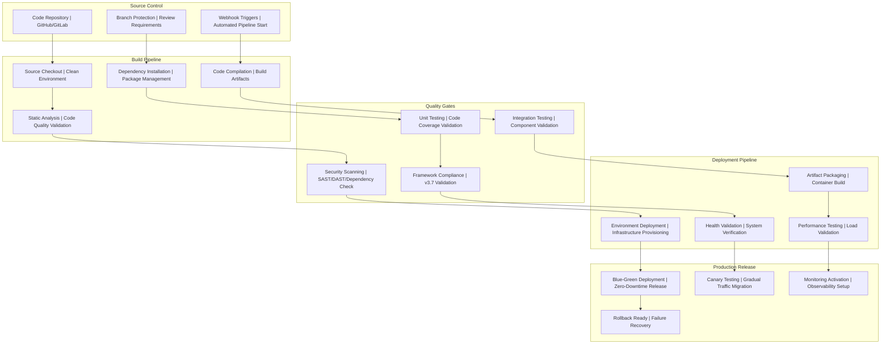

# CI/CD Pipeline Framework v3.7
## AI-First Continuous Integration and Deployment Automation

**Version:** 3.7 - Production Ready CI/CD Automation  
**Date:** 2025-08-20  
**Status:** Production Ready  
**Integration:** Framework v3.7 compliant with AI-first development methodology  
**Focus:** Enterprise-grade CI/CD automation with quality gates  

---

## 🚀 **Executive Summary: CI/CD Excellence**

### **AI-First CI/CD Capabilities**
Framework v3.7 delivers **enterprise-grade CI/CD automation** through:

- **Automated Build Pipelines:** Complete compilation, testing, and artifact generation
- **Quality Gate Integration:** Framework compliance validation and security scanning
- **AI-Driven Testing:** Intelligent test execution with adaptive strategies
- **Multi-Environment Deployment:** Automated promotion through development, staging, production
- **Security Integration:** Built-in security scanning and vulnerability management
- **Performance Validation:** Automated performance testing and benchmarking
- **Rollback Automation:** Intelligent failure detection and automated recovery

### **Production Readiness Indicators**
✅ **Build Automation:** Complete build pipeline with quality validation  
✅ **Testing Integration:** Automated unit, integration, and security testing  
✅ **Quality Gates:** Framework compliance and security validation  
✅ **Deployment Pipeline:** Multi-environment automated deployment  
✅ **Monitoring Integration:** CI/CD pipeline observability and alerting  
✅ **Rollback Capability:** Automated failure detection and recovery  
✅ **Security Scanning:** Integrated SAST, DAST, and dependency scanning  
✅ **Performance Validation:** Automated performance testing and optimization  

---

## 🔄 **CI/CD Pipeline Architecture**

### **Complete Pipeline Flow**



### **Pipeline Configuration Structure**

```
deployment/pipelines/
├── github-actions/               # GitHub Actions workflows
│   ├── ci-build.yml             # Continuous integration build
│   ├── security-scan.yml        # Security scanning workflow
│   ├── performance-test.yml     # Performance testing workflow
│   ├── deployment-prod.yml      # Production deployment workflow
│   └── rollback-procedure.yml   # Automated rollback workflow
├── gitlab-ci/                   # GitLab CI/CD configurations
│   ├── .gitlab-ci.yml          # Main GitLab CI configuration
│   ├── build-stage.yml         # Build stage configuration
│   ├── test-stage.yml          # Testing stage configuration
│   ├── security-stage.yml      # Security validation stage
│   └── deploy-stage.yml        # Deployment stage configuration
├── azure-devops/               # Azure DevOps pipelines
│   ├── azure-pipelines.yml     # Main Azure pipeline
│   ├── build-template.yml      # Build template
│   ├── test-template.yml       # Testing template
│   ├── security-template.yml   # Security scanning template
│   └── deploy-template.yml     # Deployment template
├── jenkins/                    # Jenkins pipeline configurations
│   ├── Jenkinsfile             # Main Jenkins pipeline
│   ├── build-pipeline.groovy   # Build stage pipeline
│   ├── test-pipeline.groovy    # Testing stage pipeline
│   ├── security-pipeline.groovy # Security stage pipeline
│   └── deploy-pipeline.groovy  # Deployment stage pipeline
└── quality-gates/              # Quality gate configurations
    ├── sonarqube-config.xml    # SonarQube quality configuration
    ├── security-policy.yml     # Security policy enforcement
    ├── performance-thresholds.yml # Performance validation criteria
    └── framework-compliance.yml # Framework v3.7 validation rules
```

---

## ⚙️ **Build Pipeline Configuration**

### **GitHub Actions CI/CD**

#### **Main CI Build Workflow**

**GitHub Actions CI/CD Pipeline Architecture:**

**Pipeline Configuration Structure:**
- **Trigger Management**: Push/pull request triggers with branch protection and workflow dispatch capabilities
- **Environment Setup**: Python 3.11, Node.js 18, Google Cloud Registry, and project configuration
- **Job Orchestration**: Setup, build, test, security scan, quality gates, container build, and deployment jobs
- **Artifact Management**: Version generation, build artifact creation, and cross-job artifact sharing
- **Matrix Testing**: Parallel execution of unit, integration, and security test suites

**Build Pipeline Components:**
- **Source Control Integration**: Code checkout with full history and change detection for smart deployment triggers
- **Dependency Management**: Automated dependency installation with caching for performance optimization
- **Code Quality Validation**: Black formatting, Flake8 linting, and MyPy type checking with configurable standards
- **Framework Compliance**: Automated Framework v3.7 structure validation with required files and directories verification
- **Application Build**: Python compilation and import validation with build artifact generation

**Testing Pipeline Components:**
- **Test Matrix Execution**: Parallel unit, integration, and security testing with matrix strategy optimization
- **Coverage Validation**: 85% minimum code coverage requirement with comprehensive reporting
- **Security Testing**: Bandit SAST, Safety dependency scanning, and custom security test execution
- **Test Artifact Management**: JUnit XML results, coverage reports, and security scan outputs with retention policies

**Quality Gate Validation:**
- **Automated Quality Assessment**: Python-based test result parsing and security scan validation
- **Failure Threshold Management**: Configurable failure and error rate thresholds with automated pass/fail determination
- **Multi-Criteria Validation**: Unit test results, security scan outcomes, and framework compliance verification
- **Quality Reporting**: Comprehensive quality gate status reporting with detailed failure analysis

**Container Build Pipeline:**
- **Docker Buildx Integration**: Multi-platform container building with advanced caching strategies
- **Google Cloud Authentication**: Service account-based authentication with secure credential management
- **Container Registry Management**: Automated image pushing with version tagging and latest tag management
- **Container Manifest Generation**: Build metadata, version information, and deployment artifact creation

**Multi-Environment Deployment:**
- **Staging Deployment**: Automated staging environment deployment with health validation and functionality testing
- **Production Deployment**: Blue-green deployment strategy with traffic management and zero-downtime releases
- **Canary Testing**: Gradual traffic shifting (10% → 50% → 100%) with monitoring and automated rollback capabilities
- **Release Management**: Automated GitHub release creation with comprehensive release notes and deployment information

**Automated Rollback System:**
- **Failure Detection**: Automatic failure detection with intelligent rollback triggering
- **Previous Version Recovery**: Automated previous revision identification and traffic rollback to stable versions
- **Rollback Notification**: Team notification system with rollback status and recovery information
- **Recovery Validation**: Post-rollback health verification and system stability confirmation

---
## 🔐 **Security Integration**

### **Security Pipeline Configuration**

**Comprehensive Security Scanning Architecture:**

**Security Pipeline Structure:**
- **Scheduled Scanning**: Daily security scans at 6 AM UTC with on-demand and push-triggered security validation
- **Multi-Layer Security Analysis**: Static Analysis Security Testing (SAST), Dynamic Application Security Testing (DAST), and Container Security Scanning
- **Security Tool Integration**: Bandit Python security analyzer, Safety dependency vulnerability scanner, and Semgrep code analysis
- **Automated Security Gates**: Security threshold validation with pass/fail determination and comprehensive reporting

**Static Analysis Security Testing (SAST):**
- **Python Security Analysis**: Bandit-based security issue detection with high-confidence filtering and JSON reporting
- **Dependency Vulnerability Scanning**: Safety-based dependency vulnerability detection with critical severity filtering
- **Code Pattern Analysis**: Semgrep-based security pattern detection with automated configuration and comprehensive rule coverage
- **Security Report Generation**: Standardized JSON security reports with artifact management and cross-job accessibility

**Dynamic Application Security Testing (DAST):**
- **Live Application Testing**: Docker-based test application deployment with realistic runtime security testing
- **OWASP ZAP Integration**: Comprehensive web application security scanning with automated vulnerability detection
- **Application Startup Management**: Intelligent application startup waiting with health check validation before security testing
- **Security Configuration**: Custom ZAP rules and scanning configuration with comprehensive security coverage

**Container Security Scanning:**
- **Container Image Analysis**: Trivy-based container security scanning with vulnerability detection and compliance checking
- **SARIF Report Generation**: Security Analysis Results Interchange Format reporting with GitHub security integration
- **Multi-Layer Container Analysis**: Base image, dependency, and configuration security validation
- **Automated Security Upload**: GitHub CodeQL integration with security alert management and tracking

**Security Gate Validation Framework:**
- **Multi-Tool Security Assessment**: Bandit, Safety, and Semgrep result aggregation with unified security gate validation
- **Severity-Based Filtering**: High-severity issue filtering with configurable security thresholds and pass/fail criteria
- **Automated Security Reporting**: Python-based security report parsing with comprehensive security status determination
- **Security Failure Management**: Automated security gate failure handling with detailed security issue reporting and remediation guidance

---

## 📊 **Performance Testing Pipeline**

### **Performance Validation Configuration**

**Comprehensive Performance Testing Architecture:**

**Performance Pipeline Structure:**
- **Scheduled Performance Testing**: Daily performance validation at 2 AM UTC with configurable test duration parameters
- **Multi-Stage Performance Analysis**: Load testing, stress testing, and capacity planning with comprehensive performance metrics
- **Performance Tool Integration**: Locust load testing framework, Apache Bench stress testing, and Python-based performance analysis
- **Automated Performance Gates**: Performance threshold validation with response time and error rate criteria

**Load Testing Framework:**
- **Realistic User Simulation**: Locust-based user behavior modeling with configurable wait times and request patterns
- **Multi-Endpoint Testing**: Health checks, readiness validation, and core application functionality testing with weighted task distribution
- **Scalable Load Generation**: 50 concurrent users with 5 users/second spawn rate and configurable test duration (default 10 minutes)
- **Comprehensive Metrics Collection**: Response times, throughput, error rates, and user simulation statistics with HTML and CSV reporting

**Performance Analysis Framework:**
- **Automated Results Processing**: Python-based CSV parsing with comprehensive performance metric extraction and analysis
- **Performance Threshold Validation**: 2-second average response time limit and 1% error rate threshold with automated pass/fail determination
- **Detailed Performance Reporting**: Timestamped performance analysis with endpoint-specific metrics and comprehensive JSON reporting
- **Performance Artifact Management**: HTML reports, JSON analysis, and CSV data with retention and accessibility management

**Stress Testing Framework:**
- **Gradual Load Escalation**: Progressive user load increase (10 → 20 → 50 → 100 → 200 → 500 users) with breaking point detection
- **Resource-Constrained Testing**: Limited memory (1GB) and CPU (1.0 core) testing environment for realistic stress testing
- **Service Health Monitoring**: Continuous health check validation with automatic stress test termination on service failure
- **Capacity Planning Data**: Concurrent user capacity identification with service failure threshold documentation

**Performance Validation Framework:**
- **Multi-Criteria Performance Assessment**: Response time analysis, error rate validation, and throughput measurement with comprehensive reporting
- **Performance Regression Detection**: Historical performance comparison with automated regression identification and alerting
- **Capacity Planning Integration**: Stress test results analysis with capacity recommendations and scaling guidance
- **Performance Artifact Archival**: Comprehensive performance test result storage with historical trending and analysis capabilities

---

## 🤖 **AI-First CI/CD Commands**

### **Pipeline Management Commands**

```bash
# Complete CI/CD pipeline setup
"cloud-devops-expert: Initialize complete CI/CD pipeline with GitHub Actions including build automation, quality gates, security scanning, performance testing, and multi-environment deployment for Framework v3.7 compliance"

# Quality gate configuration
"test-engineer + security-auditor: Configure comprehensive quality gates including unit testing (>85% coverage), integration testing, security scanning (SAST/DAST), and Framework v3.7 compliance validation"

# Security pipeline integration
"security-auditor + cloud-devops-expert: Implement security-first CI/CD pipeline with automated vulnerability scanning, dependency checks, container security validation, and compliance reporting"

# Performance validation setup
"performance-optimizer + cloud-devops-expert: Configure automated performance testing pipeline with load testing, stress testing, and performance threshold validation integrated into deployment workflow"
```

### **Pipeline Optimization Commands**

```bash
# Build optimization
"cloud-devops-expert: Optimize build pipeline performance including dependency caching, parallel job execution, artifact management, and build time reduction strategies"

# Deployment automation
"cloud-devops-expert: Configure advanced deployment strategies including blue-green deployments, canary releases, automated rollback procedures, and zero-downtime deployments"

# Monitoring integration
"cloud-ops-engineer: Integrate comprehensive CI/CD pipeline monitoring including build success rates, deployment health, performance metrics, and failure analysis"

# Cost optimization
"cloud-devops-expert: Analyze and optimize CI/CD pipeline costs including compute usage, artifact storage, runner efficiency, and resource allocation optimization"
```

### **Quality Validation Commands**

```bash
# Framework compliance validation
"test-engineer + project-manager: Validate Framework v3.7 compliance including structure validation, requirements traceability, BDD scenario coverage, and ADR documentation completeness"

# Security gate validation
"security-auditor: Execute comprehensive security validation including static analysis results, dynamic testing outcomes, dependency vulnerability status, and container security compliance"

# Performance gate validation  
"performance-optimizer: Validate performance thresholds including response time requirements, throughput targets, resource utilization limits, and scalability benchmarks"

# Production readiness assessment
"project-manager: Coordinate comprehensive production readiness validation including all quality gates, security compliance, performance validation, and deployment automation verification"
```

---

## 📊 **CI/CD Success Metrics**

### **Build Pipeline Metrics**
- **Build Success Rate:** >95% successful builds across all branches
- **Build Time:** <10 minutes for complete build and test cycle
- **Quality Gate Pass Rate:** >95% quality gate success rate
- **Framework Compliance:** 100% Framework v3.7 structure validation

### **Security Integration Metrics**
- **Security Scan Coverage:** 100% security scanning integration
- **Vulnerability Detection:** <24 hours for critical vulnerability remediation
- **Compliance Rate:** 100% security policy compliance
- **False Positive Rate:** <5% security scan false positives

### **Deployment Pipeline Metrics**
- **Deployment Success Rate:** >99% successful automated deployments
- **Deployment Time:** <15 minutes for complete deployment cycle
- **Rollback Time:** <5 minutes for automated failure recovery
- **Zero-Downtime Deployments:** 100% production deployment uptime

### **Performance Validation Metrics**
- **Performance Test Coverage:** 100% critical path performance validation
- **Response Time Validation:** <2 seconds average response time
- **Throughput Validation:** >1000 requests/second capacity
- **Resource Efficiency:** <80% average resource utilization

---

## 🎯 **Conclusion: CI/CD Pipeline Excellence**

Framework v3.7 CI/CD Pipeline provides **enterprise-grade automation** with:

**🔄 Complete Pipeline Automation:**
- Automated build, test, and deployment workflows
- Multi-environment deployment with quality gates
- Security-first integration with comprehensive scanning
- Performance validation with automated testing

**🔐 Security-First Integration:**
- SAST/DAST/SCA security scanning automation
- Container security validation and compliance
- Dependency vulnerability management
- Security policy enforcement and reporting

**📊 Quality Excellence:**
- Framework v3.7 compliance validation
- >95% quality gate success rate
- Comprehensive test automation and coverage
- Performance threshold validation and optimization

**🚀 Production Excellence:**
- >99% deployment success rate with zero-downtime releases
- Automated rollback and failure recovery
- Blue-green and canary deployment strategies
- Enterprise-grade monitoring and observability integration

**Framework Integration:**
The CI/CD pipeline seamlessly integrates with Framework v3.7 development methodology, providing automated validation of framework compliance, security requirements, and quality standards while delivering reliable, secure, and performant applications to production.