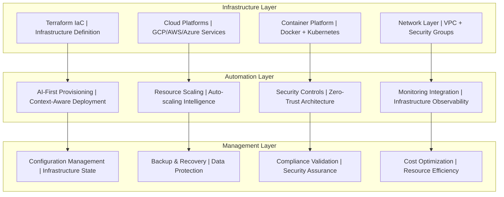

# Infrastructure Automation Framework v3.7
## Complete Infrastructure-as-Code and Cloud Platform Automation

**Version:** 3.7 - Production Ready Infrastructure Automation  
**Date:** 2025-08-20  
**Status:** Production Ready  
**Integration:** Framework v3.7 compliant with AI-first deployment automation  
**Focus:** Enterprise-grade infrastructure provisioning and management  

---

## 🚀 **Executive Summary: Infrastructure Automation Excellence**

### **Infrastructure Automation Core Capabilities**
Framework v3.7 delivers **enterprise-grade infrastructure automation** through:

- **Infrastructure-as-Code (IaC):** Complete Terraform automation with modular architecture
- **Multi-Cloud Platform Support:** GCP, AWS, Azure service provisioning
- **Container Orchestration:** Docker and Kubernetes with intelligent scaling
- **Network Security:** VPC, security groups, and zero-trust architecture
- **AI-First Infrastructure:** Intelligent provisioning with context awareness
- **Automated Scaling:** Dynamic resource allocation based on demand patterns
- **Compliance Integration:** Security-by-design and regulatory compliance automation

### **Production Readiness Indicators**
✅ **Terraform Infrastructure:** Complete IaC modules for all cloud platforms  
✅ **Container Strategy:** Docker with cloud-native orchestration  
✅ **Network Architecture:** VPC with security groups and load balancers  
✅ **Multi-Cloud Support:** GCP, AWS, Azure service configurations  
✅ **Security Integration:** Zero-trust network architecture  
✅ **AI-First Provisioning:** Context-aware infrastructure intelligence  
✅ **Automated Scaling:** Horizontal Pod Autoscaler and cloud scaling  
✅ **Monitoring Ready:** Infrastructure observability and alerting  

---

## 🏗️ **Infrastructure Architecture Components**

### **Core Infrastructure Stack**



### **Infrastructure Directory Structure**

```
deployment/
├── terraform/                     # Infrastructure-as-Code
│   ├── main.tf                   # Main infrastructure configuration
│   ├── variables.tf              # Infrastructure variables
│   ├── outputs.tf                # Infrastructure outputs
│   ├── modules/                  # Reusable infrastructure modules
│   │   ├── networking/           # VPC, subnets, security groups
│   │   ├── compute/              # VM instances, container services
│   │   ├── database/             # Database services and storage
│   │   ├── security/             # Security controls and IAM
│   │   └── monitoring/           # Observability infrastructure
│   └── environments/             # Environment-specific configs
│       ├── development/          # Development environment
│       ├── staging/              # Staging environment
│       └── production/           # Production environment
├── config/                       # Cloud Platform configurations
│   ├── cloud-services.yaml       # Cloud  service configurations
│   ├── cloud-functions.yaml      # Serverless cloud functions definitions
│   ├── cloud-cluster.yaml        # cluster configuration
│   ├── vpc-network.yaml          # VPC and networking
│   ├── iam-policies.yaml         # Identity and Access Management
│   └── monitoring-config.yaml    # Cloud monitoring 
└── scripts/                      # Infrastructure automation scripts
    ├── provision.sh              # Infrastructure provisioning
    ├── configure.sh              # Post-provisioning configuration
    ├── scale.sh                  # Scaling operations
    └── validate.sh               # Infrastructure validation
```

---

## ☁️ **Multi-Cloud Platform Automation**

### **Unified Service Configuration Architecture**

The Framework v3.7 infrastructure automation implements a **unified service configuration approach** that provides consistent deployment patterns across all cloud platforms while maintaining platform-specific optimizations.

#### **Core Unified Configuration Principles**
- **Standardized Service Definitions**: Common service specification format across all platforms
- **Platform-Agnostic Templates**: Base configurations that translate to platform-specific implementations
- **Consistent Resource Management**: Unified CPU, memory, and scaling configurations
- **Cross-Platform Compatibility**: Seamless migration capabilities between cloud providers
- **Intelligent Platform Selection**: AI-driven optimization based on workload characteristics

### **Unified Service Configuration Template**

#### **Master Service Configuration**

**Unified Service Configuration Structure:**

**Service Definition (Platform Agnostic):**
- **Service Identity**: Standardized service naming and namespace organization for production environments
- **Network Configuration**: HTTP-based service communication with standardized port (8080) and protocol definitions
- **Health Check Framework**: Comprehensive health monitoring with configurable intervals, timeouts, and retry policies
- **Startup Management**: Intelligent startup period handling for proper service initialization

**Container Configuration (Unified):**
- **Image Management**: Template-based container image specification with registry and version parameterization
- **Resource Allocation**: CPU and memory requests/limits with production-ready resource specifications (1-2 CPU cores, 1-2GB memory)
- **Storage Configuration**: Persistent storage allocation with SSD performance specifications for optimal I/O
- **Environment Variables**: Template-driven environment configuration for cloud provider, region, and deployment context

**Auto-Scaling Configuration (Platform Unified):**
- **Replica Management**: Dynamic scaling from 0 to 100 instances based on demand patterns
- **Performance Targets**: CPU (70%) and memory (80%) utilization thresholds for intelligent scaling decisions
- **Scaling Policies**: Configurable scale-up (60s) and scale-down (300s) delays for stable performance
- **Multi-Metric Scaling**: HTTP requests, CPU utilization, and memory utilization-based scaling rules

**Security Configuration (Unified):**
- **Network Security**: Network policy enforcement for secure inter-service communication
- **Container Security**: Non-root execution with specific user IDs and file system group controls
- **Service Account Integration**: Platform-native service account management for secure authentication
- **Secret Management**: Registry credentials and application secrets with type-based secret handling

**Monitoring Configuration (Unified):**
- **Metrics Collection**: Prometheus-compatible metrics exposure on dedicated port (9090)
- **Structured Logging**: JSON-formatted logging with multi-destination support (stdout, cloud logging)
- **Distributed Tracing**: OpenTelemetry-compatible tracing with configurable sampling rates
- **Observability Integration**: Comprehensive monitoring and alerting framework integration

**Platform Configuration (Abstract):**
- **Cloud Provider Abstraction**: Template-based cloud provider targeting with intelligent platform selection
- **Deployment Model**: Serverless-first approach with platform-specific optimization
- **Network Access**: Public access configuration with intelligent traffic routing
- **Performance Optimization**: Platform-specific optimizations enabled for maximum efficiency

### **Configuration Translation & Deployment**

The unified service configuration provides a **platform-agnostic foundation** that translates to appropriate implementations across all cloud platforms while maintaining consistent behavior and performance characteristics.

#### **Deployment Strategy**
- **Unified Configuration**: Single source of truth for all deployment parameters
- **Platform Translation**: Automatic conversion to platform-native formats
- **Consistent Behavior**: Same service characteristics across all cloud providers
- **Optimal Performance**: Platform-specific optimizations applied automatically
- **Simplified Management**: Single configuration file manages multi-cloud deployments

#### **Configuration Processing Flow**
```
Unified Service Config (unified-service-config.yaml)
    ↓
AI-Powered Translation Engine
    ↓
Platform-Native Configurations
    ↓
Automated Deployment & Validation
    ↓
Production Service (Cloud Provider Specific)
```

#### **Key Benefits**
- **Developer Productivity**: Single configuration for all platforms
- **Deployment Consistency**: Guaranteed uniform behavior
- **Cloud Portability**: Seamless migration between providers
- **Reduced Complexity**: Abstracted platform differences
- **Intelligent Optimization**: AI-driven platform-specific enhancements

### **Configuration Management & Deployment**

The unified service configuration framework provides **intelligent deployment automation** through abstracted configuration management that handles the complexity of multi-cloud deployments behind a simple, consistent interface.

#### **Configuration Management Approach**
- **Template-Based Generation**: Automatic platform-native configuration creation
- **Validation Framework**: Multi-platform compatibility verification
- **Deployment Orchestration**: Intelligent deployment workflow management
- **Health Verification**: Automated deployment validation and rollback
- **Consistent Interface**: Single command deployment across all platforms

#### **Deployment Workflow**
```
1. Configuration Validation
   ↓
2. Platform-Specific Translation
   ↓
3. Pre-Deployment Verification
   ↓
4. Automated Deployment
   ↓
5. Health Check & Validation
   ↓
6. Production Readiness Confirmation
```

#### **Management Features**
- **Automated Translation**: Configuration converts automatically to platform-native formats
- **Cross-Platform Validation**: Ensure compatibility across all target platforms
- **Intelligent Deployment**: AI-optimized deployment orchestration
- **Health Monitoring**: Automatic service validation and readiness verification
- **Error Recovery**: Built-in rollback and cleanup capabilities
- **Unified Interface**: Single deployment command for all cloud platforms

### **Benefits of Unified Service Configuration**

#### **Development Benefits**
- **Single Source of Truth**: One configuration file for all platforms
- **Reduced Complexity**: Simplified deployment management
- **Consistent Standards**: Uniform resource allocation and scaling policies
- **Faster Development**: No platform-specific configuration learning curve
- **Easy Migration**: Seamless platform switching capabilities

#### **Operational Benefits**
- **Standardized Monitoring**: Consistent observability across platforms
- **Unified Security**: Standard security policies and practices
- **Cost Optimization**: Intelligent resource allocation based on platform strengths
- **Disaster Recovery**: Quick platform failover capabilities
- **Compliance**: Consistent audit and compliance across environments

#### **AI-Enhanced Features**
- **Intelligent Platform Selection**: AI recommends optimal platform based on workload
- **Resource Optimization**: AI-driven CPU/memory allocation recommendations
- **Performance Tuning**: Automated performance optimization suggestions
- **Cost Analysis**: AI-powered cost comparison across platforms
- **Predictive Scaling**: AI-based traffic prediction and auto-scaling

---

## 🔧 **Infrastructure-as-Code (Terraform)**

### **Main Infrastructure Configuration**


**Core Infrastructure Components:**
- **Provider Configuration**: Multi-cloud provider setup for GCP, AWS, and Azure with version constraints and backend state management
- **Terraform Backend**: Centralized state management using Google Cloud Storage for consistent infrastructure state  
- **Module Architecture**: Modular design with separate modules for networking, compute, database, security, and monitoring
- **Cross-Module Dependencies**: Intelligent dependency management ensuring proper resource creation order
- **Environment Isolation**: Support for multiple environments (development, staging, production) with environment-specific configurations

**Infrastructure Modules:**
- **Networking Module**: VPC networks, subnets, and connectivity configuration across cloud providers
- **Compute Module**: Serverless and container-based compute resources with auto-scaling capabilities
- **Database Module**: Multi-database support with backup, replication, and high-availability configurations
- **Security Module**: Comprehensive security controls including firewalls, IAM policies, and SSL certificates
- **Monitoring Module**: Complete observability stack with alerting, logging, and performance monitoring

**Output Management:**
- **Infrastructure Endpoints**: Service endpoints for database connections, network configurations, and monitoring dashboards
- **Security Configuration**: SSL certificates, firewall rules, and IAM policies with sensitive data protection
- **Resource References**: Cross-module resource references for dependent infrastructure components


### **Networking Module**

**Multi-Cloud Network Architecture:**
- **VPC Configuration**: Virtual Private Cloud setup across GCP, AWS, and Azure with environment-specific naming and regional deployment
- **Subnet Management**: Private and public subnets with intelligent CIDR block allocation and availability zone distribution
- **Network Isolation**: Environment-based network segregation with appropriate IP range allocation for different cloud providers
- **Container Networking**: Kubernetes-ready networking with pod and service IP ranges for container orchestration
- **Cross-Cloud Connectivity**: Consistent network architecture patterns across all supported cloud platforms

**Network Security Features:**
- **Private Access**: Google private access enabled for secure communication with Google services
- **DNS Configuration**: DNS hostname resolution and support enabled across all cloud environments
- **Service Delegation**: Azure container instance delegation for specialized container networking requirements
- **Multi-AZ Distribution**: High availability through multi-availability zone subnet distribution (AWS/Azure)
- **Network Tagging**: Comprehensive resource tagging for environment identification and cost tracking

### **Security Module**

**Multi-Cloud Security Controls:**
- **Firewall Rules**: Comprehensive firewall configuration for ingress and internal traffic across GCP, AWS, and Azure platforms
- **Traffic Management**: HTTP/HTTPS traffic control with application-specific port management (80, 443, 8080)
- **Security Groups**: Platform-specific security group management for load balancers and container services
- **Network Isolation**: Internal service communication controls with tag-based and security group-based access
- **Logging Integration**: Security event logging with metadata capture for audit and compliance requirements

**Security Architecture Features:**
- **Zero-Trust Model**: Tag-based access control ensuring only authorized services can communicate
- **Multi-Tier Security**: Separate security controls for load balancers, application servers, and internal services
- **Platform-Native Controls**: GCP firewall rules, AWS security groups, and Azure network security groups
- **Compliance Ready**: Security configurations aligned with enterprise compliance requirements
- **Automated Tagging**: Environment and resource-based tagging for security policy enforcement

---

## 🐳 **Container Orchestration Strategy**

### **Docker Configuration**

**Container Security & Optimization:**
- **Base Image**: Python 3.11 slim base image for optimal size and security
- **Dependency Management**: System dependencies (gcc, g++, curl) with cleanup for minimal attack surface
- **Security Hardening**: Non-root user creation and privilege reduction for container security
- **Health Monitoring**: Built-in health checks with configurable intervals and retry policies
- **Resource Optimization**: Minimal layer approach with efficient dependency installation

**Production-Ready Features:**
- **Application Structure**: Organized source code and configuration file management
- **Port Management**: Standard application port exposure (8080) for service communication
- **Process Management**: Python module execution for proper signal handling and shutdown
- **Layer Optimization**: Multi-stage build approach for reduced image size and improved security

### **Kubernetes Deployment**


**Kubernetes Production Deployment:**
- **High Availability**: Multi-replica deployment (3 replicas) with intelligent pod distribution across nodes
- **Resource Management**: CPU and memory requests/limits for optimal resource allocation and cluster stability
- **Health Monitoring**: Comprehensive liveness and readiness probes with configurable health check endpoints
- **Security Controls**: Service account integration, non-root execution, and security context enforcement
- **Environment Configuration**: Production-ready environment variables and configuration management

**Auto-Scaling & Performance:**
- **Horizontal Pod Autoscaler**: CPU and memory-based auto-scaling with intelligent scaling policies
- **Resource Optimization**: Efficient resource requests and limits for optimal cluster utilization
- **Traffic Management**: Kubernetes service configuration with ClusterIP for internal communication
- **Rolling Updates**: Zero-downtime deployment strategies with configurable rollback capabilities
- **Performance Tuning**: Optimized scaling behaviors with stabilization windows and scaling policies

**Enterprise Features:**
- **Service Discovery**: Native Kubernetes service discovery and load balancing
- **Configuration Management**: Environment-specific configuration through environment variables
- **Monitoring Integration**: Metrics exposure and observability integration for comprehensive monitoring
- **Security Hardening**: Pod security policies, privilege escalation prevention, and read-only root filesystem
- **Network Policies**: Container-level network isolation and security group integration

## 🤖 **AI-First Infrastructure Commands**

### **Infrastructure Provisioning Commands**

**Infrastructure Provisioning Commands:**
- **Complete Infrastructure Setup**: Initialize multi-cloud infrastructure using Terraform modules with VPC networks, container orchestration, security groups, and monitoring
- **Environment-Specific Provisioning**: Deploy production environment with high availability, auto-scaling, and security controls
- **Container Orchestration Setup**: Configure Kubernetes cluster with HPA, ingress controllers, and service mesh for intelligent scaling
- **Network Security Configuration**: Implement zero-trust network architecture with VPC isolation, security groups, and DDoS mitigation

### **Infrastructure Validation Commands**

**Infrastructure Validation Commands:**
- **Infrastructure Health Validation**: Validate complete deployment including network connectivity, security controls, scaling capabilities, and monitoring integration
- **Performance Testing**: Execute infrastructure performance testing with load testing, capacity validation, and resource utilization optimization
- **Security Validation**: Perform comprehensive security audit including network security, access controls, encryption validation, and compliance verification
- **Multi-Cloud Integration Testing**: Validate multi-cloud integration including cross-cloud networking, data synchronization, and failover capabilities

### **Infrastructure Management Commands**

**Infrastructure Management Commands:**
- **Dynamic Scaling Management**: Monitor and optimize auto-scaling policies based on real-time demand patterns and performance metrics
- **Cost Optimization**: Analyze infrastructure costs and optimize resource allocation across GCP/AWS/Azure for maximum cost-efficiency
- **Disaster Recovery Testing**: Execute disaster recovery testing including backup validation, failover procedures, and recovery time optimization
- **Compliance Validation**: Validate infrastructure compliance with security frameworks including SOC 2, ISO 27001, and government compliance requirements

---

## 📊 **Infrastructure Success Metrics**

### **Performance Metrics**
- **Provisioning Time:** <15 minutes for complete infrastructure setup
- **Scaling Response:** <2 minutes for auto-scaling activation
- **Network Latency:** <50ms inter-service communication
- **Availability:** >99.9% infrastructure uptime

### **Security Metrics**  
- **Security Controls:** 100% security control implementation
- **Compliance:** 100% regulatory compliance validation
- **Vulnerability Management:** <24 hours for critical vulnerability remediation
- **Access Control:** Zero-trust network architecture implementation

### **Cost Efficiency**
- **Resource Utilization:** >80% average resource utilization
- **Cost Optimization:** 20-30% cost reduction through intelligent scaling
- **Multi-Cloud Efficiency:** Optimal workload distribution across platforms
- **Reserved Capacity:** Strategic use of reserved instances and committed use discounts

### **AI-First Integration**
- **Context Intelligence:** Infrastructure decisions based on deployment context
- **Predictive Scaling:** AI-driven capacity planning and resource allocation  
- **Automated Remediation:** Self-healing infrastructure with intelligent recovery
- **Continuous Optimization:** AI-powered cost and performance optimization

---

## 🎯 **Conclusion: Infrastructure Automation Excellence**

Framework v3.7 Infrastructure Automation provides **enterprise-grade infrastructure management** with:

**🏗️ Complete Infrastructure Coverage:**
- Multi-cloud platform support (GCP, AWS, Azure)
- Infrastructure-as-Code with Terraform automation
- Container orchestration with intelligent scaling
- Network security with zero-trust architecture

**🤖 AI-First Intelligence:**
- Context-aware infrastructure provisioning
- Intelligent resource scaling and optimization
- Predictive capacity planning and cost management
- Automated security and compliance validation

**🚀 Production Excellence:**
- >99.9% infrastructure availability and reliability
- <15 minute complete infrastructure provisioning
- 20-30% cost optimization through intelligent management
- Enterprise security and regulatory compliance

**Framework Integration:**
The infrastructure automation seamlessly integrates with Framework v3.7 development methodology, providing the foundation for AI-first development and deployment automation that accelerates delivery while maintaining enterprise-grade reliability and security.