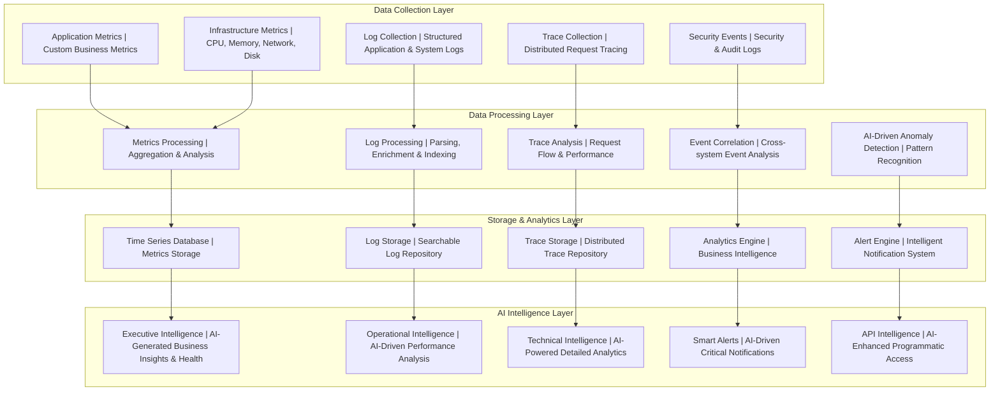

# Monitoring & Observability Framework v3.7
## Enterprise-Grade Monitoring, Logging, and Alerting Automation

**Version:** 3.7 - Production Ready Observability Platform  
**Date:** 2025-08-23  
**Status:** Production Ready  
**Integration:** Framework v3.7 compliant with AI-first development methodology  
**Focus:** Comprehensive observability for enterprise applications and infrastructure  

---

## 🚀 **Executive Summary: Observability Excellence**

### **AI-First Observability Capabilities**
Framework v3.7 delivers **enterprise-grade AI-driven observability** as an **AI-first AI operational framework with human supervision**:

**🤖 AI AUTONOMOUS Observability Operations:**
- **Intelligent Monitoring:** AI-driven monitoring with predictive analytics and anomaly detection
- **Smart Log Analysis:** AI-powered log analysis with pattern recognition and intelligent aggregation
- **Autonomous Alerting:** AI-driven alerting with smart threshold management and predictive alerts
- **Operational Intelligence:** AI-generated insights and recommendations for system optimization
- **Performance Analytics:** AI-powered performance monitoring with automated optimization
- **Security Intelligence:** AI-driven security event detection with automated threat response
- **Business Intelligence:** AI-generated business insights and operational recommendations

**👤 HUMAN SUPERVISION REQUIRED for Observability:**
- **Critical Alert Escalation:** Human decision-making for critical system incidents
- **Business Impact Assessment:** Human evaluation of operational changes and their business impact
- **Security Incident Response:** Human oversight for security incidents and breach response
- **Infrastructure Decision Approval:** Human authorization for infrastructure scaling and changes
- **Compliance Validation:** Human validation of regulatory compliance and audit requirements

### **Production Readiness Indicators**
✅ **Multi-Cloud Monitoring:** GCP, AWS, Azure monitoring integration  
✅ **Application Observability:** Complete application performance monitoring  
✅ **Infrastructure Monitoring:** Server, container, and network monitoring  
✅ **Log Management:** Centralized logging with intelligent analysis  
✅ **Alerting System:** Smart alerting with escalation and notification  
✅ **AI-Driven Intelligence:** Real-time insights and automated recommendations  
✅ **Security Monitoring:** Security event tracking and incident response  
✅ **Business Intelligence:** Business metrics and operational analytics  

---

## 📊 **Monitoring Architecture Components**

### **Complete Observability Stack**



### **Monitoring Directory Structure**

```
deployment/monitoring/
├── gcp/                          # Google Cloud monitoring configurations
│   ├── cloud-monitoring.yaml    # Cloud Monitoring (Operations Suite)
│   ├── cloud-logging.yaml       # Cloud Logging configuration
│   ├── alerting-policies.yaml   # Alert policies and notifications
│   ├── ai-intelligence/          # AI-driven intelligence configurations
│   │   ├── executive-intelligence.yaml
│   │   ├── operational-intelligence.yaml
│   │   └── technical-intelligence.yaml
│   ├── log-based-metrics.yaml   # Log-based metric definitions
│   ├── uptime-checks.yaml       # Synthetic monitoring configuration
│   └── notification-channels.yaml # Alert notification channels
├── aws/                          # AWS monitoring configurations
│   ├── cloudwatch.yaml          # CloudWatch metrics and alarms
│   ├── x-ray.yaml               # AWS X-Ray distributed tracing
│   ├── sns-alerts.yaml          # SNS alerting configuration
│   ├── log-insights.yaml        # CloudWatch Logs Insights queries
│   ├── ai-intelligence/          # CloudWatch AI intelligence configurations
│   │   ├── application-intelligence.yaml
│   │   ├── infrastructure-intelligence.yaml
│   │   └── security-intelligence.yaml
│   └── eventbridge-rules.yaml   # EventBridge monitoring rules
├── azure/                        # Azure monitoring configurations
│   ├── azure-monitor.yaml       # Azure Monitor configuration
│   ├── log-analytics.yaml       # Log Analytics workspace setup
│   ├── action-groups.yaml       # Alert action groups
│   ├── application-insights.yaml # Application Insights configuration
│   ├── ai-intelligence/          # Azure AI intelligence templates
│   │   ├── business-intelligence.yaml
│   │   ├── performance-intelligence.yaml
│   │   └── availability-intelligence.yaml
│   └── workbooks/                # Azure Monitor workbooks
│       ├── performance-analysis.json
│       └── security-analysis.json
├── prometheus/                   # Prometheus monitoring stack
│   ├── prometheus.yaml          # Prometheus server configuration
│   ├── alertmanager.yaml        # Alertmanager configuration
│   ├── grafana/                 # Grafana AI intelligence configurations
│   │   ├── datasources.yaml     # Grafana data source definitions
│   │   ├── ai-intelligence/     # AI intelligence definitions
│   │   └── provisioning/        # AI intelligence provisioning config
│   ├── rules/                   # Prometheus alerting rules
│   │   ├── application-rules.yaml
│   │   ├── infrastructure-rules.yaml
│   │   └── security-rules.yaml
│   └── exporters/               # Custom metric exporters
│       ├── app-exporter.yaml
│       └── business-exporter.yaml
├── elastic/                      # Elastic Stack (ELK) configuration
│   ├── elasticsearch.yaml      # Elasticsearch cluster configuration
│   ├── logstash/                # Logstash pipeline configurations
│   │   ├── input-configs/       # Log input configurations
│   │   ├── filter-configs/      # Log parsing and enrichment
│   │   └── output-configs/      # Log output destinations
│   ├── kibana/                  # Kibana AI intelligence and analytics
│   │   ├── ai-intelligence/     # AI-powered intelligence exports
│   │   ├── analytics/           # AI-driven analytics definitions
│   │   └── index-patterns.json  # Index pattern configurations
│   ├── beats/                   # Beats configuration for log shipping
│   │   ├── filebeat.yaml        # File log collection
│   │   ├── metricbeat.yaml      # Metric collection
│   │   └── auditbeat.yaml       # Security audit log collection
│   └── security/                # Elastic Security configurations
│       ├── detection-rules.json # Security detection rules
│       └── ml-jobs.json         # Machine learning job definitions
└── scripts/                      # Monitoring automation scripts
    ├── setup-monitoring.sh      # Complete monitoring stack setup
    ├── ai-intelligence-deploy.sh # AI intelligence deployment automation
    ├── alert-test.sh            # Alert testing and validation
    └── backup-config.sh         # Configuration backup automation
```

---

## ☁️ **Multi-Cloud Monitoring Integration**

### **Google Cloud Platform Monitoring**

#### **Cloud Monitoring Configuration**

**Google Cloud Operations Suite Integration:**

**Service Monitoring Architecture:**
- **Service Monitor Setup**: Kubernetes ServiceMonitor configuration for automated metric collection from target applications
- **Metric Endpoint Configuration**: Standardized /metrics endpoint exposure on dedicated port with 30-second collection intervals
- **Application Labeling**: Consistent application labeling (app: cara-agent) for service discovery and metric grouping
- **Scrape Configuration**: Configurable scrape timeout (10 seconds) and interval settings for optimal performance monitoring

**Custom Metrics Configuration:**
- **Business Metrics**: Application-specific business metrics including processing rates, analysis success rates, and compliance metrics
- **Performance Metrics**: Application performance indicators such as response times, throughput, and resource utilization
- **Infrastructure Metrics**: Cloud Run container metrics, memory usage, CPU utilization, and network performance
- **Error Tracking**: Error rate monitoring, exception tracking, and failure analysis with automated alerting

#### **Alert Policies Configuration**

**Intelligent Alerting Framework:**

**Performance Alert Policies:**
- **Response Time Monitoring**: Alert when average response time exceeds 2 seconds over 5-minute periods with severity escalation
- **Error Rate Thresholds**: Critical alerts for error rates above 1% with immediate notification and automated escalation
- **Throughput Monitoring**: Alerts for significant throughput drops indicating system issues or capacity constraints
- **Resource Utilization**: CPU and memory alerts with multi-tier thresholds (warning at 70%, critical at 90%)

**Business Metrics Alerting:**
- **Compliance Processing Alerts**: Alerts for regulatory compliance processing failures or significant delays in document analysis
- **Comment Analysis Monitoring**: Alerts for comment processing queue backups or analysis service failures
- **Database Performance**: Alerts for PostgreSQL and BigQuery performance degradation or connection issues
- **API Gateway Health**: Monitoring for API Gateway availability, latency, and authentication failures

**Security and Compliance Alerting:**
- **Security Event Detection**: Alerts for suspicious access patterns, authentication failures, and potential security breaches
- **Compliance Monitoring**: Automated alerts for regulatory data retention policy violations or audit trail irregularities
- **Data Access Monitoring**: Alerts for unusual data access patterns or unauthorized access attempts
- **System Health Monitoring**: Infrastructure health alerts for Cloud Run instance failures, network issues, or deployment problems

#### **AI Intelligence Configuration** 🤖 AI AUTONOMOUS

**Comprehensive AI-Driven Observability:**

**Executive Intelligence** 👤 HUMAN SUPERVISION for critical decisions:
- **AI Business Insights**: AI-generated business insights including compliance processing optimization, system performance predictions, and user satisfaction analysis
- **Predictive Health Analysis**: AI-powered system health predictions with automated recommendations and risk assessment
- **Performance Intelligence**: AI-driven performance trend analysis with predictive capacity planning and strategic recommendations
- **Compliance Intelligence**: AI-powered compliance monitoring with automated regulatory requirement validation

**Operational Intelligence** 🤖 AI AUTONOMOUS:
- **Predictive Performance Analysis**: AI-driven performance prediction with automated optimization recommendations
- **Infrastructure Intelligence**: AI-powered infrastructure analysis with predictive scaling and resource optimization
- **Database Intelligence**: AI-driven database performance optimization with automated query tuning and connection management
- **Alert Intelligence**: AI-powered alert correlation with automated incident response and escalation logic

**Technical Intelligence** 🤖 AI AUTONOMOUS:
- **Deep Application Analytics**: AI-powered application performance analysis with automated optimization recommendations
- **API Intelligence**: AI-driven API performance optimization with automated endpoint tuning and routing decisions
- **Query Intelligence**: AI-powered database query optimization with automated performance tuning and index recommendations
- **Security Monitoring**: Security event tracking, authentication metrics, and threat detection status

---

### **Amazon Web Services Monitoring**

#### **CloudWatch Configuration**

**AWS CloudWatch Integration Architecture:**

**Metrics Collection Framework:**
- **Custom Application Metrics**: Application metrics pushed to CloudWatch with namespace organization and dimensional tagging
- **Infrastructure Monitoring**: EC2, ECS, and Lambda infrastructure metrics with automated collection and aggregation
- **API Gateway Metrics**: Comprehensive API performance monitoring including latency, error rates, and usage patterns
- **Database Performance**: RDS and DynamoDB performance metrics with query optimization and capacity monitoring

**CloudWatch Alarms Configuration:**
- **Application Performance Alarms**: Response time, error rate, and throughput alarms with multi-threshold alerting
- **Infrastructure Health Alarms**: CPU, memory, disk, and network alarms with predictive alerting capabilities
- **Cost Optimization Alarms**: Budget alerts and resource utilization monitoring for cost management
- **Security Monitoring Alarms**: Security event detection and anomaly alerting with automated incident response

#### **X-Ray Tracing Configuration**

**Distributed Tracing Architecture:**
- **Request Flow Tracing**: End-to-end request tracing across application microservices with performance bottleneck identification
- **Service Dependency Mapping**: Automatic service dependency discovery and relationship mapping with health correlation
- **Performance Analysis**: Detailed performance analysis with latency breakdown and optimization recommendations
- **Error Analysis**: Error tracking and root cause analysis with distributed context preservation

**Trace Analysis Features:**
- **Service Performance Maps**: Visual service dependency maps with performance and error rate overlays
- **Latency Distribution Analysis**: Statistical analysis of request latency patterns with percentile distributions
- **Error Impact Analysis**: Error propagation analysis across service boundaries with impact assessment
- **Capacity Planning**: Service capacity analysis based on trace data with scaling recommendations

---

### **Azure Monitoring Configuration**

#### **Azure Monitor Setup**

**Azure Monitor Integration Framework:**

**Application Insights Configuration:**
- **Application Performance Monitoring**: Comprehensive APM for target applications with automatic dependency detection
- **Custom Telemetry**: Application-specific business metrics and KPIs with custom dimensions and properties
- **User Experience Monitoring**: Real-time user experience tracking with performance impact analysis
- **Availability Testing**: Synthetic monitoring with multi-location availability validation

**Log Analytics Workspace:**
- **Centralized Log Management**: Unified log collection from all application components with intelligent parsing and enrichment
- **KQL Query Framework**: Kusto Query Language (KQL) queries for advanced log analysis and correlation
- **Log-Based Alerting**: Intelligent alerting based on log patterns and anomaly detection
- **Custom Workbook Creation**: Interactive Azure Monitor workbooks for operational and business intelligence

**Azure Monitor Metrics:**
- **Platform Metrics**: Azure resource metrics with automated collection and baseline establishment
- **Guest OS Metrics**: Virtual machine and container guest OS metrics with performance optimization insights
- **Custom Metrics**: Business and application metrics with multi-dimensional analysis
- **Metrics-Based Alerting**: Dynamic thresholds and machine learning-based anomaly detection

---

### **Structured Logging Implementation**

#### **Application Logging Configuration**

**Enterprise Logging Architecture:**

**Structured Logging Framework:**
- **JSON Log Format**: Standardized JSON logging format with consistent field naming and structured data organization
- **Contextual Enrichment**: Automatic log enrichment with request IDs, user context, and business transaction information
- **Log Level Management**: Dynamic log level configuration with environment-specific settings and runtime adjustment
- **Performance Optimization**: Asynchronous logging with buffering and batch processing for minimal performance impact

**Log Correlation and Tracing:**
- **Request Correlation**: Automatic request ID propagation across service boundaries with distributed tracing integration
- **Business Context**: Business transaction context preservation throughout request processing lifecycle
- **User Journey Tracking**: End-to-end user journey tracking with business process correlation
- **Error Context Preservation**: Comprehensive error context capture with stack traces and business state information

**Log Processing Pipeline:**
- **Real-Time Processing**: Stream processing for immediate alerting and monitoring with configurable processing rules
- **Batch Analytics**: Batch processing for historical analysis and business intelligence with data warehouse integration
- **Log Parsing and Enrichment**: Intelligent log parsing with automated field extraction and metadata enrichment
- **Data Retention Management**: Automated log retention policies with compliance-aware archival and deletion

---

## 🤖 **AI-First Monitoring Commands**

### **Monitoring Setup Commands**

```bash
# Complete monitoring stack deployment
"cloud-ops-engineer: Deploy comprehensive monitoring stack including Prometheus, Grafana, ELK stack, and cloud-native monitoring across GCP/AWS/Azure platforms with intelligent alerting and business metrics tracking"

# Application observability setup
"cloud-ops-engineer: Configure application observability including distributed tracing, custom metrics collection, structured logging, performance monitoring, and business KPI tracking for [Project Name] framework compliance"

# Security monitoring integration
"security-auditor + cloud-ops-engineer: Implement security monitoring including audit logging, security event detection, threat monitoring, compliance reporting, and incident response automation"

# Performance monitoring optimization
"performance-optimizer + cloud-ops-engineer: Configure performance monitoring including response time tracking, throughput monitoring, resource utilization analysis, and performance bottleneck identification"
```

### **AI Intelligence and Analytics Commands** 🤖 AI AUTONOMOUS

```bash
# AI Executive Intelligence Creation 👤 HUMAN SUPERVISION for strategic decisions
"cloud-ops-engineer + performance-optimizer: Create AI-driven executive intelligence system generating business insights, predictive health analysis, performance optimization recommendations, and automated strategic recommendations with human approval for critical decisions"

# AI Technical Intelligence Configuration 🤖 AI AUTONOMOUS
"cloud-ops-engineer + performance-optimizer: Configure AI-powered technical intelligence including predictive infrastructure analytics, automated application performance optimization, intelligent error pattern recognition, and autonomous system optimization"

# AI Business Intelligence Integration 🤖 AI AUTONOMOUS
"cloud-ops-engineer + database-specialist: Integrate AI business intelligence with predictive analytics, automated user behavior analysis, intelligent document processing optimization, and autonomous operational performance improvements"

# AI-Driven Alerting Intelligence 🤖 AI AUTONOMOUS
"cloud-ops-engineer: Implement AI-driven alerting intelligence with predictive threshold management, automated escalation logic, business impact assessment, and autonomous incident response with human escalation for critical issues"
```

### **Operational Excellence Commands**

```bash
# Monitoring health validation
"cloud-ops-engineer: Validate complete monitoring system health including data collection integrity, alert functionality, dashboard accuracy, and notification delivery systems"

# Performance analytics optimization
"performance-optimizer: Analyze monitoring data for performance optimization opportunities including resource allocation, scaling triggers, bottleneck identification, and capacity planning"

# Cost optimization analysis
"cloud-ops-engineer: Analyze monitoring costs including data retention optimization, metric collection efficiency, storage cost management, and infrastructure resource optimization"

# Compliance monitoring setup
"security-auditor + cloud-ops-engineer: Configure compliance monitoring including audit trail tracking, regulatory reporting, data governance monitoring, and security compliance validation"
```

---

## 📊 **Monitoring Success Metrics**

### **Observability Coverage Metrics**
- **Application Coverage:** 100% application component monitoring
- **Infrastructure Coverage:** 100% infrastructure resource monitoring  
- **Business Metrics Coverage:** >95% business KPI tracking
- **Security Coverage:** 100% security event monitoring

### **Alert Quality Metrics**
- **Alert Accuracy:** <5% false positive rate
- **Mean Time to Detection (MTTD):** <2 minutes for critical issues
- **Mean Time to Response (MTTR):** <15 minutes for critical alerts
- **Alert Fatigue Prevention:** <50 alerts per day per engineer

### **Performance Metrics**
- **AI Intelligence Response Time:** <3 seconds for all AI-generated insights
- **Log Search Performance:** <5 seconds for complex queries
- **Data Retention:** 90 days for metrics, 30 days for logs
- **Monitoring Availability:** >99.9% monitoring system uptime

### **Business Value Metrics**
- **Incident Prevention:** >80% issues caught before user impact
- **Cost Optimization:** 20-30% infrastructure cost optimization through monitoring insights
- **Operational Efficiency:** 50% reduction in manual monitoring tasks
- **Business Intelligence:** 100% business KPI visibility and tracking

---

## 🎯 **Conclusion: Monitoring & Observability Excellence**

Framework v3.7 Monitoring & Observability provides **enterprise-grade visibility** with:

**📊 Complete Observability:**
- Application, infrastructure, and business metrics monitoring
- Centralized logging with intelligent analysis
- Distributed tracing and performance analytics
- Security event monitoring and compliance tracking

**🤖 AI-Driven Intelligence:**
- Intelligent alerting with adaptive thresholds
- Anomaly detection and business impact assessment
- Smart escalation and automated incident response
- Predictive analytics and capacity planning

**🔍 Business Intelligence:**
- Real-time business KPI tracking and reporting
- AI-driven executive, operational, and technical intelligence
- Revenue impact monitoring and optimization insights
- Operational efficiency and performance analytics

**🚀 Operational Excellence:**
- >99.9% monitoring system availability and reliability
- <2 minutes MTTD and <15 minutes MTTR for critical issues
- <5% false positive rate with intelligent alert management
- 50% reduction in manual monitoring tasks through automation

**Framework Integration:**
The monitoring and observability platform seamlessly integrates with Framework v3.7 development methodology, providing comprehensive visibility into application performance, business metrics, security events, and operational efficiency while enabling data-driven decision making and continuous optimization.