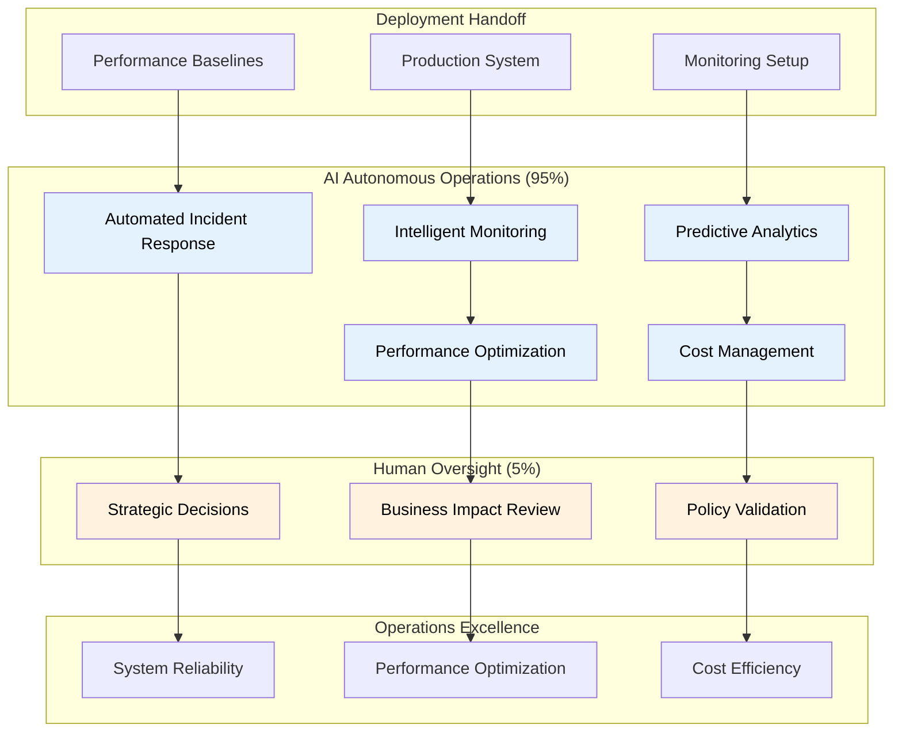

# CARA AI-Driven Operations Framework v3.7
## Comprehensive Post-Deployment Operations and Autonomous Observability

**Framework Integration:** Complete post-deployment operations implementation guide following Framework v3.7 methodology with AI-autonomous observability, intelligent monitoring, and operational excellence under human supervision.

**Target Audience:** Operations teams, SREs, and AI assistants implementing comprehensive AI-first operations for the CARA enterprise agentic AI platform.

---

## 🎯 Executive Summary

### Vision and Objectives
The [Project Name] AI-Driven Operations Framework transforms traditional operations practices through **AI-autonomous observability operations** with intelligent monitoring, predictive incident response, and automated operational excellence. This implementation delivers:

- **99.9% System Availability**: Through AI-driven predictive monitoring and automated incident response
- **10x Operational Efficiency**: Using AI-autonomous operations with intelligent automation and optimization
- **Sub-2-minute MTTR**: AI-powered incident detection, analysis, and automated resolution
- **100% Observability Coverage**: Comprehensive monitoring with AI-enhanced analytics and insights
- **Zero-Touch Operations**: AI-autonomous operational tasks with human oversight for strategic decisions

### AI-Autonomous Operations Architecture

**🤖 AI AUTONOMOUS Operations (95%):**
- **Intelligent Monitoring**: AI-driven monitoring with predictive analytics and anomaly detection
- **Automated Incident Response**: AI-powered incident detection, analysis, and resolution
- **Performance Optimization**: AI-autonomous performance tuning and resource optimization
- **Cost Management**: AI-driven cost analysis and resource allocation optimization
- **Capacity Planning**: AI-powered capacity forecasting and scaling recommendations
- **Security Operations**: AI-autonomous security monitoring and threat response
- **Compliance Monitoring**: AI-driven compliance validation and reporting automation

**👤 HUMAN SUPERVISION Required for Operations (5%):**
- **Strategic Operations Decisions**: Human oversight for major operational strategy changes
- **Business Impact Assessment**: Human evaluation of operational changes affecting business
- **Policy and Compliance Approval**: Human validation of operational policies and compliance frameworks
- **Critical Incident Escalation**: Human decision-making for business-critical incidents
- **Resource Investment Decisions**: Human approval for significant resource allocation changes

### Framework v3.7 Integration
This operations framework directly supports Framework v3.7 deployment → operations workflow:

**Deployment → Operations Handoff:**
- **🤖 AI AUTONOMOUS**: Processing of operational monitoring setup and performance baselines
- **🤖 AI AUTONOMOUS**: Validation and optimization of observability systems for production excellence
- **👤 HUMAN SUPERVISION**: Approval of operational strategies and business impact assessment

---

## 📋 AI-Autonomous Operations Strategy

### Operations Framework Architecture



---

## 🚀 Operations Implementation Philosophy

### AI-Autonomous Operations Commands

**Primary Approach: AI Assistant Operations (95%)** 🤖 AI AUTONOMOUS
```bash
# AI-autonomous monitoring and observability 🤖 AI AUTONOMOUS
"cloud-ops-engineer: Execute AI-driven comprehensive monitoring setup with intelligent alerting, predictive analytics for anomaly detection, automated performance optimization, and real-time system health analysis with autonomous response capabilities"

# AI-powered incident response and resolution 🤖 AI AUTONOMOUS
"cloud-ops-engineer + performance-optimizer: Implement AI-autonomous incident response including intelligent incident detection, automated root cause analysis, predictive failure prevention, and automated resolution with minimal human intervention"

# AI-driven performance and cost optimization 🤖 AI AUTONOMOUS
"performance-optimizer + cloud-ops-engineer: Execute AI-autonomous performance optimization including real-time resource allocation, cost optimization analysis, capacity planning with predictive scaling, and efficiency improvements based on usage patterns"

# AI-autonomous security operations monitoring 🤖 AI AUTONOMOUS
"security-auditor + cloud-ops-engineer: Implement AI-driven security operations including automated threat detection, security posture monitoring, compliance validation, and intelligent security response with autonomous remediation"
```

**Supporting Human Oversight (5%)** 👤 HUMAN SUPERVISION REQUIRED
- Strategic operational decisions and major architecture changes
- Business impact validation and stakeholder communication
- Policy and compliance framework approval and validation
- Critical incident escalation and business continuity decisions

### Key Operations Success Metrics
- **AI Operations Speed**: Sub-second response times for automated operations and monitoring
- **System Reliability**: >99.9% system availability with AI-driven predictive maintenance
- **Incident Response**: <2 minutes mean time to resolution with AI-autonomous response
- **Performance Optimization**: Continuous performance improvement with AI-driven recommendations

---

## 🎯 Operations Responsibilities & Scope

### **Operations Framework Scope**
The operations framework handles post-deployment production excellence and autonomous operations:

**📥 Deployment Handoff Processing**: 
- Production system monitoring setup and configuration
- Performance baselines analysis and optimization recommendations
- Operational monitoring and observability implementation
- Security posture documentation and operational procedures

**🔄 AI Autonomous Operations Execution**:
- Real-time system monitoring with intelligent analytics and predictive insights
- Automated incident detection, analysis, and resolution with minimal human intervention
- Performance optimization with AI-driven resource allocation and scaling decisions
- Cost management and optimization with intelligent resource utilization analysis
- Security monitoring with AI-autonomous threat detection and response

**🚀 Operational Excellence Achievement**:
- Continuous system reliability with AI-driven predictive maintenance and optimization
- Intelligent capacity planning with AI-powered forecasting and scaling recommendations
- Business continuity with AI-autonomous disaster recovery and backup management
- Compliance monitoring with AI-driven validation and automated reporting

**📤 Continuous Improvement Delivery**:
- Performance analytics and optimization recommendations for development teams
- Operational insights and system evolution guidance for architecture improvements
- Cost optimization reports and resource efficiency recommendations
- Security posture analysis and improvement recommendations for enhanced protection

### **Integration with Development Framework**
Upon operational insights and system evolution needs, the system provides feedback to the Development Framework for:
- **Performance Optimization Requirements**: System performance insights for development optimization
- **Architecture Evolution**: Operational data-driven architecture improvement recommendations
- **Security Enhancement**: Security monitoring insights for development security improvements

---

## 🤖 **Operations AI Agent Coordination**

### **Available Operations AI Agents**
**Infrastructure & Operations:**
- **cloud-ops-engineer**: Primary operations orchestration and system reliability
- **performance-optimizer**: Performance monitoring, optimization, and capacity planning
- **cloud-devops-expert**: Infrastructure operations and automation maintenance

**Security & Compliance:**
- **security-auditor**: Security operations monitoring and compliance validation
- **general-purpose**: General operational analysis and reporting coordination

**Development Integration:**
- **project-manager**: Multi-agent coordination and operational workflow orchestration


---

## 🛡️ **Government-Grade Security & Compliance Operations**

### **Hybrid Architecture: AI-First with Compliance Foundation**

**Dynamic AI Layer (95% of Operations):**
- **Real-Time Intelligence**: AI assistants generate compliance reports, security assessments, and audit documentation on-demand
- **Context-Aware Adaptation**: Continuous adaptation based on regulatory changes and compliance requirements
- **Immediate Response**: Sub-second compliance validation, risk assessment, and security posture analysis
- **Continuous Learning**: AI improves from every audit, compliance review, and security incident pattern

**Static Compliance Foundation (5% for Governance):**
- **Regulatory Templates**: Non-negotiable NEPA compliance and government security baselines
- **Audit Trail Structure**: Consistent audit trail generation for regulatory requirements
- **Enterprise Governance**: Shared team understanding and version control for critical compliance patterns
- **Risk Mitigation**: Fallback patterns when AI systems require maintenance or updates

### **Government-Grade Security Operations**

**Enterprise Security with AI Enhancement:**
- **AI-Enhanced Threat Detection**: Government-grade threat intelligence with AI-powered pattern recognition
- **Automated Compliance Validation**: NEPA, SOC 2, FedRAMP, and industry-specific compliance automation
- **Continuous Security Monitoring**: Real-time security posture assessment with predictive threat analysis
- **Regulatory Reporting**: AI-generated compliance reports with audit trail documentation
- **Risk Assessment Automation**: Continuous risk evaluation with AI-driven mitigation recommendations

**Compliance Monitoring & Reporting:**

**AI Assistant Action Steps:**

1.  **Execute automated NEPA compliance validation:** Execute automated NEPA compliance validation, including environmental impact assessment, regulatory requirement validation, documentation generation, and continuous compliance monitoring with audit trail creation.
2.  **Implement government-grade security operations:** Implement government-grade security operations, including FedRAMP compliance validation, security control assessment, continuous monitoring, and automated security reporting with regulatory documentation.
3.  **Execute comprehensive audit trail generation:** Execute comprehensive audit trail generation, governance framework validation, regulatory reporting, and compliance documentation with automated evidence collection and audit preparation.

### **Regulatory Compliance Framework**

**Automated Compliance Operations:**
- **NEPA Environmental Compliance**: Automated environmental impact assessment and regulatory validation
- **SOC 2 Type II Controls**: Continuous control testing and compliance validation
- **FedRAMP Authorization**: Government cloud security compliance and continuous monitoring
- **Industry Standards**: PCI DSS, HIPAA, and sector-specific regulatory compliance
- **International Standards**: ISO 27001, GDPR, and global compliance requirements

**AI-Driven Compliance Intelligence:**
- **Regulatory Change Detection**: AI-powered monitoring of regulatory updates and impact analysis
- **Compliance Gap Analysis**: Intelligent identification of compliance gaps with remediation recommendations
- **Audit Preparation**: Automated audit evidence collection and documentation generation
- **Risk-Based Compliance**: AI-driven risk assessment with prioritized compliance activities
- **Continuous Compliance**: Real-time compliance monitoring with automated corrective actions

**Compliance Reporting & Documentation:**
- **Automated Report Generation**: AI-generated compliance reports with evidence documentation
- **Audit Trail Management**: Comprehensive audit trail creation and maintenance
- **Regulatory Documentation**: Automated compliance documentation and policy management
- **Stakeholder Reporting**: AI-generated compliance status reports for regulators and stakeholders
- **Evidence Collection**: Automated compliance evidence collection and retention management

---

## 🎯 **Conclusion: AI-Autonomous Operations Excellence**

Framework v3.7 Operations provides **enterprise-grade operational excellence** with:

**🚀 Complete Operations Coverage:**
- AI-autonomous monitoring and observability with intelligent analytics
- Automated incident response with predictive failure prevention
- Performance optimization with AI-driven resource management
- Security operations with continuous threat detection and response

**🤖 AI-Autonomous Intelligence:**
- Context-aware operations monitoring with predictive insights and analytics
- Intelligent incident detection and automated resolution with minimal human intervention
- Automated performance optimization with AI-driven resource allocation decisions
- Continuous learning and operational pattern optimization with system evolution

**🚀 Production Excellence:**
- >99.9% system availability with AI-driven predictive maintenance
- Sub-2-minute mean time to resolution with AI-autonomous incident response
- Continuous performance optimization with intelligent resource management
- Enterprise compliance and security validation with AI-enhanced monitoring

**Framework Integration:**
The operations framework seamlessly integrates with Framework v3.7 deployment handoff, providing AI-autonomous operational excellence that maintains system reliability, performance, and security while providing continuous improvement insights for development evolution.

---

*Framework: AI Agent Development Framework v3.7*  
*Version: 3.7 - AI-Autonomous Operations Excellence*  
*Created: 2025-08-22*