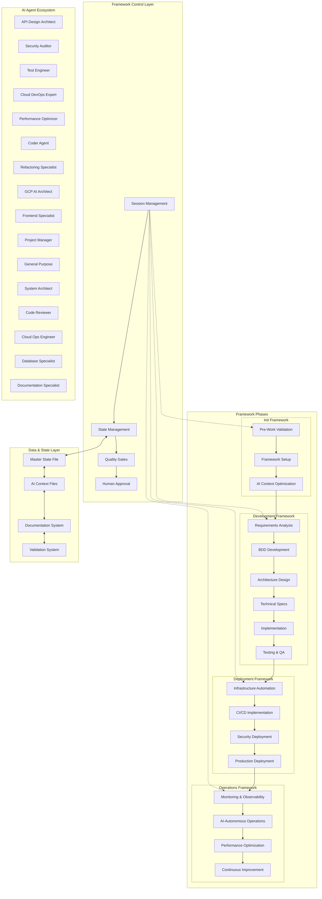
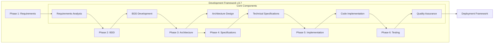
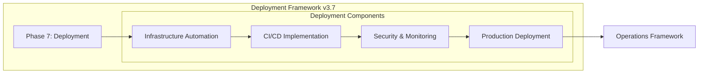
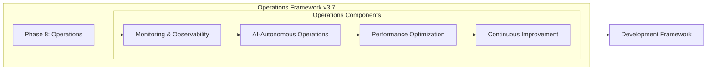
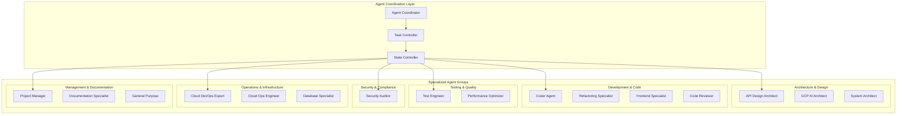
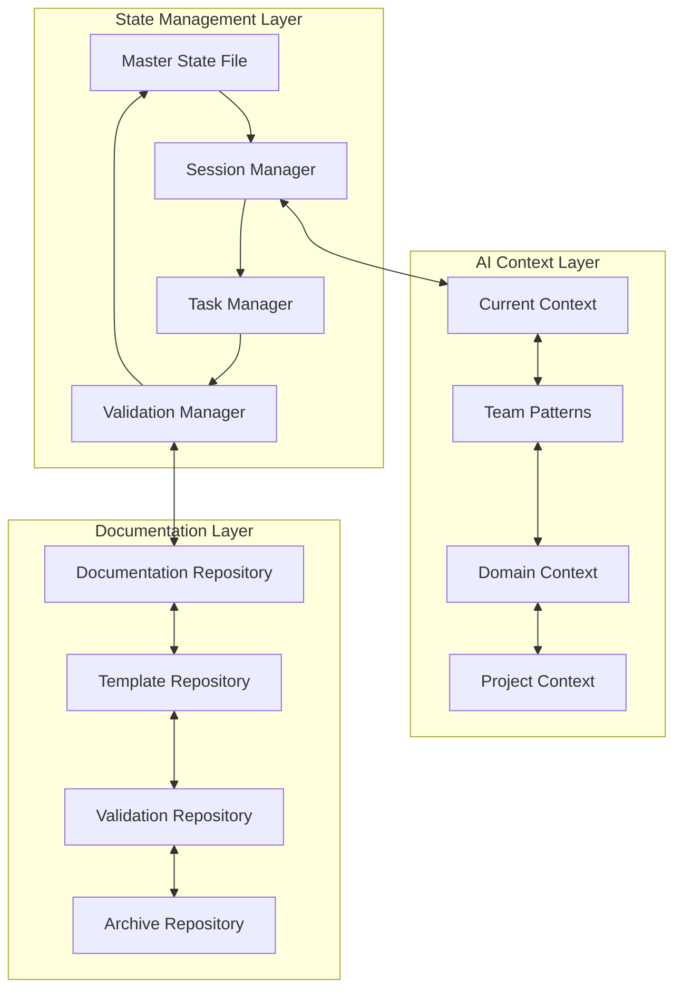
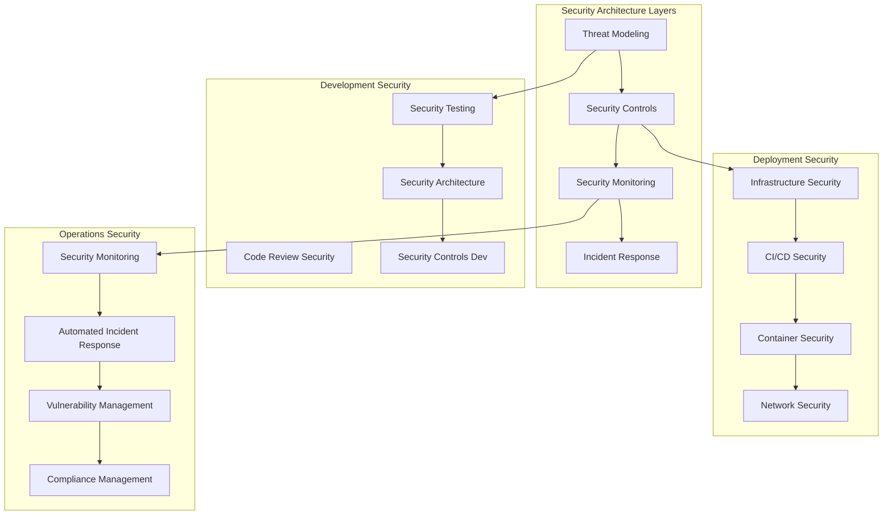

# System Architecture & Design
## AI Agent Development Framework v3.7 Architecture Document

**Version:** 3.7 - System Architecture Edition  
**Date:** 2025-08-23  
**Framework:** AI Agent Development Framework v3.7  
**Purpose:** Complete system architecture and design specification  
**Integration:** Links to [`docs/adr/`](docs/adr/) for detailed Architecture Decision Records  

---

## 🏗️ **Architecture Overview**

The AI Agent Development Framework v3.7 implements a **multi-phase, AI-first architecture** that transforms traditional software development through systematic AI automation with human strategic oversight.

### **Core Architectural Principles**

1. **AI-First Design**: AI agents drive execution, humans provide strategic oversight
2. **Phase-Based Architecture**: Four integrated phases with clear handoff protocols
3. **State-Driven Coordination**: Centralized state management across all framework phases
4. **Security-by-Design**: Integrated security throughout all architectural layers
5. **Framework Compliance**: Systematic structure ensuring consistent, repeatable outcomes

---

## 🔧 **System Architecture**

### **High-Level Architecture Diagram**

### **Architectural Components**

#### **1. Framework Control Layer**
**Purpose**: Orchestrates all framework activities with consistent session management and quality assurance

- **Session Management**: Universal protocols across all framework phases
- **State Management**: Centralized state tracking through master state file
- **Quality Gates**: Systematic validation preventing non-compliant progression
- **Human Approval**: Strategic decision points requiring explicit human authorization

#### **2. AI Agent Ecosystem** 
**Purpose**: Provides specialized domain expertise and task execution capabilities

- **16 Specialized Agents**: Each agent provides specific domain expertise
- **Multi-Agent Coordination**: Complex workflows requiring multiple agent collaboration
- **Context Sharing**: Agents access shared context through `.ai_context/` files
- **Human Integration**: Agent recommendations subject to human oversight and approval

#### **3. Framework Phases**
**Purpose**: Four integrated phases providing complete software development lifecycle coverage

- **Init Framework**: Project initialization, migration, pre-work, framework setup
- **Development Framework**: Requirements analysis through implementation and testing
- **Deployment Framework**: Infrastructure automation through production deployment
- **Operations Framework**: Monitoring setup through continuous improvement

#### **4. Data & State Layer**
**Purpose**: Provides persistent state, context, and documentation throughout framework execution

- **Master State File**: Single source of truth for all framework progress and status
- **AI Context Files**: Optimized context for AI agent performance and coordination
- **Documentation System**: Complete documentation with templates, examples, and validation
- **Validation System**: Systematic validation and compliance verification

---

## 🔄 **Framework Phase Architecture**

### **Init Framework Architecture**

```mermaid
graph LR
    subgraph "Init Framework v3.7"
        P1[Phase -1: Pre-Work]
        P0[Phase 0: Setup]
        
        subgraph "Pre-Work Components"
            PA[Project Analysis]
            MA[Migration Assessment]
            HD[Human Decisions]
            VS[Version Control Safety]
        end
        
        subgraph "Setup Components"
            FS[Framework Structure]
            AC[AI Context Setup]
            SF[Security Foundation]
            IE[Integration & Environment]
        end
        
        P1 --> PA --> MA --> HD --> VS
        VS --> P0
        P0 --> FS --> AC --> SF --> IE
    end
    
    IE --> DEV[Development Framework]
```

#### **Key Architectural Decisions:**
- **Safety-First Design**: Mandatory pre-work prevents data loss and ensures project safety
- **Human Decision Integration**: Explicit human choices required for migration approach
- **Framework Foundation**: Complete v3.7 structure established before development begins
- **AI Optimization**: Context optimization configured for <5 second loading performance

### **Development Framework Architecture**

#### **Key Architectural Decisions:**
- **Requirements-Driven**: Complete requirements analysis before implementation begins
- **BDD Integration**: Behavioral validation throughout development process
- **Security-by-Design**: Security considerations integrated in architecture phase
- **Quality Gates**: Comprehensive testing and validation before deployment handoff

### **Deployment Framework Architecture**

#### **Key Architectural Decisions:**
- **Infrastructure-as-Code**: Complete infrastructure automation with version control
- **Zero-Downtime Deployment**: Blue-green, canary, and rolling deployment strategies
- **Security Integration**: Security controls deployed with infrastructure automation
- **Monitoring Foundation**: Observability systems established during deployment

### **Operations Framework Architecture**

#### **Key Architectural Decisions:**
- **AI-Autonomous Operations**: 95% autonomous with 5% human supervision
- **Predictive Monitoring**: AI-driven anomaly detection and incident prevention
- **Performance Intelligence**: Automated optimization and resource management
- **Continuous Feedback**: Operations insights feed back to development improvements

---

## 🤖 **AI Agent Architecture**

### **Agent Coordination Architecture**

### **Agent Integration Patterns**

#### **Single Agent Tasks**
- **Direct Execution**: Agent receives task, executes autonomously, reports completion
- **Human Validation**: Agent completes task, human validates before progression
- **Quality Gates**: Agent output validated through framework quality gates

#### **Multi-Agent Collaboration**
- **Sequential Workflow**: Agents execute in defined sequence with handoff protocols
- **Parallel Execution**: Multiple agents work simultaneously with coordination
- **Expert Consultation**: Primary agent consults specialists for domain expertise
- **Review & Validation**: Agent work reviewed by appropriate specialist agents

#### **Human-AI Integration**
- **AI Recommendation**: Agents provide recommendations, humans make decisions
- **Approval Gates**: Human approval required before critical operations proceed
- **Strategic Oversight**: Humans provide strategic direction, AI handles execution
- **Quality Assurance**: Human validation of AI output before framework progression

---

## 📊 **State Management Architecture**

### **State Management System**

#### **State Management Components**

##### **Master State File (`.ai_context/framework_progress.md`)**
- **Single Source of Truth**: Authoritative state for all framework progress
- **Phase Tracking**: Current phase, completion status, next phase readiness
- **Human Approvals**: All human decisions documented with timestamps
- **Quality Metrics**: Framework compliance and validation status
- **Handoff Management**: Phase transition status and requirements

##### **Session Management**
- **TodoWrite Integration**: Real-time task management with status updates
- **Single Focus Enforcement**: Only one task in-progress at any time
- **Session Lifecycle**: Start → Work → End protocols with state persistence
- **Cross-Session Continuity**: Context preservation across sessions
- **Audit Trail**: Complete history of all session activities

##### **AI Context Optimization**
- **Performance Target**: <5 second context loading for all AI agents
- **Context Relevance**: Project-specific information optimized for AI consumption
- **State Coherence**: Consistent state across all AI agent interactions
- **Human Integration**: Context includes human decisions and preferences
- **Framework Alignment**: Context optimized for Framework v3.7 methodology

---

## 🛡️ **Security Architecture**

### **Security-by-Design Architecture**

#### **Security Integration Points**

##### **Development Phase Security**
- **Threat Modeling**: Comprehensive threat analysis during architecture design
- **Secure Coding**: Security-aware code implementation with automated scanning
- **Security Testing**: Security validation integrated into BDD testing framework
- **Architecture Security**: Security controls designed into system architecture

##### **Deployment Phase Security**
- **Infrastructure Security**: Security controls deployed with infrastructure automation
- **Pipeline Security**: CI/CD pipeline security scanning and validation
- **Container Security**: Container image scanning and runtime security
- **Network Security**: Network segmentation and security controls

##### **Operations Phase Security**
- **Security Monitoring**: Real-time security monitoring and threat detection
- **Incident Response**: Automated security incident detection and response
- **Vulnerability Management**: Continuous vulnerability scanning and remediation
- **Compliance Management**: Regulatory compliance monitoring and reporting

---

## 📈 **Architecture Success Metrics**

### **Performance Architecture Targets**

#### **System Performance**
- **Context Loading**: <5 seconds for complete AI context loading
- **State Management**: <1 second for state updates and queries
- **Agent Coordination**: <30 seconds for multi-agent task coordination
- **Quality Gates**: <2 minutes for comprehensive validation execution
- **Phase Transitions**: <5 minutes for complete phase handoff validation

#### **Framework Effectiveness**
- **Development Velocity**: 10x improvement through architecture optimization
- **Quality Assurance**: >95% defect reduction through systematic architecture
- **Security Integration**: 100% security-by-design implementation
- **Operational Excellence**: >99.9% availability through architecture design
- **Framework Compliance**: 100% architecture adherence to v3.7 specifications

### **Architecture Validation Criteria**

✅ **Complete Integration**: All architectural components integrated and functional  
✅ **AI-First Design**: AI agents effectively coordinated through architecture  
✅ **Human Integration**: Human oversight points properly integrated  
✅ **Security Excellence**: Security-by-design implemented throughout architecture  
✅ **Performance Achievement**: All performance targets met through architecture design  
✅ **Framework Compliance**: Architecture enables 100% framework methodology compliance  

---

*System Architecture Document Version: v3.7 - Complete Framework Architecture*  
*Framework: AI Agent Development Framework v3.7*  
*Created: 2025-08-23*  
*Purpose: Comprehensive system architecture and design specification for AI-first development methodology*